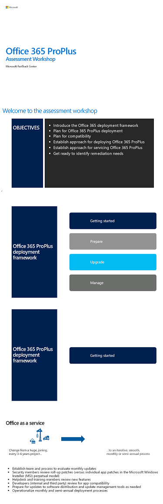

# FastTrack assessment workshop for Office 365 ProPlus

When working with enterprise customers who are deploying Office 365 ProPlus, Microsoft FastTrack experts deliver an assessment workshop that prepares the customer for the deployment with guidance and best practices. The workshop covers the following objectives:

- Introduce the Office 365 ProPlus deployment framework
- Plan for Office 365 ProPlus deployment
- Plan for compatibility
- Establish approach for deploying Office 365 ProPlus
- Establish approach for servicing Office 365 ProPlus
- Get ready to identify remediation needs

To learn more how you can use FastTrack to help with your deployment, see [Microsoft Fastrack](https://fasttrack.microsoft.com/office). You can review how FastTrack will help you prepare, upgrade, and manage Office 365 ProPlus in the [Office 365 FastTrack Benefit](https://docs.microsoft.com/fasttrack/o365-fasttrack-benefit-for-office-365).

To deliver the workshop, FastTrack uses the PowerPoint deck below, which we encourage you to review and use as part of your deployment planning. The workshop aligns to the phases and best practices available in the [Office Deployment Guide](https://aka.ms/officedeployment).

   [PDF](https://github.com/MicrosoftDocs/OfficeDocs-DeployOffice/blob/live/DeployOffice/images/O365-ProPlus-Assessment-Workshop.pdf) | [PowerPoint](https://github.com/MicrosoftDocs/OfficeDocs-DeployOffice/blob/live/DeployOffice/images/O365-ProPlus-Assessment-Workshop.pptx)

