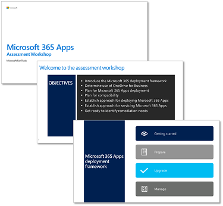

# FastTrack assessment workshop for Microsoft 365 Apps

When working with enterprise customers who are deploying Microsoft 365 Apps for enterprise (previously named Office 365 ProPlus), Microsoft FastTrack experts deliver an assessment workshop that prepares the customer for the deployment with guidance and best practices. The workshop covers the following objectives:

- Introduce the Microsoft 365 deployment framework
- Determine use of OneDrive for Business
- Plan for Microsoft 365 Apps deployment
- Plan for compatibility
- Establish approach for deploying Microsoft 365 Apps
- Establish approach for servicing Microsoft 365 Apps
- Get ready to identify remediation needs

To learn more how you can use FastTrack to help with your deployment, see [Microsoft FastTrack](https://fasttrack.microsoft.com/office). You can review how FastTrack will help you prepare, upgrade, and manage Microsoft 365 Apps for enterprise in the [Office 365 FastTrack Benefit](https://docs.microsoft.com/fasttrack/o365-fasttrack-benefit-for-office-365).

To deliver the workshop, FastTrack uses the PowerPoint deck below, which we encourage you to review and use as part of your deployment planning. The workshop aligns to the phases and best practices available in the [Office Deployment Guide](deployment-guide-microsoft-365-apps.md).

   [PDF](https://github.com/MicrosoftDocs/OfficeDocs-DeployOffice/raw/live/DeployOffice/images/microsoft-365-apps-assessment-workshop.pdf) | [PowerPoint](https://github.com/MicrosoftDocs/OfficeDocs-DeployOffice/raw/live/DeployOffice/images/microsoft-365-apps-assessment-workshop.pptx)

