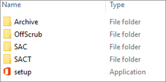

# Best practices: Deployment for locally managed

 *The Best Practices Guide includes deployment recommendations and real-world examples from the Office 365 Product Group and delivery experts from Microsoft Services. For a list of all the articles, see  [Best practices guide for deploying Office 365 ProPlus in the enterprise](best-practices-guide-for-deploying-office-365-proplus-in-the-enterprise.md).* 
  
    
    

Now that  *Locally Managed*  has been through Assessment and Planning, it is time to deploy the software.
## Create a folder structure in Distributed File System

Use the existing Distributed File System (DFS) and scripts to let users install from a network share without requiring administrative privileges on the local machines.  *Locally Managed*  should have a similar folder structure within the DFS to host Office 365 client related content, and users must have read permissions to the share.
  
    
    

|||
|:-----|:-----|
|**Folder path** <br/> |**Purpose** <br/> |
|\\\\Server\\Share\\O365  <br/> |This is the parent folder that will be used for storing all Office 365 ProPlus related items.  <br/> |
|\\\\Server\\Share\\O365\\FRDC  <br/> |Use this folder to store the most current Office 365 ProPlus First Release for Deferred Channel build that pre-production users will receive.  <br/> |
|\\\\Server\\Share\\O365\\DC  <br/> |Use this folder to store the most current Office 365 ProPlus Deferred Channel build that production users will receive. Production channel should be Deferred Channel.  <br/> |
|\\\\Server\\Share\\O365\\Archive  <br/> |Use this folder to host N-1 previously known good builds in case a rollback or downgrade is needed.  <br/> |
|\\\\Server\\Share\\O365\\OffScrub  <br/> |Use this folder to host the OffScrub scripts to remove previous versions of Office.  <br/> |
   
The following image is an example of the folder structure that  *Locally Managed*  should create:
  
    
    

  
    
    

  
    
    

  
    
    

  
    
    

## Download the Office 365 ProPlus files for redistribution

Download the latest version of the  [Office Deployment Tool (ODT)](https://www.microsoft.com/en-us/download/details.aspx?id=49117) and put it in the **\\\\Server\\Share\\O365** network location. Then, create and configure the download XML file to download the Office 365 ProPlus source files. Run ODT setup.exe in download mode and the download XML to retrieve the latest Office 365 ProPlus source files. The downloaded source files must be for 32-bit Deferred and First Release for Deferred Channel builds, Project Pro, Visio Pro, and all supported languages for the Office 365 clients.
  
    
    
The specific download packages are as follows:
  
    
    

|||
|:-----|:-----|
|**Package** <br/> |**Languages** <br/> |
|Office 365 ProPlus - Deferred Channel - 32-bit  <br/> |English, French, German  <br/> |
|Visio Pro - Deferred Channel - 32-bit  <br/> |English  <br/> |
|Project Pro - Deferred Channel - 32-bit  <br/> |English  <br/> |
|Office 365 ProPlus, Project Pro, and Visio Pro - First Release for Deferred Channel - 32-bit  <br/> |English  <br/> |
   
The Deferred Channel download XML should be placed in the corresponding ** \\\\Server\\Share\\O365\\DC** network location The First Release for Deferred Channel download XML should be placed in the corresponding **\\\\Server\\Share\\O365\\FRDC** network location. Both the Deferred Channel and First Release for Deferred Channel download XMLs should download the source bits into their corresponding channel folders in DFS.
  
    
    
For examples, see  [Best practices: Download XML files for locally managed](best-practices-download-xml-files-for-locally-managed.md).
  
    
    

## Configure the deployment files

The next step is to edit the install XML files for the deployment.  *Locally Managed*  created multiple XML files, that together with the downloaded Office 365 ProPlus files, will configure and install Office 365 ProPlus.
  
    
    
 [GitHub](http://officedev.github.io/Office-IT-Pro-Deployment-Scripts/XmlEditor.mdl) was leveraged to edit the XML files.
  
    
    
The following XML files must be created:
  
    
    

||||
|:-----|:-----|:-----|
|**XML file** <br/> |**Languages** <br/> |**Exclusions/additions** <br/> |
|Office 365 ProPlus - Deferred Channel - Desktops - 32-bit - CanAm Region  <br/> |English, French  <br/> |Exclude Access  <br/> |
|Office 365 ProPlus - Deferred Channel - Desktops - 32-bit - Germany  <br/> |German  <br/> |Exclude Access  <br/> |
|Office 365 ProPlus - Deferred Channel - VDI - 32-bit - All regions  <br/> |English, French, German  <br/> |Shared Activation  <br/> Exclude Access  <br/> |
|Project Pro - Deferred Channel - Desktops - 32-bit  <br/> |English  <br/> ||
|Visio Pro - Deferred Channel - Desktops - 32-bit  <br/> |English  <br/> ||
|Individual languages - Deferred Channel - Desktops 32-bit  <br/> |English, French, German  <br/> ||
|Office 365 ProPlus, Project Pro, and Visio Pro - First Release Deferred Channel - Desktops - 32-bit  <br/> |English  <br/> |Exclude Access  <br/> |
   
The Deferred Channel install XML should be placed in the corresponding \\ **\\Server\\Share\\O365\\DC** network location . The First Release for Deferred Channel install XML should be placed in the corresponding **\\\\Server\\Share\\O365\\FRDC** network location.
  
    
    
For examples, see  [Best practices: Install XML files for locally managed](best-practices-install-xml-files-for-locally-managed.md).
  
    
    

## Configure the Office Scrub tool to remove all previous versions of Office

 *Locally Managed*  has only one preexisting version of Office in the environment, Office 2010 (MSI), so only the version of the OffScrub tool that removes Office 2007 and 2010 MSI versions must be obtained from Premier support. The OffScrub script should be stored in the **\\\\Server\\Share\\O365\\OffScrub** network location. The application will be run via a batch file or script. It is automated and the user will not need elevated privilege.
  
    
    
The following sequence will be run:
  
    
    

- Office 2010 (MSI) Full Suite Removal
    
  
User data will be persisted and all instances of Project and Visio will be removed with the accompanying version of the Office suite.
  
    
    
For examples, see  [Best practices: Uninstall XML files for locally managed](best-practices-uninstall-xml-files-for-locally-managed.md).
  
    
    

## Create the batch install wrapper to automate the OffScrub and Office 365 ProPlus install or removal

 *Locally Managed*  should use batch files or scripts stored in the previously created folder structure. The script or batch file will run with elevated privileges, so users only need read permissions to the share that hosts the batch file or script, OffScrub script, ODT setup.exe, install XML files, and Office 365 source files.
  
    
    
A sample Office 365 ProPlus batch file task order is as follows:
  
    
    

- Run OffScrub
    
  - Remove all Office 2010 (MSI) components
    
  
  - Remove Office 2013 Core Suite components (leave Project and Visio 2013)
    
  
  - Leave user data in place
    
  
- Install InfoPath 2013 (MSI)
    
  
- Install Office 365 ProPlus with proper channel, architecture, and languages
    
  
The Project and Visio batch file task orders should be as follows:
  
    
    

- Install Project or Visio with proper channel, architecture, and languages
    
  
The following batch files or scripts should be created:
  
    
    

- OffScrub + Office 365 ProPlus Deferred Channel install
    
  
- Project Pro Deferred Channel install
    
  
- Visio Pro Deferred Channel install
    
  
- OffScrub + Office 365 ProPlus First Release for Deferred Channel install
    
  
- Project Pro First Release for Deferred Channel install
    
  
- Visio Pro First Release for Deferred Channel install
    
  
- Office 365 ProPlus uninstall
    
  
- Individual language installations
    
  
 *Locally Managed*  must advertise separate batch files for Deferred Channel and First Release for Deferred Channel users. Users should only be able to perform the script that automates the Office 365 ProPlus configuration that is designed for them: no pre-production or FRDC users should see the DC or production script. Therefore, the DC automation scripts should be stored in its respective folder location ( **\\\\Server\\Share\\O365\\DC** ), and the FRDC automation scripts should be stored in its respective folder location ( **\\\\Server\\Share\\O365\\FRDC** ). *Locally Managed*  users should be instructed to go to the designated folder and run the appropriate Office script based on their end user role (production or pre-production), or Group Policy should copy the appropriate batch file to the user's desktop to run.
  
    
    
Add the following line to a to a batch file (for example, **Office365_DC_Configuration.cmd** ). This line will dynamically determine the script directory and find setup.exe and install XML. Note that this command does not check whether the script is performed with elevated rights, so *Locally Managed*  must make sure that elevated rights are applied. A similar batch line can be leverage for OffScrub.
  
    
    


```

"%~dp0Setup.exe" /configure "%~dp0install.xml" 
```

You can create an additional batch file (for example, **Office365_Removal.cmd** ) to uninstall and leverage the following batch line:
  
    
    


```
"%~dp0Setup.exe" /configure "%~dp0removal.xml" 
```

For detailed guidance, see  [Best practices: Distributed File System configuration for locally managed](best-practices-distributed-file-system-configuration-for-locally-managed.md).
  
    
    

## Configure Office 2016 for Mac for distribution

 *Locally Managed*  has a small Mac environment and does not have Mac software distribution tools, but still wants to have control over their Mac clients. Therefore, it is recommended that they use a network share deployment.
  
    
    
For detailed guidance, see  [Best practices: Office 2016 Mac client install for locally managed](best-practices-office-2016-mac-client-install-for-locally-managed.md).
  
    
    

