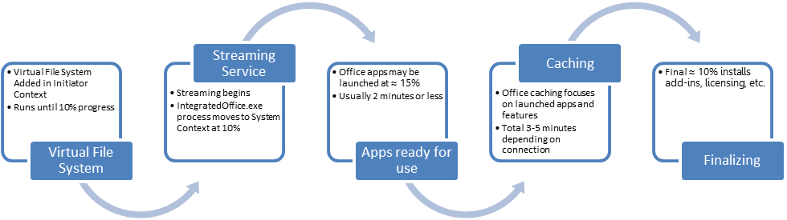

# Best practices for installing Office 365 ProPlus from CDN or DFS

 *The Best Practices Guide includes deployment recommendations and real-world examples from the Office 365 Product Group and delivery experts from Microsoft Services. For a list of all the articles, see  [Best practices guide for deploying Office 365 ProPlus in the enterprise](best-practices-guide-for-deploying-office-365-proplus-in-the-enterprise.md).* 
  
    
    

When planning for and implementing a Office UNRESOLVED_TOKEN_VAL(365) ProPlus deployment, it is critical to understand the available deployment options. This article covers the high level description of the different architecture components that are used in the CDN and DFS client deployment processes.
## Platform architecture

Office UNRESOLVED_TOKEN_VAL(365) ProPlus is available in both 32-bit and 64-bit editions. You should understand the advantages and disadvantages before selecting a specific architecture.
  
    
    
The following table details the advantages and disadvantages of selecting 64-bit Office:
  
    
    

|||
|:-----|:-----|
|**Advantages**   |**Disadvantages**   |
|64-bit can address more memory than 32-bit.    |Native 64-bit Office UNRESOLVED_TOKEN_VAL(365) ProPlus cannot be installed on computers that have 32-bit Office applications and third- party add-ins installed.    |
|Excel 2016 can load much larger workbooks. Excel 2016 made updates to use 64-bit memory addressing to move beyond the 4 gigabytes (GB) addressable memory boundary that limits 32-bit applications. (Must be on version 1602 and current channel. The update for Deferred Channel is expected to release in Oct 2016.)    |Macros and add-ins might need to be re-written to work in an 64-bit environment.    |
|Some tools, like Power Query, are supported in 64-bit environments only.    |Some applications may not render graphics correctly.    |
   

> [!NOTE]
> For detailed guidance, see  [64-bit editions of Office 2013](https://technet.microsoft.com/en-us/library/ee681792%28v=office.15%29.aspx). 
  
    
    

It is recommended that 32-bit is used for both 32-bit and 64-bit operating systems if users in your organization depend on existing extensions to Office, such as Microsoft ActiveX® controls, third-party add-ins, in-house solutions built on previous versions of Office, or 32-bit versions of programs that interface directly with Office.
  
    
    
If some users in your organization are Excel expert users who work with Excel spreadsheets that are larger than 4 GB, they can install the 64-bit edition of Office 365 ProPlus. In addition, if you have in-house solution developers, we recommend that those developers have access to the 64-bit edition of Office UNRESOLVED_TOKEN_VAL(365) ProPlus so that they can test and update your in-house solutions in the 64-bit edition of Office UNRESOLVED_TOKEN_VAL(365) ProPlus.
  
    
    

### Click-to-Run technology

Click-to-Run is a Microsoft streaming and virtualization technology that reduces the time that is required to install Office and helps you run multiple versions of Office on the same computer. The streaming technology lets you download and begin to use an Office product before the whole product is installed on the computer.
  
    
    
The virtualization technology provides an isolated environment for Office to run on your computer. This isolated environment provides a separate location for the Office product files and settings to be stored so that they don't change other applications that are already installed on the computer. This lets you run the latest version of Office side -by-side with an earlier version of Office that is already installed on the computer.
  
    
    

> [!NOTE]
>  The earlier version of Office that is already installed on the computer must be one of the following versions of Office: Office 2010, Office 2007, or Office 2003. Microsoft only tests the N-1 for side by side compatibility.>  The versions of Office that you install must be the same edition. For example, both installations of Office are the 32 -bit edition.
  
    
    

Even though the Office product runs in a self-contained environment, the Office product can interact with the other applications that are installed on the computer. Macros, in-document automation, and cross-Office product interoperability will work. Click-to-Run is designed to allow locally-installed add-ins and dependent applications to work with it. However, some add-ins or other integration points with Office might behave differently or might not work when you are using Click-to-Run.
  
    
    
Click-to-Run is used to install and update Office products. These streaming and virtualization capabilities are based on technologies include in Microsoft Application Virtualization (App-V).
  
    
    

### Installation process

Click-to-Run uses a multi-process framework to do the following tasks:
  
    
    

- Start an installation and perform core Click-to-Run tasks such as streaming and application start.
    
  
- Maintain state for the virtualized package.
    
  
- Initiate integration tasks.
    
  
- Monitor for updates.
    
  
- Provide an interface into the Click-to-Run platform.
    
  
Applications and processes use this interface to query for state and to communicate information.
  
    
    

  
    
    

  
    
    
A single executable program contains the logic that is required to initiate Click-to-Run streaming and application start processes. It includes all the components that are required to stream Click-to-Run packages.
  
    
    
Streaming of Office, a core component of the Click-to-Run infrastructure, allows for parts of the product to be prioritized, grouped into blocks, and delivered over time while the applications run. The streaming process is controlled by the streaming engine.
  
    
    
The streaming engine manages downloads of items in the streaming queue, prioritizes incoming streaming requests, determines whether to display streaming user interface, and publishes the downloaded information to the native file system. The streaming engine also maintains a streaming queue, a prioritized list of all the Office sources and components that are to be downloaded to the local cache to complete the installation or to fulfill on-demand requests that are generated by an application's runtime. Every Click-to-Run package has a default streaming queue prioritization at first. This prioritization can change dynamically in response to application use before the product is fully cached locally.
  
    
    

## Feature selection

Due to the nature of Click-to-Run deployment, customizations and feature selections at the application level are not possible. This is unlike Office MSI versions, where the Office Customization Tool (OCT) can be used to generate customized .msp files for use at install time.
  
    
    

## Customization

After the Office configuration decisions have been made, an approach must be defined to apply these settings to the Office installation. Customization of Office deployment can be broken into two key approaches:
  
    
    

- During deployment
    
  
- Post deployment
    
  

### Deployment customization

The Office UNRESOLVED_TOKEN_VAL(365) ProPlus installation architecture offers only one method to perform customization during deployment: using an XML definition file.
  
    
    
 **Setup customization file (XML)**
  
    
    
The XML file configures the way that Setup will interact with user and how Office 365 ProPlus is installed and maintained.
  
    
    
You can specify the following options in the XML file:
  
    
    

- Languages to install.
    
  
- Platform architecture to install (32-bit or 64-bit).
    
  
- License activation feature.
    
  
- Installation logs usage.
    
  
- Display information.
    
  
- Update settings.
    
  
 **Multiple language deployment**
  
    
    
When configuring the deployment of multiple languages, it is important to consider the approach the deployment of these languages. By default, Setup installs only the language version that match elements that are defined in the XML customization file.
  
    
    
You can install more than one language on a single computer without using more than one license. The first language that is defined in the XML configuration file is the default language. Each language size is between 150 -250 MB.
  
    
    

## Prepare to deploy

The MSI version of Office allows for the Office Customization Tool (OCT) to customize Office installation. The OCT tool cannot be leveraged for Office UNRESOLVED_TOKEN_VAL(365) ProPlus. Instead, customization is accomplished by using Group Policy.
  
    
    

- Review and record the customization settings in the legacy version of Office.
    
  
- Download the  [Office 2016 Administrative Template files](https://www.microsoft.com/en-us/download/details.aspx?id=49030).
    
  
- Choose the 32 or 64-bit template files.
    
  
- Compare the recorded customization settings with the Office 2016 Administrative Template Excel spreadsheet for Office UNRESOLVED_TOKEN_VAL(365) ProPlus Customization.
    
  
- Import the Office 2016 Administrative Template Files into Active Directory and configure the appropriate Group Policy settings. See  [Managing Group Policy ADMX Files Step-by-Step Guide](https://msdn.microsoft.com/en-us/library/bb530196.aspx).
    
  
The Office 2016 Administrative Template files are updated with new settings to control the look and feel of Office UNRESOLVED_TOKEN_VAL(365) ProPlus
  
    
    

### Languages

It is a preferred practice that Office UNRESOLVED_TOKEN_VAL(365) ProPlus languages are installed during the initial installation. Additionally, languages can be deployed post installation. You can review the supported languages for Office UNRESOLVED_TOKEN_VAL(365) ProPlus at  [Language identifiers](https://technet.microsoft.com/en-us/library/f5fee727-df49-4ef7-b073-dd6c08dfecfa).
  
    
    

### Office applications

The following applications are included with Office 365 ProPlus:  [Office 365 ProPlus](https://products.office.com/en-us/business/office-365-proplus-business-software). Although InfoPath is not included in Office 365 ProPlus, it is available for Office 365 ProPlus subscribers. The download for InfoPath 2013 for Office 365 ProPlus Subscription is located  [here](https://www.microsoft.com/en-us/download/details.aspx?id=48734).
  
    
    

- Review the applications.
    
  
- Decide which applications to deploy.
    
  

## Visio and Project 2016

Visio 2016 and Project 2016 are not included with Office UNRESOLVED_TOKEN_VAL(365) ProPlus, and require a separate license. You can install the volume licensed versions of Project and Visio 2016, with the requirements are located at  [Use the Office Deployment Tool to install volume licensed editions of Visio 2016 and Project 2016](https://technet.microsoft.com/library/mt703272.aspx). The installations leverage C2R technology, but activate by using a traditional MAK/KMS system.
  
    
    

## Side by side or removal of legacy Office

- Side by Side - It is a preferred practice that the legacy versions of Office are removed during the installation of Office ProPlus. Side by side should be only be used for limited testing during the pilot deployment.
    
  
- Removal of Legacy Office -The preferred practice for the removal of legacy versions of Office is to utilize OffScrub for the specific version Office. OffScrub is fully supported by Premier and should be contacted to obtain the required versions.
    
  

