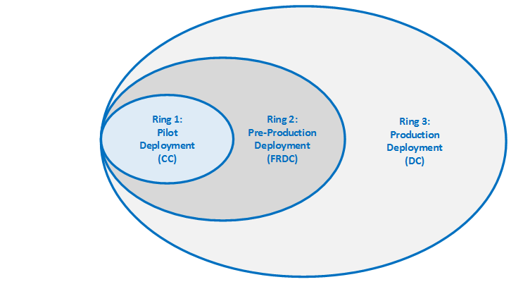

# Best practices for managing channels

> [!IMPORTANT]
> On April 20, we announced changes to better align the Office 365 ProPlus and Windows 10 update models. In that  [blog post](https://go.microsoft.com/fwlink/p/?linkid=846981), we highlighted changes to the release cadence and the support duration of feature updates for Office 365 ProPlus. As part of these changes, Office 365 ProPlus is also changing the names of its update channels. > For more information about these changes, see  [Overview of the upcoming changes to Office 365 ProPlus update management](overview-of-the-upcoming-changes-to-office-365-proplus-update-management.md). > As most of these changes take effect in September 2017, this content will be updated in the next few months. 
  
    
    

 *The Best Practices Guide includes deployment recommendations and real-world examples from the Office 365 Product Group and delivery experts from Microsoft Services. For a list of all the articles, see  [Best practices guide for deploying Office 365 ProPlus in the enterprise](best-practices-guide-for-deploying-office-365-proplus-in-the-enterprise.md).* 
This article describes recommended channel membership roles and best practices for channel management.
  
    
    

## Channel membership roles

Customers appreciate the value of constantly getting new features with Office UNRESOLVED_TOKEN_VAL(365) ProPlus; however, there is a concern about how often the product updates and how to have adequate time to validate the new features so that they don't break existing business processes. Additional time is also needed to train the help desk and end users before the feature is enabled through the production environment. Customers have done this previously with software and patches they release by first releasing it to a QA group that represents a population sample of all business groups and apps. After the QA group has the software/patch and has not reported any adverse effects in 1 -2 weeks, the IT team then starts the production roll out to the entire organization. 
  
    
    
This process can now be achieved by leveraging the different Office UNRESOLVED_TOKEN_VAL(365) client channel builds so that the QA group has the features for at least 4 months before the rest of the enterprise receives those features.
  
    
    
To have appropriate channel representation across the environment, we recommend you use the following diagram. Each group can have Office UNRESOLVED_TOKEN_VAL(365) ProPlus deployed and managed by using the Office Content Delivery Network (CDN), an on premises source location, or a mix between the Office CDN and an on premises source location. Additionally, pilot and pre-production groups should have instructions on how to immediately report abnormalities or issues, so they can be addressed before they are released in the Deferred Channel build.
  
    
    

  
    
    

  
    
    

||||||
|:-----|:-----|:-----|:-----|:-----|
|**Ring**   |**Channel**   |**Client population**   |**Primary function**   |**Roles**   |
|Pilot deployment    |Current    |< 1%    |Evaluate new features and functionality before release across all available channels.    |Developers, testers, application/add-in owners, IT and O365 champions, Office project team members, training and communication leads.    |
|Pre-production deployment    |First Release for Deferred Channel    |< 10%    |Business group feature and functionality validation, provide direct feedback to IT and Office admins.    |Developers, testers, training and communication leads, business group champions, and designated end users from each business group.    |
|Production deployment    |Deferred    |~89%    |End user production.    |All end users not in the pilot or pre-production groups.    |
   

## Manage updates overview

This section describes how to implement an automated process to publish Office UNRESOLVED_TOKEN_VAL(365) ProPlus builds. By default, each client is set to pull from the Office CDN using the Deferred Channel update channel method. The client will check the specified update path location and if there is no new version, it will remain as is. If there is a newer version, the client will perform a delta binary to calculate the difference between itself and the update location's build, compress the data, and then start the transmission to update. Office will use Background Intelligent Transfer Service (BITS) to control bandwidth if downloading from the Office CDN; BITS is not applied if downloading from an SMB file share. The client does not need administrative privileges to update. Office checks for updates regularly via a scheduled task and can be seen in Task Scheduler.
  
    
    

## Channel management

When updating directly from the Office CDN, channel management is managed by the cloud service. This means that based on the channel membership, the Office client gets the appropriate build of Office. 
  
    
    
The Office update engine cannot distinguish between the channels; it is driven by build numbers. If you control patching on premises, we highly recommend that you review the following sections, because the Office client is missing the proper channel management control from the Office CDN. There is no channel awareness by the Office client when the update source is managed on premises. This means that the update engine picks up the latest available build that is advertised through the v32.cab file. When managing patching on premises withOffice UNRESOLVED_TOKEN_VAL(365) ProPlus 2016, careful consideration, planning, and organization is required to make sure that Office clients receive the correct channel builds.
  
    
    

### Manage updates through the Office CDN

The following steps are recommended for a fully automated testing and deployment process using the Office CDN for patching:
  
    
    

1. Identify and configure a pilot group to use Current Channel.
    
  
2. Identify and configure a pre-production or QA group to use First Release for Deferred Channel.
    
  
3. Configure all other clients to be in the production group to use Deferred Channel.
    
  
4. Configure all groups to receive updates directly from the Office CDN.
    
  
5. When a new build is released for the various channels, the update mechanism automatically downloads the latest build by using a scheduled task. 
    
  
6. Have pilot and pre-production groups use Office as usual, with instructions to immediately report any issues or concerns.
    
  

### Manage updates on premises

If your organization does not have the network capacity to adopt updates directly from the Office CDN, the builds can instead be hosted in an on premises source location. 
  
    
    

> [!NOTE]
> After the builds are hosted on premises, the Office client is missing the proper channel management control and the update engine will pick up the latest available build rather than the associated channel membership. 
  
    
    

Due to the availability dates of the builds, we recommend that you check for build updates several times per month. An automated task can be created to check the Office CDN to see if there is a newer build available in a specific channel. If so, the automated task can download the build source files to a specified location. An administrator can then take the newly download source files and distribute them out to the appropriate channel membership groups.
  
    
    

### Switch update channels

If you switch update channels, you should carefully plan to account for the full delta change. Switching Channels is not advised because it is a 100% file delta install. If the channel you are switching to is 1.2 GB, then a complete 1.2 GB of network bandwidth is consumed if installing locally (700-800 GB if using Office CDN). There is no need to uninstall and then re-install; however, the network impact is the same as a new install. The task of switching update channels should use the existing deployment infrastructure.
  
    
    
For step by step guidance on switching update channels, see  [Best practices: Channel management](best-practices-channel-management.md).
  
    
    

## Out-of-Band build for Deferred Channel

Microsoft might release an out-of-band build outside of the estimated release timeline for Deferred Channel. In these cases, it is recommended that the deployment administrators evaluate the out-of-band build and whether to deploy or skip the out of band build.
  
    
    
If it is deemed critical for deployment, follow the same deployment procedures that were previously stated and process it as usual. Otherwise, skip the out-of-band build and deploy the released out of band Patch Tuesday build.
  
    
    

## Rollback or downgrade strategy

A rollback or downgrade strategy should be planned in the unlikely event that a new Office 365 ProPlus build causes a disruption in service. The update engine can perform a downgrade, but the engine must be instructed to rollback by specifying a previous build number to rollback to. If the target version is not specified, the Office 365 ProPlus client cannot complete a downgrade. 
  
    
    
Similar to update scenarios, the rollback should take the client channel membership into account. The downgrade should respect the current channel membership of the client, and a target build version correlating to that current channel membership should be specified to maintain channel membership. If the target version specified is of a different channel than the channel that the client is currently on, the downgrade will succeed and a full delta will be performed in downgrading to the different channel.
  
    
    
For guidance on how to perform a rollback using the OfficeC2RClient.exe update engine, see  [Best practices: Channel management](best-practices-channel-management.md).
  
    
    

## Group Policy management

Customers should incorporate the  [Office 2016 Administrative Template files (ADMX/ADML)](https://www.microsoft.com/en-us/download/details.aspx?id=49030) to configure update settings for Office UNRESOLVED_TOKEN_VAL(365) ProPlus.
  
    
    

> [!NOTE]
> When using Group Policy settings to manage Office UNRESOLVED_TOKEN_VAL(365) ProPlus, the Group Policy settings take precedence over any configuration settings that are set by the install XML and Office Deployment Tool. Therefore, it is recommended that you use Group Policy settings as additional enforcement to settings that are specified via the install XML and Office Deployment Tool 
  
    
    

You can use the following Group Policy objects to manage Office 365 ProPlus:
  
    
    

|||
|:-----|:-----|
|**Update setting**   |**Group Policy setting**   |
|Set updates to occur automatically    |Enable automatic updates    |
|Specify a location to look for updates    |Update path    |
|Specify the version of Office UNRESOLVED_TOKEN_VAL(365) ProPlus to update to    |Target version    |
|Set a deadline, by which time updates must be applied    |Update deadline    |
|Hide update notifications from users    |Hide update notifications    |
|Hide the option to enable or disable Office automatic updates    |Hide options to enable or disable updates    |
   
For more information on managing updates by using Group Policy, or to manage Office 365 ProPlus update settings using the Office Deployment Tool configuration options, see  [Configure update settings for Office 365 ProPlus](https://technet.microsoft.com/en-us/library/dn761708.aspx).
  
    
    

