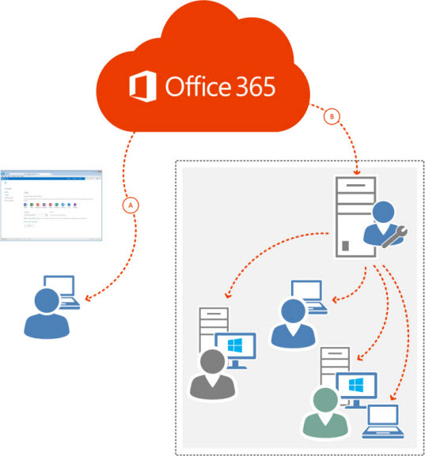
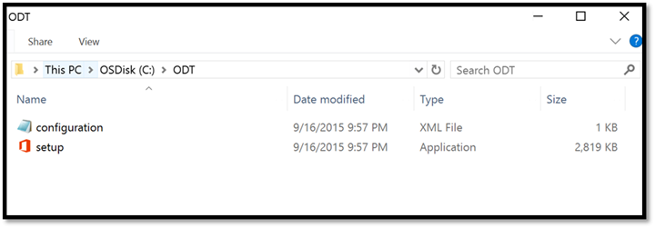

# Best practices: Deploying Office 365 ProPlus

 *The Best Practices Guide includes deployment recommendations and real-world examples from the Office 365 Product Group and delivery experts from Microsoft Services. For a list of all the articles, see [Best practices](best-practices.md).* 
  
When planning for and implementing a modern Office 365 ProPlus deployment, it is critical to understand the available deployment options. This article covers the preferred deployment options and provides high level descriptions of the architecture components.
  
## Deployment options

The three common deployment options for delivering Office 365 ProPlus to customer's end user devices are:
  
- [The Enterprise Managed scenario](best-practices-deployment-scenarios.md#Enterprise) uses software distribution tools to deploy Office 365 ProPlus.
    
- [The Locally Managed scenario](best-practices-deployment-scenarios.md#Local) uses on-premises file distribution systems to deploy Office 365 ProPlus.
    
- [The Cloud Managed scenario](best-practices-deployment-scenarios.md#Cloud) uses the Office Content Delivery Network (CDN) to deploy Office 365 ProPlus.
    
For additional information on these customer scenarios, see the [Best Practices: Deployment scenarios](best-practices-deployment-scenarios.md).
  
The following is a high level overview of the general deployment components and tools that are used in an Office 365 ProPlus deployment.
  
## Client distribution and update maintenance infrastructure overview

In general, the modern Office 365 ProPlus deployment solution includes functionality to deploy, maintain, and update clients from both an on premise infrastructure, and from an off premise Office Content Delivery Network (CDN) infrastructure. The on premise and off premise deployment infrastructures provide IT administrators flexibility to manage the initial deployment and maintenance of the Office client for different connectivity and end user segments of their environment.
  
The following image shows a high level overview of the on premises and off premises deployment infrastructure components for Office 365 ProPlus.
  

  
The deployment solution is comprised of two main source file distribution locations:
  
- **Off premises distribution (A)** - distribution from the Office Content Delivery Network (CDN).
    
- **On premises distribution (B)** - distribution from local file shares, software distribution systems, or distributed file systems.
    
The following supporting processes contribute to the overall deployment solution:
  
- **Office Deployment Tool** - Tool used to customize and configure Office 365 ProPlus distribution packages.
    
- **Deployment Package** - components required to install Office 365 ProPlus.
    
- **Office Build Maintenance** - For each channel release, a proper patching protocol must be established.
    
- **Network Bandwidth** - It is recommended to use maintenance windows to distribute Office builds to mitigate network bandwidth impact.
    
- **Security Management** - Group Policy settings (GP) are recommended for managing Office 365 ProPlus first run and user experience, as well as to manage incompatible Office Add-Ins
    
## Overview of key infrastructure components

### Source file distribution locations

There are two preferred source file distribution locations when deploying and managing Office 365 ProPlus. When planning and building an Office 365 deployment solution, it is recommended to understand the distribution locations and benefits of each location. Each source file location has benefits, and most deployment solutions will leverage both locations to provide the IT administrators with flexibility to use the best location based on the connectivity and delivery requirements of the end user segments in the environment.
  
 **Off Premises distribution using the Office CDN**
  
While it is not common for an enterprise to use the Office 365 portal for the initial Office 365 ProPlus client install, there are scenarios where you should use the Office CDN as the "SourcePath" location in theOffice 365 ProPlus client deployment package. Leveraging the Office CDN as a "SourcePath" allows the IT department to manage the deployment through a controlled deployment process, and then leverage the Office CDN for the source file locations. This method allows the customer's IT department to have direct control over when end users will receive the new Office client, allows the IT department to configure what applications will be installed on the end user's client device, and takes advantage of Microsoft's file replication and distribution capabilities on the Office CDN.
  
The IT managed deployment method using the Office CDN provides enterprises with the flexibility to support remote users and smaller branch offices with minimal corporate connectivity to deploy, update, and patch the end users devices. For an in depth overview of the Office 365 CDN, see [Content delivery networks](https://support.office.com/en-us/article/Content-delivery-networks-0140f704-6614-49bb-aa6c-89b75dcd7f1f?ui=en-US&amp;rs=en-US&amp;ad=US).
  
 **On Premises distribution locations**
  
A majority of enterprise customers already have tools and processes in place for managing software and file distribution, such as System Center Configuration Manager, distributed file system (DFS) solutions, or other software distribution systems. If you have already invested in software distribution solutions, it is preferred to leverage these systems for the Office 365 ProPlus client. By leveraging existing infrastructures, you can lower the education ramp for users by not having to invest in training for a new system as part of the overall deployment.
  
### Office Deployment Tool

The Office Deployment Tool downloads and installs Office 365 clients. You can download the most recent version of the [Office Deployment Tool](https://www.microsoft.com/en-us/download/details.aspx?id=49117) from the Microsoft Download Center. It is highly recommended for customers to frequently check for a newer version of the Office Deployment Tool, as it might contain updates.
  
For detailed information on the Office Deployment Tool, see [Configuration options for the Office Deployment Tool](../configuration-options-for-the-office-2016-deployment-tool.md).
  
Perform the following steps to extract the executable together with a sample configuration XML:
  
1. Download the [Office Deployment Tool](https://www.microsoft.com/en-us/download/details.aspx?id=49117).
    
2. Double-click **officedeploymenttool.exe**.
    
3. Accept the Microsoft Software License Terms.
    
4. Select a destination folder (for example, **C:\\ODT** ), and click **OK** to continue.
    
5. Click ** OK** to finish.
    
You now have a folder structure that looks similar to the following screenshot:
  

  
### Deploy by using software distribution tools

This section covers the general steps for deploying Office 365 ProPlus by using existing software distribution tools. For specific instructions and prescribed guidance for software distribution tools, see [Best practices: System Center Configuration Manager configuration for enterprise managed](best-practices-system-center-configuration-manager-configuration-for-enterprise.md).
  
Deploying Office 365 ProPlus with an existing software distribution tool is the recommended solution for a majority of enterprise customers because it is already in use for other software distribution, and the infrastructure required to distribute the Office 365 ProPlus client already exists. The follow steps are the generalized recommended steps for a successful deployment.
  
1. Prepare the Office 365 ProPlus Installation Files.
    
2. Create an application in the software distribution system.
    
3. Create a deployment type for the application.
    
4. Distribute the application to distribution points.
    
5. Deploy the application to the appropriate device collection.
    
A critical change in deploying with software distribution tools is that in the configuration XMLs, the SourcePath attribute must be removed because software distribution tools typically copy the installation files to a different named subfolder on each computer, and the SourcePath cannot be specified for every computer. When the SourcePath isn't specified or left out, the Office Deployment Tool automatically looks for the Office 365 ProPlus installation files in the same folder in which the Office Deployment Tool is located.
  
## Group Policy settings

See [Best practices: Implementing group policy](best-practices-implementing-group-policy.md) for instructions on how to deploy the desired Group Policy settings into production.
  

