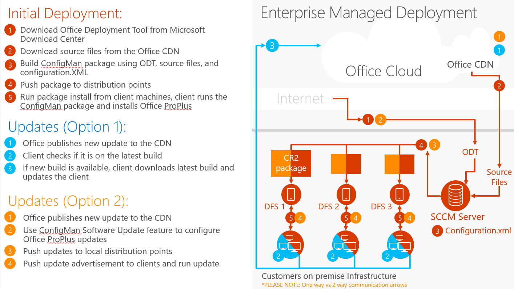
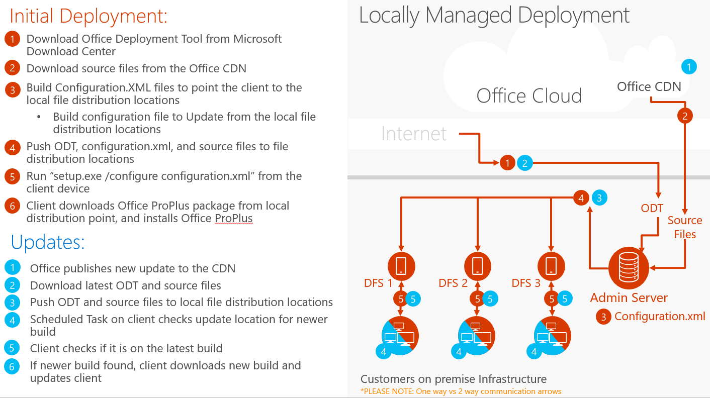
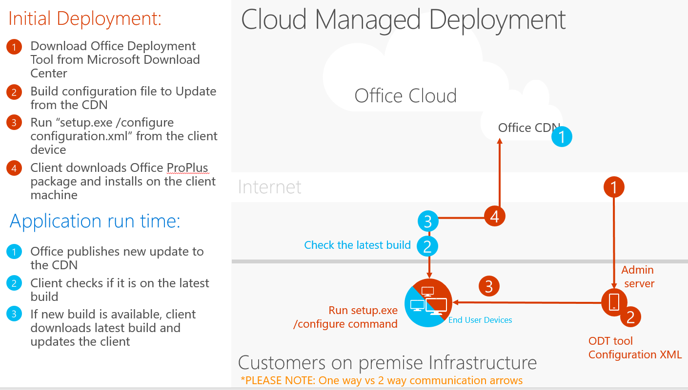

# Best Practices: Deployment scenarios

 *The Best Practices Guide includes deployment recommendations and real-world examples from the Office 365 Product Group and delivery experts from Microsoft Services. For a list of all the articles, see [Best practices](best-practices.md).* 
  
## The Enterprise Managed scenario

The Enterprise Managed scenario represents large to very large organizations, with tens of thousands of employees who are distributed globally. Enterprise Managed scenarios use software management tools such as System Center Configuration Manager to manage end user client devices and software. Users are not local administrators on their machines. The IT department in the Enterprise Managed scenario typically controls and automates the technologies.
  

  
## The Locally Managed scenario

The Locally Managed scenario represents medium to large organizations that range up to ten thousand employees. There may be multiple sites in different countries or continents, but locally managed is not considered to be distributed globally. Locally Managed does not have software distribution tools to manage client software, but instead uses a Distributed File System and network shares to host deployment packages for end users. Locally Managed leverages batch files or scripts that run with elevated privileges so the deployment is automated for end users, who are generally not local administrators on their machines.
  

  
## The Cloud Managed scenario

The Cloud Managed scenario represents small businesses that typically range in the hundreds of employees, and are generally located out of one country or a single office. Cloud Managed does not have software distribution tools to manage client software, but instead uses network shares to host deployment packages for end users. Cloud Managed uses batch files or scripts so the deployment is automated for end users, but because users have local administrator rights, some software installation is left up to the end user.
  

  

