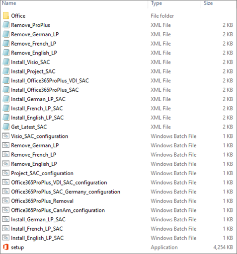

# Best practices: Distributed File System configuration for locally managed

 *The Best Practices Guide includes deployment recommendations and real-world examples from the Office 365 Product Group and delivery experts from Microsoft Services. For a list of all the articles, see [Best practices](best-practices.md).* 
  
 *Locally Managed*  will use their Distributed File System (DFS) and batch files or scripts to deploy the Office 365 ProPlus packages. The scripts are set to install silently because multiple steps are being performed.
  
The Office 365 ProPlus configuration script does the following:
  
- Run OffScrub
    
  - Remove all Office 2010 MSI components if found
    
  - Leave user data in place
    
- Install InfoPath 2013 MSI
    
- Install Office 365 ProPlus with proper channel, architecture, and languages from DFS
    
## OffScrub

The following table includes the OffScrub Command lines that  *Locally Managed*  uses for the batch file or script sequence to remove the previous version of Office 2010 (MSI):
  
|||
|:-----|:-----|
|**Context for program**   |**Command line**   |
|Office 2010 Removal    |Command prompt cscript Offscrub2010.vbs clientall /bypass 1 /log c:\\temp /nocancel /q    |
   
## Batch file

 *Locally Managed*  will use batch files or scripts to complete the Office 365 client configurations. The batch files must run with elevated privileges because their users are not local admins on their machines. *Locally Managed*  must do one of the following:
  
- Create a batch file shortcut that runs with elevated privileges, and paste the shortcuts into the appropriate **\\\\Server\\Share\\O365\\SAC** and **\\\\Server\\Share\\O365\\SACT** folders.
    
- In the batch file or script, include a parameter that will launch command prompt with elevated privileges when it is run by an end user without local administrator rights on the machine.
    
 *Locally Managed*  can then either instruct users to the correct batch file or script to run in the DFS network location, or use Group Policy to manually deploy the batch file to the user's desktop.
  
The following image shows an example of the Office Source location for  *Locally Managed*  32-bit Semi-Annual Channel. It includes the ODT setup.exe, Office 365 client download and configuration XML files, individual language pack installation XML files, Office 365 client source files, and batch files to install or uninstall the Office 365 client software and language packs. A similar example should also exist in the SACT folder.
  

  
The following table shows example batch files or scripts:
  
||||
|:-----|:-----|:-----|
|**Context**   |**Batch file**   |**Performs**   |
|Office 365 ProPlus SAC Desktop 32-bit    |Office365ProPlus_SAC_CanAm_Configuration    |Uninstalls Office 2010 using OffScrub tool and installs Office 365 ProPlus 32-bit Semi-Annual Channel with CanAm 2 languages    |
|Office 365 ProPlus SAC VDI 32-bit    |Office365ProPlus_VDI_SAC_Configuration    |Uninstalls Office 2010 using OffScrub tool, installs Office 365 ProPlus 32-bit Semi-Annual Channel with 3 languages, and enables Shared Computer Activation    |
|Visio Pro SAC Desktop 32-bit    |Visio_SAC_Configuration    |Installs Visio Pro 32-bit Semi-Annual Channel with 1 language    |
|French Language Pack SAC 32-bit    |Install_French_LP_SAC    |Installs French language pack 32-bit Semi-Annual Channel to existing Office 365 clients    |
   

