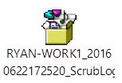

# Best practices: Step by step installation using CDN

 *The Best Practices Guide includes deployment recommendations and real-world examples from the Office 365 Product Group and delivery experts from Microsoft Services. For a list of all the articles, see [Best practices](best-practices.md).* 
  
This article discusses how to install and manage Office 365 ProPlus by leveraging the Content Delivery Network (CDN). It also provides a high level description of the different architecture components.
  
## Deploy Office 365 ProPlus

### Create XML file for installation

The XML file for installation will specify the following items:
  
- Product and languages
    
- Level of interface to display
    
- Logging options
    
- Product updates behavior
    
The parameters and settings for the XML file can be found at [Reference: Configuration options for the Office Deployment Tool](https://technet.microsoft.com/en-us/library/jj219426.aspx). The parameters for Project and Visio 2016 volume licensing can be found at [Use the Office Deployment Tool to install volume licensed editions of Visio 2016 and Project 2016](https://technet.microsoft.com/library/mt703272.aspx). A graphical UI for creating the XML file can be found at the Office GitHub Repository [Office Click-To-Run Configuration XML Editor](http://officedev.github.io/Office-IT-Pro-Deployment-Scripts/XmlEditor.mdl).
  
### Create OffScrub.vbs configuration file

An OffScrub configuration command must be created to automate the removal of Office.
  
1. From Premier, obtain the appropriate version of OffScrub for the Office version to remove.
    
2. From an elevated command prompt with administrative privileges, run the following command to get the SKU IDs of the Office products installed:
    
  ```
  cscript <OffScrub file>.vbs /preview /log <path to log out file>
  ```

    Example:
    
  ```
  cscript Offscrub10.vbs /preview /log c:\\temp
  ```

3. Review the out offscrub /preview command and look for the following line:
    
  ```
  Found registered product(s): PRJSTDR,PROPLUSR,VISIOR
  ```

    Example output:
    
     
  
    The products found in the above example are Project 2010 Standard, Office ProPlus 2010 and Visio 2010.
    
4. Run the following command from an elevated command prompt with administrative privileges to remove all Office 2010 client products:
    
  ```
  cscript OffScrub10.vbs clientall /bypass 1 /log c:\\temp /nocancel /q
  ```

    **Sample Offscrub10.vbs removing Office 2010 and keeping Visio 2010 and Project 2010**
    
  ```
  cscript OffScrub10.vbs PROPLUSR /bypass 1 /log c:\\temp /nocancel /q
  ```

    **Sample Offscrub10.vbs removing Office 2010 removing Visio 2010 and keeping Project 2010**
    
  ```
  cscript OffScrub10.vbs PROPLUSR, VISIOR /bypass 1 /log c:\\temp /nocancel /q
  ```

### Install Office365 ProPlus and remove legacy version of Office

 **Install Office 365 ProPlus and remove legacy version of Office - non-shared workstation**
  
1. Make sure that the update channel has been set in the Office 2016 Group Policy object.
    
2. Copy OffScrub, the ODT, and the install XML file to a local directory on the workstations.
    
3. From an elevated command prompt with administrator privileges, run the OffScrub.vbs with the appropriate command line switches.
    
4. Review the OffScrub exit codes that are contained in the script.
    
    > [!NOTE]
    > Each version of OffScrub will have the same or similar Error/Success codes. Review each script for respective codes. 
  
5. From an elevated command prompt with administrator privileges, run ** setup.exe /configure <installXMLfilename>.xml**.
    
6. Review the installation log.
    
7. Reboot the workstation to cleanup any files that were not cleared from the registry during the OffScrub process.
    
 **Install Office 365 ProPlus and remove legacy version of Office - shared workstation**
  
1. Ensure the update channel has been set in the Office 2016 Group Policy object.
    
2. Copy OffScrub, the ODT, and the install XML file to a local directory on the workstations.
    
3. From an elevated command prompt with administrator privileges, run the OffScrub.vbs with the appropriate command line switches.
    
4. Review the OffScrub exit codes that are contained in the script.
    
    > [!NOTE]
    > Each version of OffScrub will have the same or similar Error/Success codes. Review each script for respective codes. 
  
5. From an elevated command prompt with administrator privileges, run **setup.exe /configure <installXMLfilename>.xml**.
    
6. Review the installation log.
    
7. Reboot the workstation to cleanup any files that were not cleared from the registry during the OffScrub process.
    
## Post-deployment tasks

### Remove an application from Office 365 ProPlus

You can remove a program from the Office Suite post-deployment by using an XML configuration file.
  
The parameters and settings for the XML file can be found at [Reference: Configuration options for the Office Deployment Tool](https://technet.microsoft.com/en-us/library/jj219426.aspx). A graphical UI for creating the XML file can be found at the Office GitHub Repository [Office Click-To-Run Configuration XML Editor](http://officedev.github.io/Office-IT-Pro-Deployment-Scripts/XmlEditor.mdl).
  
 **Sample Configuration File for Removing Word Post Install - Semi-Annual Channel**
  
```
<Configuration>
   <Add Channel="Broad" OfficeClientEdition="32">
      <Product ID="O365ProPlusRetail">
         <Language ID="en-us" />
         <ExcludeApp ID="Word" />
      </Product>
   </Add>
   <Updates Channel="Broad" Enabled="TRUE" />
   <Property Name="FORCEAPPSHUTDOWN" Value="TRUE" />
   <Logging Level="Standard" Path="c:\\Officeinstall" />
   <Display Level="Full" AcceptEULA="TRUE" />
</Configuration> 
```

 **XML configuration file breakdown**
  
|||
|:-----|:-----|
|**Component** <br/> |**Explanation** <br/> |
|OfficeClientEdition="32"  <br/> |The architecture of Office being downloaded.  <br/> |
|Product ID="O365ProPlusRetail"  <br/> |SKU of Office 365 ProPlus being downloaded  <br/> |
|Language ID="en-us"  <br/> |The default language forOffice 365 ProPlus.  <br/> |
|ExcludeApp ID="Word"  <br/> |Remove Word from deployed Office 365 ProPlus.  <br/> |
|Updates Channel = "Broad"  <br/> |The Update Channel for Office 365 ProPlus. This parameter should match the Channel build being installed. If it does the product will switch to the channel defined.  <br/> Example: The channel being installed is Monthly Channel and the Updates Channel is set to Semi-Annual Channel. When the client updates, Office 365 ProPlus will update to Semi-Annual Channel, which might or might not contain all the features/non-security updates that the Monthly Channel does.  <br/> |
|Enabled="TRUE"  <br/> |Updates are enabled.  <br/> |
|Property Name="FORCEAPPSHUTDOWN" Value="TRUE"  <br/> |Force the Office 365 ProPlus apps to shutdown. This should be set to True. If the applications are not closed, installation can fail.  <br/> |
|Logging Level="Standard" Path="c:\\office install"  <br/> |Logging level and location of log file.  <br/> |
|Display Level="Full"  <br/> |Full UI when installing Office 365 ProPlus.  <br/> |
|AcceptEULA="TRUE"  <br/> |Accept the license agreement.  <br/> |
   
 **Steps to remove an application post-deployment**
  
1. Copy ODT and the configuration XML file to a local directory on the workstations.
    
2. From an elevated command prompt with administrator privileges, run **setup.exe /configure <configurationXMLfilename>.xml**.
    
3. Review the installation log.
    
### Add an application to Office 365 ProPlus

You can add a program to the Office 365 ProPlus suite post-deployment by using an XML install file.
  
The parameters and settings for the XML file can be found at [Reference: Configuration options for the Office Deployment Tool](https://technet.microsoft.com/en-us/library/jj219426.aspx). A graphical UI for creating the XML file can be found at the Office GitHub Repository [Office Click-To-Run Configuration XML Editor](http://officedev.github.io/Office-IT-Pro-Deployment-Scripts/XmlEditor.mdl).
  
 **Sample Configuration File Adding Word to an Already Deployed Office 365 ProPlus - Semi-Annual Channel**
  
```
<Configuration>
   <Add Channel="Broad" OfficeClientEdition="32">
      <Product ID="O365ProPlusRetail"> 
         <Language ID="en-us" />
      </Product> 
   </Add>
   <Updates Channel="Broad" Enabled="TRUE" /> 
   <Property Name="FORCEAPPSHUTDOWN" Value="TRUE" /> 
   <Logging Level="Standard" Path="c:\\Officeinstall" /> 
   <Display Level="Full" AcceptEULA="TRUE" />
</Configuration> 
```

 **XML configuration file breakdown**
  
|||
|:-----|:-----|
|**Component** <br/> |**Explanation** <br/> |
|OfficeClientEdition="32"  <br/> |The architecture of Office being downloaded.  <br/> |
|Product ID="O365ProPlusRetail"  <br/> |SKU of Office 365 ProPlus being downloaded  <br/> |
|Language ID="en-us"  <br/> |The default language forOffice 365 ProPlus.  <br/> |
|Updates Channel = "Broad"  <br/> |The Update Channel for Office 365 ProPlus. This parameter should match the Channel build being installed. If it does the product will switch to the channel defined.  <br/> Example: The channel being installed is Monthly Channel and the Updates Channel is set to Semi-Annual Channel. When the client updates, Office 365 ProPlus will update to Semi-Annual Channel, which might or might not contain all the features/non-security updates that the Monthly Channel does.  <br/> |
|Enabled="TRUE"  <br/> |Updates are enabled.  <br/> |
|Property Name="FORCEAPPSHUTDOWN" Value="TRUE"  <br/> |Force the Office 365 ProPlus apps to shutdown. This should be set to True. If the applications are not closed, installation can fail.  <br/> |
|Logging Level="Standard" Path="c:\\office install"  <br/> |Logging level and location of log file.  <br/> |
|Display Level="Full"  <br/> |Full UI when installing Office 365 ProPlus.  <br/> |
|AcceptEULA="TRUE"  <br/> |Accept the license agreement.  <br/> |
   
 **Steps to add an application post-deployment**
  
1. Copy ODT and the XML configuration file to a local directory on the workstations.
    
2. From an elevated command prompt with administrator privileges, run **setup.exe /configure <configurationXMLfilename>.xml**.
    
3. Review the installation log.
    
### Add a language post-deployment

You can add an additional language to Office 365 ProPlus post-deployment.
  
If the Office 365 ProPlus is on Monthly Channel greater than update 2062, use the newest ODT and XML install file that identifies the language to be installed. If Office 365 ProPlus is not using the above requirements, a full XML configuration must be used.
  
 **Sample XML Add Spanish to Post Deployment - Monthly Channel**
  
```
<Configuration>
   <Add Channel="Monthly" OfficeClientEdition="32">
      <Product ID="LanguagePack"> 
         <Language ID="es-es" />
      </Product> 
   </Add>
   <Property Name="FORCEAPPSHUTDOWN" Value="TRUE" />
</Configuration> 
```

 **XML configuration file breakdown**
  
|||
|:-----|:-----|
|**Component** <br/> |**Explanation** <br/> |
|Channel="Monthly"  <br/> |The channel build of Office 365 ProPlus being installed.  <br/> |
|OfficeClientEdition="32"  <br/> |The architecture of Office being downloaded.  <br/> |
|Product ID="LanguagePack"  <br/> |Language Pack  <br/> |
|Language ID="en-us"  <br/> |The default language forOffice 365 ProPlus.  <br/> |
|Updates Channel = "Broad"  <br/> |The Update Channel for Office 365 ProPlus. This parameter should match the Channel build being installed. If it does the product will switch to the channel defined.  <br/> Example: The channel being installed is Monthly Channel and the Updates Channel is set to Semi-Annual Channel. When the client updates, Office 365 ProPlus will update to Semi-Annual Channel, which might or might not contain all the features/non-security updates that the Monthly Channel does.  <br/> |
|Property Name="FORCEAPPSHUTDOWN" Value="TRUE"  <br/> |Force the Office 365 ProPlus apps to shutdown. This should be set to True. If the applications are not closed, installation can fail.  <br/> |
   
 **Steps to add a language post-deployment - Monthly Channel and Non-Monthly Channel**
  
1. Copy ODT and the configuration XML file to a local directory on the workstations.
    
2. From an elevated command prompt with administrator privileges, run **setup.exe /configure <configurationXMLfilename>.xml**.
    
3. Review the installation log.
    
### Change from non-shared workstation to shared workstation

To change from a non-shared workstation to shared workstation, you must redeploy a configuration XML.
  
 **Sample Configuration File with all Applications Shared Computer Activation - Semi-Annual Channel**
  
```
<Configuration>
   <Add Channel="Broad" OfficeClientEdition="32">
      <Product ID="O365ProPlusRetail"> 
         <Language ID="en-us" />
      </Product> 
   </Add>
   <Updates Channel="Broad" Enabled="TRUE" />
   <Property Name="SharedComputerLicensing" Value="1" />
</Configuration> 
```

 **XML configuration file breakdown**
  
|||
|:-----|:-----|
|**Component** <br/> |**Explanation** <br/> |
|Channel="Broad"  <br/> |The channel build of Office 365 ProPlus being installed.  <br/> |
|OfficeClientEdition="32"  <br/> |The architecture of Office being downloaded.  <br/> |
|Product ID="O365ProPlusRetail"  <br/> |SKU of Office 365 ProPlus being downloaded  <br/> |
|Language ID="en-us"  <br/> |The default language forOffice 365 ProPlus.  <br/> |
|Updates Channel = "Broad"  <br/> |The Update Channel for Office 365 ProPlus. This parameter should match the Channel build being installed. If it does the product will switch to the channel defined.  <br/> Example: The channel being installed is Monthly Channel and the Updates Channel is set to Semi-Annual Channel. When the client updates, Office 365 ProPlus will update to Semi-Annual Channel, which might or might not contain all the features/non-security updates that the Monthly Channel does.  <br/> |
|Enabled="TRUE"  <br/> |Updates are enabled.  <br/> |
|Property Name="SharedComputer Licensing" Value="1"  <br/> |Shared Computer Licensing is enabled  <br/> |
   
 **Steps to change from non-shared to shared workstation post-deployment**
  
1. Copy ODT and the configuration XML file to a local directory on the workstations to be deployed.
    
2. From an elevated command prompt with administrator privileges, run **setup.exe /configure <configurationXMLfilename>.xml**.
    
3. Review the installation log.
    
## Change update channels

It is a preferred practice to change the update channel by changing it in the Office 2016 Group Policy object if required. The changing of channels will result in a 100% delta change to the product. For more information on switching channels, see [Best practices: Channel management](best-practices-channel-management.md).
  
## Rollback or downgrade strategy

In the unlikely scenario that the pilot or production group deems that the newly updated build is not suitable for use, a rollback or downgrade can be completed in order to get the group back on a previously known good or approved build of Office 365 ProPlus. For more information on rollbacks, see [Best practices: Channel management](best-practices-channel-management.md).
  

