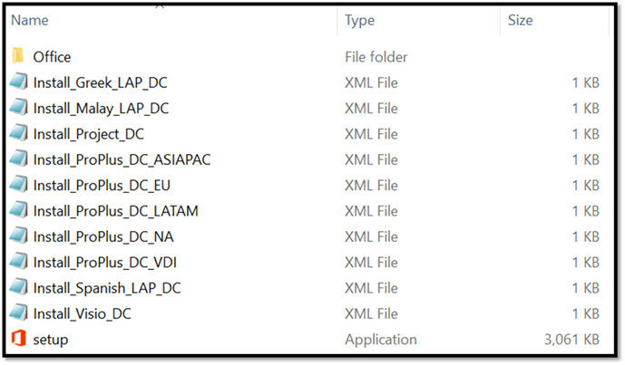

# Best practices: System Center Configuration Manager configuration for enterprise managed

 *The Best Practices Guide includes deployment recommendations and real-world examples from the Office 365 Product Group and delivery experts from Microsoft Services. For a list of all the articles, see [Best practices](best-practices.md).* 
  
 *Enterprise Managed*  will use their existing enterprise software deployment and management tool, System Center Configuration Manager, to deploy Office 365 client packages. The packages are set to install silently because task sequences are used to configure and install a stack of products.
  
The task sequence does the following:
  
- Run OffScrub
    
  - Remove all Office 2007 components if found
    
  - Remove all Office 2010 components if found
    
  - Leave user data in place
    
- Install InfoPath 2013 MSI
    
- Install Office 365 ProPlus with proper channel, architecture, and languages from System Center Configuration Manager
    
## OffScrub

The following table includes the OffScrub command lines that Enterprise Managed used to remove previous versions of Office: 
  
|||
|:-----|:-----|
|**Context for program**   |**Command line**   |
|Office 2007 Removal    |Command prompt cscript Offscrub2007.vbs clientall /bypass 1 /log c:\\temp /nocancel /q    |
|Office 2010 Removal    |Command prompt cscript Offscrub2010.vbs clientall /bypass 1 /log c:\\temp /nocancel /q    |
|Office 2013 MSI Removal    |Command prompt cscript OffScrub_O15msi clientall /bypass 1 /log c:\\temp /nocancel /q    |
   
## Office source location

The following image shows an example of the Office source location for Enterprise Managed 32-bit Semi-Annual Channel. The ODT setup.exe is next to the downloaded Office 365 client source files and install XML files. This allows for the file paths to always be relative; therefore, a source path is not needed for the install XML. This is recommended for System Center Configuration Manager deployments because you don't need to be concerned about the names of the distribution points of local CCMCache.
  

  
The previous image is an example of an Office 365 ProPlus System Center Configuration Manager 32-bit Semi-Annual Channel package: the ODT setup.exe, all of the install XML files, and all of the Office 365 client bits.
  
Examples of the programs for the package are as follows:
  
|||
|:-----|:-----|
|**Context for program**   |**Command line**   |
|Semi-Annual Channel 32-bit with Shared Computing Activation    |Setup.exe /configure Install_ProPlus_SAC_VDI.xml    |
|Semi-Annual Channel 32-bit for Desktop - North America    |Setup.exe /configure Install_ProPlus_SAC_NA.xml    |
|Semi-Annual Channel 32-bit for Desktop - LATAM    |Setup.exe /configure Install_ProPlus_SAC_LATAM.xml    |
|Semi-Annual Channel 32-bit Project Pro (VL)    |Setup.exe /configure Install_Project_SAC.xml    |
   
Individual languages are added as software programs and placed in the software catalog for users that want additional languages to self-provision. The install XMLs leverage the **Product ID="LanguagePack"** element.
  
|||
|:-----|:-----|
|**Context for program**   |**Command line**   |
|Greek    |Setup.exe /configure Install_Greek_LAP_SAC.xml    |
|Spanish    |Setup.exe /configure Install_Spanish_LAP_SAC.xml    |
|Malay    |Setup.exe /configure Install_Malay_LAP_SAC.xml    |
   
## System Center Configuration Manager step-by-step configuration

Reference the following links to configure System Center Configuration Manager to deploy and managed Office 365 ProPlus:
  
- [Deploy Office 365 ProPlus by using System Center Configuration Manager](https://technet.microsoft.com/en-us/library/dn708063.aspx)
    
- [Manage updates to Office 365 ProPlus with System Center Configuration Manager](https://technet.microsoft.com/en-us/library/mt628083.aspx)
    

