# Change management for Office 365 clients

The client applications that are included with Office 365 are released regularly with updates that provide new features and functionality together with security and other updates. Windows 10 has also adopted this servicing model and is also releasing new functionality regularly. As an IT Professional, you need to understand this servicing model and how you can manage the releases while your organization takes advantage of the new functionality. 
  
This article gives you an overview of this servicing model, and helps you understand the release channels and cadence, and how to effectively manage releases of the Office 365 client applications for your organization.
  
In this article:
  
- [A Servicing Model for Updates](change-management-for-office-365-clients.md#ServicingModel)
    
- [Release Options](change-management-for-office-365-clients.md#Branches)
    
- [Release Cadences](change-management-for-office-365-clients.md#Cadence)
    
- [Types of Changes](change-management-for-office-365-clients.md#Changes)
    
- [Roles and Responsibilities](change-management-for-office-365-clients.md#Roles)
    
- [Manage Update Deployments](change-management-for-office-365-clients.md#Manage)
    
Download this information as a model poster in [Visio](https://go.microsoft.com/fwlink/?LinkId=626680) or [PDF](https://go.microsoft.com/fwlink/?LinkId=626681) format.
  
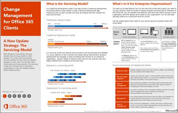
  
## A Servicing Model for Updates

Both Windows 10 and Office 365 have adopted the servicing model for client updates. This means that new features, non-security updates, and security updates are released regularly, so your users can have the latest functionality and improvements. The servicing model also includes time for enterprise organizations to test and validate releases before adopting them.
  
### What is the Servicing Model?

In a traditional development model it can take months of planning, development, and testing before a large release is ready. Traditional deployments take enterprises years to plan, evaluate test, pilot, and deploy and then maintain the entire environment. 
  
The following illustration shows a traditional release model:
  
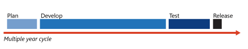
  
The following illustration shows a traditional deployment model:
  
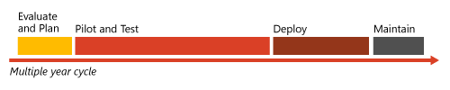
  
In a servicing model, new features and innovations can be developed and released in a quicker cadence, so that customers are always seeing improvements. Because development has changed, so does the deployment process for an enterprise organization. Quicker releases of features means that you can evaluate, pilot, and deploy different sets of features at the same time.
  
The following illustration shows releases in a servicing world:
  
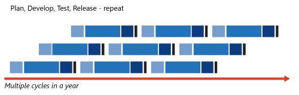
  
The following illustration shows deployment in a servicing world:
  
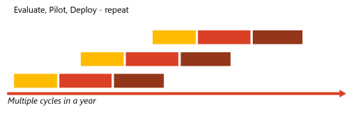
  
### What's in it for Enterprise Organizations?

You want up-to-date features, but you also want the control and support you need to run your business. With the variety of release programs for Windows 10 and Office 365, you can evaluate new features, pilot them with specific groups in your organization, and then deploy them more broadly to your organization. You can also keep specialized devices on a long-term build if you need to limit changes.
  
Use the update option that's right for your devices and your business needs. We recommend the following:
  
|||||
|:-----|:-----|:-----|:-----|
|**Device type**   |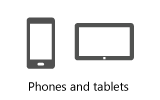|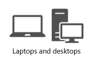|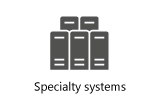|
|**Update option**   |iOS or Android devices receive regular updates from their respective app stores. Devices running the Office Mobile apps automatically receive regular updates from the Microsoft Store.     For Windows 10 devices, use Semi-Annual Channel to get regular updates with the latest features.    |To get regular updates with the latest features, use Semi-Annual Channel for Windows 10 and Monthly Channel for Office 365.     Have custom add-ins? Choose Semi-Annual Channel for Office 365, so you have time to test. For Windows 10, use Semi-Annual Channel with a targeted group of devices before deploying broadly.    |To limit changes, use Long-Term Servicing Channel for Windows 10. If Office is needed, use Office Professional Plus 2016 (using MSI files).     Examples of specialized devices: PCs that control medical equipment, point-of-sale systems, or ATMs.    |
   
#### Focus on your business, not managing the software.

The following table explains ways you can focus on your business, not managing the software, with the Office 365 client applications.
  
|||
|:-----|:-----|
|**Stay up to date**   |Regular updates mean your users' phones, tablets, and desktops stay up to date with the latest fixes.    |
|**Mix and match programs**   |Follow your business needs - not all systems need to follow the same deployment model. You can even use different models for Windows and Office on the same devices.    |
|**Save on management**   |Allow automatic updates to Semi-Annual Channel, for Windows 10 and Office 365, instead of managing the software packages yourself.    |
|**Stay in the loop**   |See what's coming in the next releases and find out what security updates have been included by reviewing communications from Microsoft.    |
|**Manage risk**   |To test critical line-of-business applications, use Semi-Annual Channel or Semi-Annual Channel (Targeted) for Office 365. For Windows 10, use Semi-Annual Channel with a targeted group of devices before deploying broadly.    |
|**Save on development**   |First, check the marketplace - others may have a solution that works. If you need custom development, use best practices to ensure add-ins work after updates.    |
   
## Release Options

You need to understand the different release options for Windows 10 and the Office 365 client applications so you can choose the right options for your business. You decide what works and choose the combinations of releases to support for your organization. This section provides an overview and helps you choose.
  
### Summary of Release Options

Use the following table to choose the right release option for your business needs:
  
|**             Up to date innovation**|**             Have time to evaluate**|**             Security, always**|
|:-----|:-----|:-----|
|Get the latest features right away. Choose Semi-Annual Channel for Windows 10 and Monthly Channel for Office 365.    |Test with your existing systems. Choose Semi-Annual Channel or Semi-Annual Channel (Targeted) for Office 365. For Windows 10, use Semi-Annual Channel with a targeted group of devices before deploying broadly.    |You'll always get the latest security updates, no waiting, whichever channel you choose.    |
   
### Default channels for client applications

Office 365 ProPlus includes the following Office applications: Word, Excel, PowerPoint, Outlook, OneNote, Access, Skype for Business, and Publisher. Project Online Desktop Client and Visio Pro for Office 365 also follow this release model. 
  
The following illustration shows these sets of client applications.
  
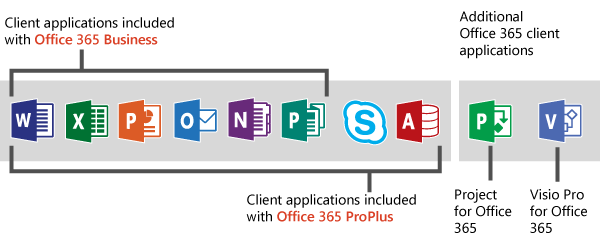
  
By default, the client applications for Office 365 are set to these channel releases:
  
- **Office 365 ProPlus** is set to use Semi-Annual Channel.
    
- **Project Online Desktop Client** and **Visio Pro for Office 365** are set to use Monthly Channel.
    
But you can determine which channel is used for your client applications, according to your business needs.
  
For more information about the channels for Office 365 client applications, see [Overview of update channels](overview-of-update-channels-for-office-365-proplus.md).
  
### Which Release Channel?

This table shows the release channels for Windows 10 and Office 365 clients.
  
|**Release Channels**|**Available for Office 365 client?**|**Available for Windows 10?**|
|:-----|:-----|:-----|
|**Windows Insider Preview** lets you preview features and give feedback.   |No    |Yes    |
|**Monthly Channel** gives your users the latest released features. It's usually best for users who don't have other apps, add-ins, or macros that need to be extensively tested with Office. It's also useful for some test systems or pilot programs.   |Yes    |No    |
|**Semi-Annual Channel** for Windows 10 gives your users the latest released features. Ideal for pilot deployments and testing of Windows 10 feature updates and for users, such as developers, who need to work with the latest features immediately.   |No    |Yes    |
|**Semi-Annual Channel (Targeted)** gives you time to check out the features and test your customizations or processes.   |Yes    |No    |
|**Semi-Annual Channel** for Office 365 gives you several months lead-time before you get the latest features. It's usually best for users that have line-of-business applications, add-ins, or macros that are business critical.   |Yes    |No    |
|**Office Professional Plus 2016** client installs (using MSI files) is good for scenarios where maximum control is required and the device has limited internet access.   |No    |No    |
|**Long-Term Servicing Channel** is intended for specialized devices, where limiting changes to the operating system is of prime importance. For example, PCs that control medical equipment, point-of-sale systems, or ATMs.   |No    |Yes    |
   
The release channels at the top of the table provide the freshest features, those at the bottom provide the most administrative control. Freshness indicates rapid access to new features and the ability to provide feedback to Microsoft. You'll sacrifice features for extra control - use the most controlled options for specialized devices, such as devices used on factory floors, for air traffic control, or in emergency rooms. Semi-Annual Channel for Office 365 offers a balance between new features and control. 
  
## Release Cadences

It is important to keep both Windows and your Office clients up to date. Office 365 and Windows 10 have aligned release cadences to make this easier. Both will have regular security updates and will have new features releasing twice per year. For specialized devices running Windows 10, there is a long-term servicing channel available which provides regular security updates but only provides new features every few years.
  
### Windows 10 Release Cadence

Windows 10 has three types of releases:
  
- **Windows Insider Preview** Join the [Windows Insider](https://insider.windows.com/) program to evaluate and provide feedback on pre-release features, and perform application compatibility validation testing. New features are released frequently.
    
- **Semi-Annual Channel** After new features have been tested through the Windows Insider program, they are released along with bug fixes and security patches as the Semi-Annual Channel. A new Semi-Annual Channel is released twice a year, around March and September, and is supported for 18 months. Start by deploying to a targeted group of devices that represent the broader organization.
    
    Approximately 4 months after a Semi-Annual Channel release, Microsoft will announce broad deployment readiness, indicating that Microsoft, independent software vendors (ISVs), partners, and customers believe that the release is ready for broad deployment. But, organizations can begin broad deployment whenever they're ready. 
    
- **Long-Term Servicing Channel** This channel provides a supported OS platform for 10 years. Enterprises can choose to move to a new release or stay where they are at and skip to the next one. The Long-Term Servicing Channel is intended for specialized devices, such as PCs that control medical equipment, point-of-sale systems, or ATMs. If Office is needed, use Office Professional Plus 2016 with these specialized devices.
    
The following illustration shows the relationships between these releases for Windows 10.
  
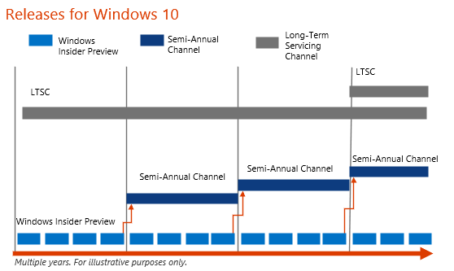
  
Read [Overview of Windows as a service](https://go.microsoft.com/fwlink/?LinkId=847278) for more information.
  
### Office 365 Client Release Cadence

Office 365 clients have the following types of releases:
  
- **Monthly Channel** New features, security updates, and fixes are released to Monthly Channel approximately every month.
    
- **Semi-Annual Channel (Targeted)** You can validate this release for four months before it becomes a Semi-Annual Channel release. New features are included only at the beginning of a release, in March and September. This channel is refreshed with non-security updates and security updates every month.
    
- **Semi-Annual Channel** The Semi-Annual Channel (Targeted) is rolled up and released as the Semi-Annual Channel every 6 months, in January and July. No new features are added until the next Semi-Annual Channel, although security updates will continue to be released. Each Semi-Annual Channel feature release is supported for an additional 14 months. This is the default channel for Office 365 ProPlus clients.
    
Read [Overview of update channels](overview-of-update-channels-for-office-365-proplus.md) for more information.
  
The following illustration shows the relationships between these releases for Office 365 ProPlus. 
  
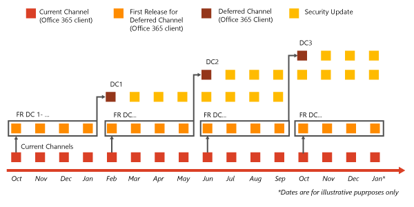
  
### Office Mobile Apps

Office Mobile Apps for iOS and Android have regular releases available through their respective app stores. Office Mobile Apps for Windows have regular releases available through the Microsoft Store.
  
### Office Professional Plus 2016 client installs

Security updates are made available for the Office clients that you install by using .MSI files as part of the Office Volume Licensing program. New features are not delivered outside of full product releases. Use, if Office is needed, for specialized devices on the Long-Term Servicing Channel of Windows 10.
  
### Deployment tools

The following table lists the deployment tools that can be used for Windows 10 and the Office 365 client applications:
  
|**Tool**|**Supported for Windows 10?**|**Supported for Office 365 clients?**|
|:-----|:-----|:-----|
|Windows Update for Business    |Yes    |No    |
|Windows Server Update Services    |Yes    |No    |
|System Center Configuration Manager    |Yes    |Yes    |
|Microsoft InTune    |Yes    |Yes    |
|3rd party software deployment tools    |Yes    |Yes    |
   
## Types of Changes

There are several types of changes that are made to Office 365 on a regular basis. The communication channels for those changes, and the actions that you might have to take for them will vary, depending on the type of change.
  
This section explains the types of changes you can expect, when to expect changes, and what you need to do to be prepared for changes in Office 365.
  
### Types of Changes for the Office 365 Service and Client Applications

Not all changes have the same impact on your users or require action. Some are planned and some unplanned by their nature (non-security updates and security updates aren't usually planned in advance). Depending on the type of change, the communication channel also varies. The following table lists the types of changes you can expect for the Office 365 service and client applications.
  
||**             Functionality**|**             Non-security updates**|**             Security**|
|:-----|:-----|:-----|:-----|
|**Type of change**   | Feature updates    New features or applications    Deprecated features   | Client hotfixes for issues   | Security patches   |
|**Advance notice?**   |30 days notice for changes that require action    |No, these are included in the monthly build for all channels    |No, these are included in the monthly build for all channels    |
|**Communication channel**   | Message Center   [Office 365 Roadmap](https://go.microsoft.com/fwlink/?LinkID=529454)   [Office Blog](https://go.microsoft.com/fwlink/?LinkId=626089)   [Office 365 ](https://go.microsoft.com/fwlink/p/?linkid=860047) space on the Microsoft Tech Community   | TechNet [Office 365 client update channel releases](https://go.microsoft.com/fwlink/?LinkID=626090) page   | Security bulletin or CVE   |
|**Requires tenant admin action?**   |Sometimes    |Rarely    |Rarely    |
|**What kind of action?**   | Change settings    Communicate changes to users    Validate customizations   | Change admin settings   ||
|**Requires testing?**   |Rarely - check business critical Add-ins    |Sometimes - testing the fix against processes or customizations    |Rarely    |
|**Examples of changes**   | Feature updates: PowerPoint - simpler process for embedding videos     New features or applications: Skype for Business   | Hotfixes based on customer reported bugs   ||
   
### Guidelines for managing change when using Office Add-ins:

- We recommend that customers use Monthly Channel to get the latest feature updates. If you have Office customizations or Add-ins deployed, you can use Semi-Annual Channel, which allows you to wait for feature updates to Office until you have had the chance to test and fix your customizations. To test and fix your customizations before those features updates are applied to Semi-Annual Channel, use Semi-Annual Channel (Targeted). Use the Office Telemetry Dashboard to check Add-ins for compatibility. For more information, see [Compatibility and telemetry in Office](https://go.microsoft.com/fwlink/?LinkId=626610).
    
- If your developers built the Office Add-in, we suggest they update the code and redeploy the custom Office Add-in.
    
- If you built your customization using VBA, VSTO, or COM, consider rebuilding your customization as an Office Add-in, or check the Office Store to see if there is a 3rd-party Add-in that provides similar functionality.
    
- Consider decommissioning Office Add-in that are no longer used or have low utilization.
    
More information about [Office Add-ins](https://go.microsoft.com/fwlink/?LinkID=626869).
  
### Tips for Testing

For functionality changes, you should test against your add-ins and other customizations to see if you need to update them. Use these tips for testing:
  
- Don't wait - have a pilot team use Monthly Channel to start evaluating new features. Use Semi-Annual Channel (Targeted) if you need a longer lead time for testing.
    
- Use an Azure virtual environment to test against your customizations or processes.
    
- Align your work with the release schedule - schedule testing passes monthly.
    
## Roles and Responsibilities

Responsibility for managing change is shared between Microsoft and you as the admin of your Office 365 tenancy. The balance of responsibility is different for an online service than it is for an on-premises server or client.
  
Understand the roles both Microsoft and you need to play before, during, and after a change occurs to the service.
  
Review what's included in each release on the [Office 365 client update channel releases](https://go.microsoft.com/fwlink/?LinkId=626090) page on TechNet.
  
### Balance of Responsibility

In a service offering, the balance of responsibility for things such as hardware maintenance and security updates shifts to the service provider (Microsoft) instead of the customer (you). However, you still need to ensure that custom software continues to function as expected when updates are rolled out.
  
For on-premises products, your organization takes on most of the responsibility for managing change.
  
Your responsibility for change management is based on the type of service. The following table summarizes the balance of responsibility for both Microsoft and the customer for online services and on-premises software.
  
||**Office 365 service** ||**Office 365 clients** ||**On-premises clients and servers** ||
|:-----|:-----|:-----|:-----|:-----|:-----|:-----|
|**Responsibility**   |**Microsoft**   |**Customer**   |**Microsoft**   |**Customer**   |**Microsoft**   |**Customer**   |
|Provide new functionality    |X    ||X    ||X    |X    |
|Test new features for quality assurance    |X    ||X    |X    |X    |X    |
|Communicate about new features    |X    |X    |X    |X    |X    |X    |
|Integrate custom software    |X    |X    |X    |X    ||X    |
|Apply security updates    |X    |||X    ||X    |
|Maintain system software    |X    |||X    ||X    |
|Maintain hardware    |X    |||X    ||X    |
   
### Microsoft's Role and Your Role

Microsoft and you both play a role in managing change for Office 365 before, during, and after a change.
  
#### Before a change

Microsoft's role
  
- Set expectations for service changes.
    
- Notify customers 30 days in advance for changes that require administrator action.
    
- Publish majority of new features and updates on the [Office 365 Roadmap](https://go.microsoft.com/fwlink/?LinkID=529454).
    
Customer's role
  
- Understand what to expect for changes and communications.
    
- Read Message Center, [Office 365 Roadmap](https://go.microsoft.com/fwlink/?LinkID=529454) and [Office Blog](https://go.microsoft.com/fwlink/?LinkId=626089) regularly.
    
- Set up pilot teams to preview new functionality using Monthly Channel.
    
- Review and update internal change management processes.
    
- Understand the Office 365 system requirements and check compliance.
    
#### During a change

Microsoft's role
  
- Roll change out to customers.
    
- Specifically for Office 365 clients: release a new Monthly Channel approximately each month and new security and non-security updates, if needed, for Semi-Annual Channel.
    
- Monitor telemetry and support escalations for any unexpected issues.
    
Customer's role
  
- Check Message Center and review the additional information link.
    
- Take any action required (if applicable) and test any add-ins.
    
- If using an internal share for updates, download the latest builds and upload to your share.
    
- If a break/fix scenario is experienced, create a Support Request.
    
#### After a change

Microsoft's role
  
- Listen to customer feedback to improve rollout of future changes.
    
- Listen to feedback on the [Office 365 ](https://go.microsoft.com/fwlink/p/?linkid=860047) space on the Microsoft Tech Community and in the admin feedback tool.
    
- Update [Office 365 Roadmap](https://go.microsoft.com/fwlink/?LinkID=529454) statuses and add new features.
    
Customer's role
  
- Work with people in your organization to adopt the change (get help on [Microsoft FastTrack](https://go.microsoft.com/fwlink/p/?linkid=860046)).
    
- Review change management processes and bottlenecks for opportunities to streamline, and use more Microsoft resources.
    
- Provide general feedback on the [Office 365 ](https://go.microsoft.com/fwlink/p/?linkid=860047) space on the Microsoft Tech Community and specific feedback in the admin feedback tool.
    
- Train users to provide app specific feedback using the Smile button in Office apps.
    
## Manage Update Deployments

You choose when and how updates are deployed to your organization by configuring:
  
- **Which channel to use.** This controls how often updates are available.
    
- **Which update method to use (automatic or manual).** This controls how your client computers get the updates.
    
### How to Apply Updates

You can decide how updates are deployed to your users' computers. You can allow the client computers to automatically receive updates over the Internet or from an on-premises location. Alternatively, you might want to have more control by packaging the updates yourself and manually delivering them to client computers over your network.
  
#### Methods for applying Office updates to client computers

The following table explains three methods you can use to apply Office updates to client computers.
  
|**Automatic**|**Manual**|
|:-----|:-----|
|**From the Internet**   |**From an on-premises location**   |**From an on-premises location**   |
|Microsoft makes an updated build available on the Internet. The client computers automatically install the updates when they are available.    |An administrator downloads the updated build to an on-premises location. The client computers automatically install the updates when they are available.    |An administrator downloads the updated build to an on-premises location. The administrator uses scripts or software distribution tools to push the updated build to the client computers.    |
   
The following illustration shows these methods:
  
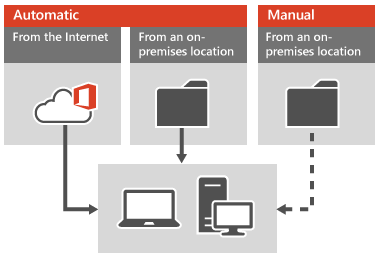
  
#### Do you need to control the delivery of updates?

To decide which method to use, consider the following scenarios:
  
- Customizations
    
  - **Allow automatic updates for...**Users or computers that are primarily for productivity and don't use customizations or integrated solutions.
    
    Recommended Channel: 
Monthly Channel
    
  - **Use manual delivery of updates for...**Users or computers that rely on customizations or integrated solutions that work with the Office 365 clients.
    
    Recommended Channel: 
Semi-Annual Channel. Validate by using Semi-Annual Channel (Targeted). 
    
- Managed or un-managed computers?
    
  - **Allow automatic updates from the Internet for...**Consumers and small businesses without an IT department.
    
  - **Deploy from an on-premises location when...**You want to control when updates are pushed out to your organization's computers.
    
### How to configure channels and update methods

Use the following methods to configure which channels are used by which client computers and how those clients computers are updated:
  
- Office Deployment Tool
    
- Group Policy - for centralized administration of domain-joined computers.
    
## See also

#### Other Resources

[Overview of update channels for Office 365 ProPlus](overview-of-update-channels-for-office-365-proplus.md)
  
[Overview of Windows as a service](https://go.microsoft.com/fwlink/?LinkId=847278)
  
[Microsoft cloud IT architecture resources](https://go.microsoft.com/fwlink/?LinkId=690243)
  
[Office 365 client update channel releases](https://go.microsoft.com/fwlink/?LinkId=626090)

