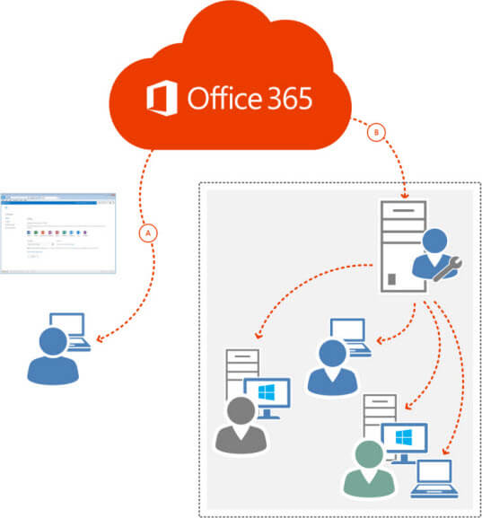

# Choose how to deploy Office 365 ProPlus

- [Deploy with System Center Configuration Manager](https://docs.microsoft.com/en-us/sccm/sum/deploy-use/manage-office-365-proplus-updates): How to deploy Office 365 ProPlus with Configuration Manager version 1702. For how to deploy with earlier versions , see [Deploy Office 365 ProPlus with System Center Configuration Manager](deploy-office-365-proplus-with-system-center-configuration-manager.md)
  
- [Deploy Office 365 ProPlus from a local source](deploy-office-365-proplus-from-a-local-source.md): Step-by-step instructions for deploying Office 365 ProPlus from a shared folder on your network with the Office Deployment Tool.
  
- [Deploy Office 365 ProPlus from the cloud](deploy-office-365-proplus-from-the-cloud.md): Step-by-step instructions for deploying Office 365 ProPlus from the Office CDN with the Office Deployment Tool.
  
## How to choose

There are two ways that you can deploy Office 365 ProPlus in your organization:
  
- Have users install Office 365 ProPlus directly from the Office 365 portal. For more details on this method, see [Set up Office 365 for business](https://support.office.com/en-US/Article/set-up-Office-365-for-business-6a3a29a0-e616-4713-99d1-15eda62d04fa).
    
- Download the Office 365 ProPlus software to your local network and then deploy it to your users from a local share using the Office Deployment Tool, System Center Configuration Manager, or another software distribution tool.
    

  
Which deployment method you use depends on what's most important for your organization. For example, to install from the Office 365 portal requires the least amount of administrative setup, but gives you less control over the deployment.
  
If you want more control over your deployment, download the Office 365 ProPlus software to an on-premises location, such as a local network share. You can then control the following:
  
- Which individual Office programs are installed.
    
- Where on the network Office 365 ProPlus is installed from.
    
- How Office 365 ProPlus is updated after it is installed.
    
- Which computers Office 365 ProPlus is installed on.
    
- Which users, if any, get the 64-bit version of Office 365 ProPlus.
    
- Which languages are available to install.
    
Also, by downloading Office 365 ProPlus to your local network, you can use many of the same tools that you already use to deploy and configure other versions of Office, including System Center Configuration Manager.
  
Whichever deployment method you use, Office 365 ProPlus is installed and runs locally on the user's computer. Office 365 ProPlus is not a web-based version of Office. Users don't have to be connected to the Internet all the time to use it.
  
## Related Topics

[Deployment guide for Office 365 ProPlus](deployment-guide-for-office-365-proplus.md)
  
[Best practices](best-practices/best-practices.md)
  

