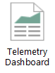
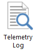
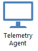
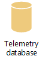
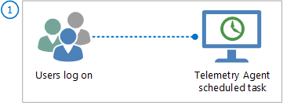
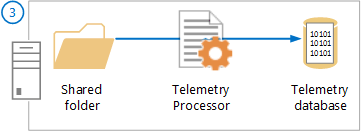

# Telemetry Dashboard topology, sizing, and bandwidth planning

***Applies to:*** *Office 365 ProPlus, Office 2019, and Office 2016*

> [!NOTE]
> To assess your Office compatibility, we recommend using the [Readiness Toolkit for Office add-ins and VBA](https://www.microsoft.com/en-us/download/details.aspx?id=55983). The Readiness Toolkit is a free download and can be used to identify the VBA macros and add-ins used in your organization. Also, the Excel-based readiness reports can tell you which add-ins are adopted or supported in Office 365 ProPlus and can provide suggestions on how to remediate VBA macros issues that are identified. For more information, see [Use the Readiness Toolkit to assess application compatibility for Office 365 ProPlus](../use-the-readiness-toolkit-to-assess-application-compatibility-for-office-365-pro.md).

  
When you deploy Telemetry Dashboard, you must consider several factors. These can include the location of the users to be monitored and the hardware specifications of the computer that runs the telemetry processor and other components that deliver the data to Telemetry Dashboard. It's also important to understand the supported limits for Telemetry Dashboard deployments, such as the maximum number of users who can be monitored. Use the guidance in this article to help you design a Telemetry Dashboard topology that is sized appropriately for your organization.
  
    

## Introducing telemetry for Office

Telemetry Dashboard is an Excel workbook that displays compatibility and inventory data about the Office files, Office add-ins, and Office solutions that are used in an organization. For a visual representation of the telemetry components used to support Telemetry Dashboard and how they work, download the [Telemetry in Office 2013](https://go.microsoft.com/fwlink/p/?LinkId=266531) poster. This poster includes a description of all components, a list of what Office files are monitored, how data collection works, and more. Although the poster is for an earlier version of Office, the information also applies to newer versions of Office.
  
  

## Before you begin planning Telemetry Dashboard deployment

Ensure that you have reviewed the content in [Assess Office compatibility](assess-office-compatibility.md). This article introduces you to the compatibility process you use with Telemetry Dashboard to gather data for Office deployment. 
  
As you review this article, be aware that the recommendations assume that the following statements are true for your organization:
  
- Telemetry agents upload data every 8 hours, which is the default setting.
    
- Each user has a single computer that runs an agent.
    
If these statements are not true for your organization, plan to adjust your topology accordingly.
  

## Office telemetry tools and components

The following table describes the tools and components for Office telemetry:
  
**Office telemetry tools**

|**Tool**|**Description**|
|:-----|:-----|
|| Telemetry Dashboard:      - Shows IT Pros a combined view of inventory and telemetry data    - Requires Excel 2019 or Excel 2016    - Is installed with Office 365 ProPlus, Office Professional Plus 2019, and Office Professional Plus 2016    - Connects to the telemetry database    - Can be viewed by multiple IT Pros    |
|| Telemetry log:     - Helps developers and experienced users diagnose compatibility issues that occur on an Office client    - Requires Excel 2019 or Excel 2016    - Is installed with Office 365 ProPlus, Office Professional Plus 2019, and Office Professional Plus 2016    - Connects to the local data store on the client computer    |
   
The following table describes the components of Office telemetry. The first two components shown below are required for both Telemetry Log and Telemetry Dashboard. The remaining components that are listed are applicable only to Telemetry Dashboard. These components collect telemetry data from across an organization so that you can view it by using Telemetry Dashboard. To learn how to deploy these components, see [Deploy Telemetry Dashboard](deploy-telemetry-dashboard.md).
  
**Office telemetry components**

|**Component**|**Description**|
|:-----|:-----|
|| Telemetry logging:     - Monitors events for (and is built into) Office 2019 and Office 2016 versions of Word, Excel, PowerPoint, and Outlook.    - Is disabled by default.    - Is enabled by using Group Policy, registry settings, or by selecting the **Enable Logging** button in Telemetry Log.    - The resulting telemetry data can be viewed on the local computer by using telemetry log.    |
|| Telemetry agent:     - Reports usage and inventory data for all Office clients.    - Reports application event data for Office clients.   - Must be deployed to Office 2003, Office 2007, and Office 2010 clients.    - Is built into Office 2019, Office 2016, and Office 2013 clients.    - Must be enabled using Group Policy or the registry.    - Runs as a scheduled task.    - Requires domain membership.    - Periodically uploads data to a shared folder.    - Requires the latest version of the Universal C Runtime (CRT). For more information, see [Update for Universal C Runtime in Windows](https://support.microsoft.com/kb/2999226).    |
|| Group Policy settings:     - Enable and configure the telemetry agent on each client.    - Are part of Office16.admx and Office16.adml.    - Are located under User Configuration\Policies\Administrative Templates\Microsoft Office 2016\Telemetry Dashboard.    - Can be downloaded from the [Microsoft Download Center](https://go.microsoft.com/fwlink/p/?LinkId=626001).    |
|| Shared folder:     - Stores telemetry data that is uploaded by telemetry agents.    - Must be on premises (no cloud support).    - Can be located on the same computer as other telemetry components.    - Is configured when you install the telemetry processor.    |
|| Telemetry processor:     - Uploads data from the shared folder to the telemetry database.    - Runs as a Windows service named "Office Telemetry Processor".    - Is supported on Windows Server 2008 and later versions.    - Can be run on Windows 7 with Service Pack 1, Windows 8, and Windows 8.1 in test or small environments.    - Can be run on the same computer as other telemetry components.    - Can be installed on multiple computers for large deployments.    - Requires domain membership unless a workaround is used.    - Requires the latest version of the Universal C Runtime (CRT). For more information, see [Update for Universal C Runtime in Windows](https://support.microsoft.com/kb/2999226).    |
|| Telemetry database:     - Provides a data source for Telemetry Dashboard.    - Requires SQL Server 2005, SQL Server 2008, SQL Server 2008 R2, SQL Server 2012, SQL Server 2014, or SQL Server 2016.    - Can be run on SQL Express editions in test or small environments.    - Can be run on the same computer as other telemetry components.    |
   

## How telemetry data is collected

The following table describes and illustrates how data collection is triggered and the flow of data between the telemetry agents and Telemetry Dashboard. You can view a more detailed diagram in the [Office telemetry poster](https://go.microsoft.com/fwlink/p/?LinkId=266531). Although the poster is for an earlier version of Office, the information also applies to newer versions of Office.
  
**Steps in the data collection process**

|**Step**|**Description**|
|:-----|:-----|
|**Users log on and trigger the telemetry agent scheduled task** | Users log on and trigger the scheduled task that uploads telemetry data. The agent waits 10 minutes for logon processes to complete, and then the agent waits for a random number of minutes, up to 4 hours, before it starts the upload process.     After the initial upload, the agent uploads telemetry data every 8 hours. Mobile or offline clients upload data when users log on when the connection is restored.     To learn how to configure the upload interval for telemetry agents, see [Enabling and configuring the telemetry agent](deploy-telemetry-dashboard.md#configure).    |
|**Telemetry agents send data to the shared folder** | In this image, telemetry agents for all versions of Office collect the following data to upload to the shared folder:      - Most recently used documents    - Registered add-ins    - System and user information      Telemetry agents for Office 2019 and Office 2016 also collect the following data for certain Office applications:     - Application events    - Add-in performance      Here are the approximate data upload sizes (in KB) for telemetry agents. These sizes can vary.     - **Office 2003, Office 2007, and Office 2010**: 50 KB per upload    - **Office 2013 or later**: 64 KB per upload      To learn more about the kinds of data that are uploaded and how to manage user privacy for this data, see [Manage the privacy of data monitored by telemetry in Office](manage-the-privacy-of-data-monitored-by-telemetry-in-office.md).    |
|**Telemetry data is processed to the database** | After the agents upload data to the shared folder, the Telemetry Processor imports the data to the telemetry database.     The shared folder, Telemetry Processor, and telemetry database can run on the same computer or on different computers.   |
|**IT Pros access telemetry data by using Telemetry Dashboard** |IT Pros who are granted permissions to the telemetry database can use Telemetry Dashboard to view the combined data. To learn more, see [To grant other administrators permission to access the telemetry database](deploy-telemetry-dashboard.md#permissions).    |
   

## Planning labels for telemetry agents

The telemetry agent collects inventory, usage, and telemetry data and uploads it to a shared folder. To help you filter and organize this data when it is displayed in Telemetry Dashboard, you can assign up to four custom labels for each agent to describe the client computer's physical location, the user's business group, user role, or other identifier. This helps you analyze telemetry data for specific business groups, types of users, or any other designation that you choose. Use the following resources to help you plan the labels that you want to use before you deploy and enable the agents:
  
- [Deploying labels (tags) for better analysis in Telemetry Dashboard](https://go.microsoft.com/fwlink/p/?LinkId=296706) describes how labels appear in Telemetry Dashboard. The blog post also describes three methods for populating the labels. For Office 2019 and Office 2016, use Group Policy and set labels based on your Active Directory structure. The scripts mentioned in the blog, Create-GroupPolicyObjectForTags.ps1 and Add-Tags.vbs, do not work with Office 2019 and Office 2016. 
    
- The "Custom reporting in Telemetry Dashboard" video demonstrates how labels are used in custom reports. This may give you some additional ideas on which labels to choose. 

   > [!VIDEO https://www.microsoft.com/videoplayer/embed/ed8327e4-c063-40f5-a634-230c067d73b4?autoplay=false]
   
*Although this video is for an earlier version of Office, the information also applies to newer versions of Office.* 

## Topology requirements for Telemetry Dashboard deployments

At a minimum, Telemetry Dashboard requires one telemetry database and one telemetry processor and shared folder pair. These can be hosted on the same computer, as shown in the following figure. You can use the computer for other purposes besides hosting Telemetry Dashboard components.
  
**Minimum topology requirements for Telemetry Dashboard**

  
Two additional requirements apply to the telemetry processor and shared folder pairs:
  
- A telemetry processor must always have a dedicated shared folder. A shared folder can't be used by multiple telemetry processors.
    
- You can have multiple telemetry processors and shared folder pairs, but each pair must be stored on a separate computer. The next section, [Supported limits for Telemetry Dashboard components](plan-telemetry-dashboard-deployment.md#sizing), describes the numbers of pairs that you can create in a Telemetry Dashboard topology.
    

## Supported limits for Telemetry Dashboard components

For best performance, we recommend that your Telemetry Dashboard topology does not exceed the limits that are described in the following table.
  
**Supported limits for Telemetry Dashboard components**

|**Supported limits for a telemetry database**|**Supported limits for each telemetry processor and shared folder pair**|
|:-----|:-----|
| - Host telemetry data for up to 100,000 users.    - Host up to ten telemetry processor and shared folder pairs.    - Host up to 30 users of Telemetry Dashboard.   Hosting of more than 30 users is supported but, when multiple users try to connect to the database at the same time, database performance may decrease temporarily.    | Process data for up to 50,000 users.    |
   
Here is a figure that shows a production topology that is configured within the supported limits. Each telemetry processor and shared folder pair has fewer than 50,000 users and this topology already has the maximum of 100,000 users for the telemetry database. Three computers host telemetry components in this example.
  
**Production topology for Telemetry Dashboard**

  

## Topology and bandwidth recommendations for Telemetry Dashboard deployments

If your organization has users who are in multiple geographic locations, make sure that you follow these guidelines when you decide where you want to deploy the Telemetry Dashboard components. 
  
- We recommend that you host the Telemetry Dashboard components (the dashboard, telemetry database, telemetry processor, shared folder, and telemetry agents) on a network that has bandwidth of 1.5 Mbps (T1) or more, with latencies no greater than 150 ms.
    
- Deploy each telemetry processor and shared folder pair as close as possible, ideally on the same computer.
    
- If you only need one telemetry processor and shared folder pair, run the telemetry database, telemetry processor, and shared folder on the same computer to avoid any bottlenecks that are caused by transferring data over the network.
    
- If you must have multiple telemetry processor and shared folder pairs, run one telemetry processor on the same computer as the telemetry database. Run other telemetry processors on separate computers.
    
For a telemetry database that hosts more than 10,000 users, consider the following recommendations, in addition to general performance recommendations for SQL Server:
  
- For the best performance, deploy SQL Server on a dedicated computer that is not hosting databases for any other application.
    
- For the best performance, place the tempdb, telemetry database, and SQL transaction logs on separate physical hard disks.
    
- Ensure that the SQL I/O channels to the disks are not shared by other applications, such as the paging file and Internet Information Services (IIS) logs.
    

## Scaling out Telemetry Dashboard deployments

We recommend that you start with a single dedicated computer that is running the telemetry database, telemetry processor and shared folder pair, and then scale out the topology by adding more computers that host telemetry processor and shared folder pairs. We recommend that you add a new telemetry processor and shared folder pair if you do either of the following:
  
- Collect data from more than 50,000 users.
    
- Collect data from remote sites. We recommend that you install the telemetry processor and shared folder pair as close to the agents on the client computers as possible.
    

## Hardware recommendations for Telemetry Dashboard deployments

The following table describes hardware recommendations for Telemetry Dashboard deployments.
  
**Hardware recommendations for the computer that hosts the telemetry database**

|**Monitored users and monitored duration**|**RAM**|**Disk space**|**Processor**|
|:-----|:-----|:-----|:-----|
|100 users for 3 months (evaluation)    |4 GB\*\*    |81 MB    |1 Ghz or faster    |
|10,000 users for 1 year    |8 GB\*\*    |14 GB    |2 GHz or faster    |
|100,000 users for 1 year    |32 GB\*\*    |107 GB    |2 GHz or faster    |
   
\*Includes inventory and events for earlier versions of Office and for Office 2019 and Office 2016.
  
\*\*The recommended RAM value is greater than the one recommended as the minimum values for SQL Server because of the distribution of data required for a Telemetry Dashboard environment.
  
The following table describes hardware recommendations for each computer that hosts a telemetry processor and shared folder pair.
  
**Hardware recommendations for each computer that hosts a telemetry processor and shared folder pair**

|**Monitored users and monitored duration**|**RAM**|**Disk space**|**Processor**|
|:-----|:-----|:-----|:-----|
|Any    |4 GB    |11 GB    |1 Ghz or faster    |
   
\*Includes inventory and events for both earlier versions of Office and for Office 2019 and Office 2016.
  
## Related topics

- [Compatibility and telemetry in Office](compatibility-and-telemetry-in-office.md)
- [Deploy Telemetry Dashboard](deploy-telemetry-dashboard.md)

