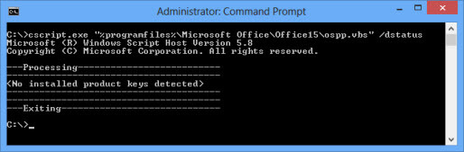

# Deploy Office 365 ProPlus as part of an operating system image

You can include [Office 365 ProPlus](about-office-365-proplus-in-the-enterprise.md) as part of an operating system image that you deploy to users in your organization. You just need to make sure you don't activate Office 365 ProPlus when you create the image. That's because you need your users to activate their Office 365 ProPlus installations by signing in with their accounts.
  
Here are the basic steps of how to include Office 365 ProPlus when you create and deploy an operating system image.
  
## 

### Step 1: Install and configure the operating system for the image

To start, install and configure the operating system on a test computer. There are several free tools from Microsoft to help you do this, such as [Windows Assessment and Deployment Kit (Windows ADK)](https://go.microsoft.com/fwlink/p/?LinkID=312996) and [Microsoft Deployment Toolkit (MDT)](https://go.microsoft.com/fwlink/p/?LinkID=268150). 
  
### Step 2: Install Office 365 ProPlus for the image by using the Office Deployment Tool

To install Office 365 ProPlus on the test computer, first download the Office 2016 version of the Office Deployment Tool from the [Microsoft Download Center](http://go.microsoft.com/fwlink/p/?LinkID=626065).
  
Then, use the [Office Deployment Tool](overview-of-the-office-2016-deployment-tool.md) to download the Office 365 ProPlus software to your local network. You also use the Office Deployment Tool to install Office 365 ProPlus on to the test computer.
  
Remember, you don't want to activate Office 365 ProPlus when you do the installation.
  
To prevent Office 365 ProPlus from trying to automatically activate during the installation, perform a silent installation. To do this, in the [configuration.xml file](configuration-options-for-the-office-2016-deployment-tool.md) that the Office Deployment Tool uses, include the following line:
  
 \<Display Level="None" AcceptEULA="True" /\>
  
When you set **Level** to **None**, you don't see any user interface elements during the installation. You won't see anything that shows the progress of the installation and you won't see any error messages.
  
> [!IMPORTANT]
> Don't sign in to the Office 365 portal to install Office 365 ProPlus from the **software** page. If you do, activation occurs automatically.   Also, don't save the setup file from the Office 365 portal to the test computer. Even if you run the setup file, which will have a file name similar to Setup.X86.en-us_O365ProPlusRetail_d079c594-698d-4370-9174-7c00f76abf00_TX_PR_.exe, from the test computer, activation occurs automatically. 
  
After the installation is complete, don't open any Office programs. If you open an Office program, you are prompted to sign-in and activate. Even if you don't sign in and you close the **Activate Office** dialog box, a temporary product key is installed. You don't want any kind of Office 365 ProPlus product key installed in your operating system image.
  
If you accidentally open an Office program, you'll have to uninstall Office 365 ProPlus, restart the computer, and then install Office 365 ProPlus again.
  
### Step 3: Install and configure other programs for the operating system image

Next, install other programs that you want to include as part of the operating system image. This includes Office add-ins you want to provide to your users.
  
Remember not to open any Office programs. After you have created the image, you can test on another computer that Office and the add-ins work correctly.
  
### Step 4: Check that an Office 365 ProPlus product key is not installed in the image

Before you save the image, you should check to make sure that no product key for Office 365 ProPlus is installed. To do this, use the ospp.vbs script. This script is installed on the computer when Office 365 ProPlus is installed.
  
For example, at a command prompt, run the following command:
  
 cscript.exe "%programfiles%\\Microsoft Office\\Office15\\ospp.vbs" /dstatus
  
You should see **\<No installed product keys detected\>**, as shown in the following screen shot.
  

  
The location of the ospp.vbs script depends on whether you install the 32-bit or 64-bit version of Office 365 ProPlus and whether you install on a 32-bit or 64 bit version of the operating system. The following table lists the possible locations of the ospp.vbs script.
  
|**Version of Office 365 ProPlus**|**Version of operating system**|**Location of ospp.vbs file**|
|:-----|:-----|:-----|
|32-bit    |32-bit    |%programfiles%\\Microsoft Office\\Office15\\    |
|32-bit    |64-bit    |%programfiles(x86)%\\Microsoft Office\\Office15\\    |
|64-bit    |64-bit    |%programfiles%\\Microsoft Office\\Office15\\    |
   
### Step 5: Save the operating system image

You can use Windows ADK or MDT 2012 to save the operating system image file that you'll deploy to your users. You can also use [System Center Configuration Manager](https://go.microsoft.com/fwlink/p/?LinkID=312997).
  
### Step 6: Test that the operating system image works

Deploy the operating system image to another test computer. Then, open the Office programs to make sure they are set up as you want. If you have a test user account for your Office 365 subscription, you can test that activation works.
  
After you finish your tests, don't save an image of the test computer.
  
### Step 7: Deploy the operating system image to your users

After you test your operating system image, you can deploy it to your users. There are many ways that you can deploy the image to computers in your organization. For example, you can use Windows ADK, MDT 2012, Configuration Manager, scripts, or other enterprise software deployment tools.
  
Users are prompted to activate Office 365 ProPlus when they open their first Office program, as seen in the following screen shot.
  

  
As long as the computer is connected to the Internet, the user just needs to sign in when prompted, and then activation occurs automatically.
  

