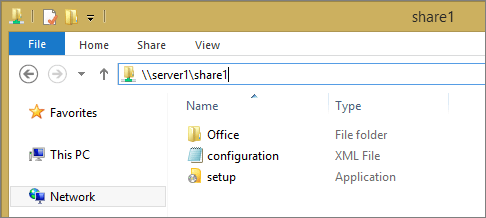
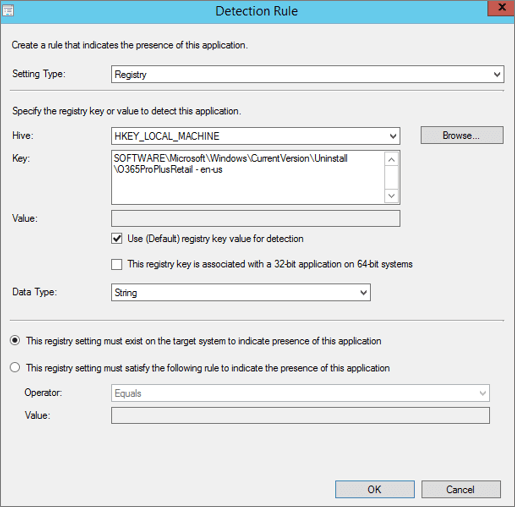
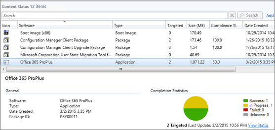
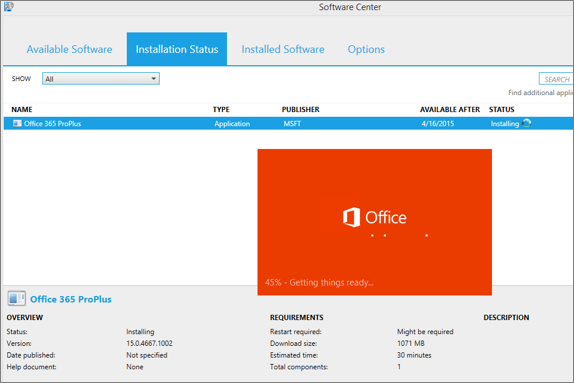

# Deploy Office 365 ProPlus with System Center 2012 R2 Configuration Manager

This article applies to System Center 2012 R2 Configuration Manager. For information on how to deploy Office 365 ProPlus with Configuration Manager version 1702 or later, see [Deploy Office 365 ProPlus with System Center Configuration Manager (Current Branch)](deploy-office-365-proplus-with-system-center-configuration-manager.md).
  
If you use System Center Configuration Manager to deploy software, such as Office, to users and computers in your organization, you can also use that existing Configuration Manager environment to deploy Office 365 ProPlus. By using Configuration Manager, you can control which users and computers get Office 365 ProPlus, where they get the installation files from, and when the Office 365 ProPlus installation occurs.
  
For example, you can control network bandwidth usage by placing the Office 365 ProPlus installation files on a distribution point within your organization's network, instead of having users install Office 365 ProPlus directly from the Internet. Keep in mind, however, that even if you're installing Office 365 ProPlus from a location within your network, the computer where Office 365 ProPlus is installed still needs access to the Internet to be able to [active Office 365 ProPlus](overview-of-licensing-and-activation-in-office-365-proplus.md#BKMK_ActivatingO365PP).
  
The steps that follow are for System Center 2012 R2 Configuration Manager, but you can also deploy Office 365 ProPlus by using System Center 2012 Configuration Manager or Configuration Manager 2007 R2.
  
## Prepare the Office 365 ProPlus installation files to be deployed by Configuration Manager

To get started, download the Office Deployment Tool from the [Microsoft Download Center](https://go.microsoft.com/fwlink/p/?LinkID=626065) to a shared folder on your organization's network. Then, use the Office Deployment Tool to [download the Office 365 ProPlus installation files](overview-of-the-office-2016-deployment-tool.md#BKMK_downloadinstallationfiles) from the Internet to the same shared folder.
  
Next, edit the configuration.xml, and review [Configuration options for the Office Deployment Tool](configuration-options-for-the-office-2016-deployment-tool.md) to decide how you want to install Office 365 ProPlus. The following example shows a configuration.xml that you can use to install the 32-bit, English version of Office 365 ProPlus.
  
```xml
<Configuration> 
   <Add OfficeClientEdition="32"> 
    <Product ID="O365ProPlusRetail"> 
     <Language ID="en-us" /> 
    </Product> 
   </Add>
   <Display Level="None" AcceptEULA="TRUE" />
</Configuration>
```

It's important that you don't include the SourcePath attribute in the Add section of your configuration.xml file. That's because Configuration Manager copies the installation files for an application into a folder under the Configuration Manager client cache folder, and the name of that subfolder is different for each computer. Because the folder name is different for each computer, you can't specify a SourcePath that will work for every computer that you're deploying Office 365 ProPlus to. Instead, leave out the SourcePath attribute. When a SourcePath isn't specified, the Office Deployment Tool automatically looks for the Office 365 ProPlus installation files in the same folder that the Office Deployment Tool is located. That's why we're including the Office Deployment Tool, the configuration.xml, and the Office 365 ProPlus installation files together in the same shared folder.
  

  
## Create an application for Office 365 ProPlus in Configuration Manager

The next step is to [create an application](https://go.microsoft.com/fwlink/p/?LinkId=535035) in Configuration Manager. An application contains the files and information that Configuration Manager needs to deploy software to a user's computer.
  
 **To create an application**
  
1. In the Configuration Manager console, choose **Software Library** > **Application Management** > **Applications**.
    
2. On the **Home** tab, in the **Create** group, choose ** Create Application**.
    
3. On the **General** page of the Create Application Wizard, select **Manually specify the application information**, and then choose **Next**.
    
4. On the **General information** page, enter a name for the application, enter any optional information, and then choose **Next.**
    
5. On the **Application Catalog** page, provide the information that's appropriate for your environment, and then choose **Next**.
    
6. On the **Deployment Types** page, choose **Next**. We'll add a deployment type later.
    
7. On the **Summary** page, review the settings you've chosen, and then choose **Next** to create the application.
    
8. After the application is created, on the **Completion** page, choose **Close**.
    
## Create a deployment type for the Office 365 ProPlus application in Configuration Manager
<a name="BKMK_DeployType"> </a>

An application in Configuration Manager must contain at least one [deployment type](https://go.microsoft.com/fwlink/p/?LinkId=535030). The deployment type contains the installation files for a software package as well as rules that specify when and how the software is deployed.
  
For the Office 365 ProPlus application, the deployment type includes the following:
  
- The path of the shared folder that contains the Office Deployment Tool, your configuration.xml file, and the Office 365 ProPlus installation files that you downloaded from the Internet. For example, \\\\server1\share1.
    
- The command line that gets the Office Deployment Tool to start the installation of Office 365 ProPlus.
    
- A [detection method](https://go.microsoft.com/fwlink/p/?LinkId=535032), which Configuration Manager uses to determine if Office 365 ProPlus is already installed on the user's computer.
    
 **To create a deployment type**
  
1. In the Configuration Manager console, choose **Software Library** > **Application Management** > **Applications**.
    
2. Select the Office 365 ProPlus application, and then on the **Home** tab, in the **Application** group, choose ** Create Deployment Type**.
    
3. On the **General** page of the Create Deployment Type Wizard, in the **Type** list, select **Script Installer**, and then choose **Next**.
    
4. On the **General Information** page, enter a name for the deployment type, enter any optional information, and then choose **Next.**
    
5. On the **Content** page, do the following:
    
  - In the **Content location** box, enter the network share where you put the Office Deployment Tool, your configuration.xml file, and the Office 365 ProPlus installation files that you downloaded from the Internet.
    
  - In the **Installation program** box, enter the following text: setup.exe /configure configuration.xml
    
    After you enter this information, choose **Next**.
    
6. On the **Detection Method** page, choose **Add Clause**.
    
7. In the **Detection Rule** dialog box, do the following:
    
  - In the **Setting Type** list, select **Registry**.
    
  - In the **Hive** list, select **HKEY_LOCAL_MACHINE**.
    
  - In the **Key** box, enter the following text: Software\Microsoft\Windows\CurrentVersion\Uninstall\O365ProPlusRetail - en-us
    
  - Select the **Use (Default) registry key value for detection** check box.
    
     
  
    After you enter this information, choose **OK**, and then on the **Detection Method** page, choose **Next**.
    
8. On the **User Experience** page, in the **Installation behavior** list, select **Install for system**, and then choose **Next**.
    
9. If you want to specify any requirements or dependencies for the deployment type, choose **Next** to go through those pages in the wizard. Otherwise, choose **Summary**.
    
10. On the **Summary** page, review the settings you've chosen, choose **Next**, and then choose **Close.**
    
## Distribute the Office 365 ProPlus application to distribution points in Configuration Manager
<a name="BKMK_Distribute"> </a>

After you create the Office 365 ProPlus application and configure its deployment type, the next step is to copy all the files needed by the application to the appropriate [distribution points](https://go.microsoft.com/fwlink/p/?LinkId=535033) in your Configuration Manager environment.
  
 **To distribute the application to distribution points**
  
1. In the Configuration Manager console, choose **Software Library** > **Application Management** > **Applications**.
    
2. Select the Office 365 ProPlus application, and then on the **Home** tab, in the **Deployment** group, choose ** Distribute Content**.
    
3. On the **General** page of the Distribute Content Wizard, choose **Next**, and then on the **Content** page, choose **Next**.
    
4. On the **Content Destination** page, choose **Add** > **Distribution Point**, select the appropriate distribution points, and then choose **OK**. Then, select **Next**.
    
5. On the **Summary** page, review the settings you've chosen, and then choose **Next**.
    
6. On the **Confirmation** page, check that the content was successfully assigned to the distribution points, and then choose **Close**.
    
7. To monitor the distribution, go to **Monitoring** > **Distribution Status** > **Content Status**.
    
8. Select the application, and then view the **Completion Statistics**.
    
     
  
## Deploy the Office 365 ProPlus application in Configuration Manager
<a name="BKMK_Deploy"> </a>

After the files for the Office 365 ProPlus application are copied to the appropriate distribution points, the next step is to [deploy the application](https://go.microsoft.com/fwlink/p/?LinkId=535036). When you deploy the application, you specify which computers or users get the application and when.
  
 **To deploy the application**
  
1. In the Configuration Manager console, choose **Software Library** > **Application Management** > **Applications**.
    
2. Select the Office 365 ProPlus application, and then on the **Home** tab, in the **Deployment** group, choose **Deploy**.
    
3. On the **General** page of the Deploy Software Wizard, choose **Browse** for the **Collection** box, and then select which computers or users that you want to deploy Office 365 ProPlus to. After you've made your selection, choose **OK**, and then choose **Next**.
    
4. On the **Content** page, choose **Next** because we've already specified the distribution points for the application.
    
5. On the **Deployment Settings** page, in the **Purpose** list, select **Required**.
    
6. If you want to specify a schedule, configure the user experience, or create an alert, choose **Next** to go through those pages in the wizard. Otherwise, choose **Summary**.
    
7. On the **Summary** page, review the settings you've chosen, and then choose **Next**.
    
8. On the **Confirmation** page, check that the application was successfully deployed, and then choose **Close**.
    
After you deploy the application, a targeted computer becomes aware of the deployed application during the computer's next client policy polling cycle, which is once every sixty minutes by default. Then, the computer downloads the installation files for the application from a distribution point into the Configuration Manager client cache. The installation of Office 365 ProPlus takes place from the client cache and no additional files are downloaded from the network or from the Internet.
  

  
## Related topics
- [Application Management in Configuration Manager](https://go.microsoft.com/fwlink/p/?LinkId=535034)
  

