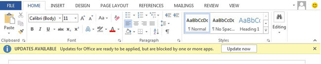
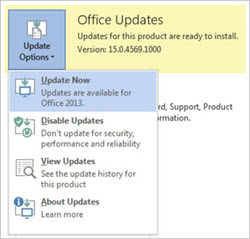
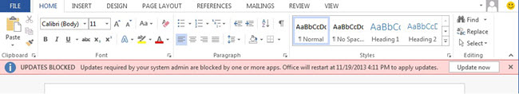

# End-user update notifications for Office 365 ProPlus

You probably don't want users in your organization to notice when security and other updates are applied to Microsoft 365 Apps on their computers. In most cases, they won't notice as the updates are installed automatically in the background. But, you should be aware that there are times when users see notifications that updates are available or need to be applied.
  
Updates can only be applied when Office programs aren't running. Therefore, notifications usually appear because the user is working in an Office program, such as Microsoft Outlook, and hasn't closed it in several days.
  
## Notifications your users see when updates can't be applied for several days to Office 365 ProPlus

After updates are downloaded to the computer that is running Microsoft 365 Apps, Office attempts to apply the updates. If, after four days, the updates still aren't applied, a message appears in the notification area in Windows, telling the user that updates are available.
  

  
The message disappears in a few seconds, but the Office icon stays visible in the notification area. If the user clicks the message, Office tries to apply the updates. If any Office programs are currently being used, they must be closed.
  
If, after six days, the updates still aren't applied, a message appears in any newly opened Office document, reminding the user that updates are available.
  

  
Users can choose **Update now** to apply the updates. The user is then prompted to close all open Office programs. After the updates are applied, the message disappears.
  
Users also see notifications if they go to **File > Account** in an Office program. The **Office Updates** section turns yellow if updates are ready to be applied.
  

  
If you don't want your users to see these types of notifications, you can [use Group Policy to hide the notifications](configure-update-settings-for-office-365-proplus.md).
  
## Notifications your users see when you set an update deadline for Office 365 ProPlus

To make sure that your users apply updates to Microsoft 365 Apps, you can [configure a deadline](configure-update-settings-for-office-365-proplus.md). The deadline specifies a date and time by when the updates must be applied. If the updates aren't applied by the deadline, Office automatically closes any open Office programs and applies the updates.

> [!NOTE]
> Starting with Configuration Manager, version 1802, if any Office 365 applications are running during an Office 365 client update enforcement, the Office applications will not be forced to close. Instead, the update install will return as requiring a system restart 

Users are given notifications leading up to the deadline. For example, within seventy-two hours of the deadline, users see a message, in any newly opened Office document, that updates are blocked.
  

  
The next reminder users see is twelve hours before the deadline. They'll see a message in the notification area in Windows, reminding them that updates are ready to be applied.
  

  
This message appears every two hours. It'll also be shown 60 minutes, 30 minutes, 15 minutes, and 5 minutes before the deadline.
  
If the deadline arrives and the updates still aren't applied, users see a dialog box that warns them that they have 15 minutes before the updates are applied.
  

  
This gives users fifteen minutes to save and close any work. When the countdown reaches 00:00, any open Office programs are closed, and the updates are applied.
  
> [!NOTE]
> The **Hide update notifications** Group Policy setting doesn't hide notifications related to deadlines.
  
## Related topics
[Overview of the update process for Office 365 ProPlus](overview-of-the-update-process-for-office-365-proplus.md)
  
[Choose how to manage updates to Office 365 ProPlus](choose-how-to-manage-updates-to-office-365-proplus.md)
  
[Configure update settings for Office 365 ProPlus](configure-update-settings-for-office-365-proplus.md)

