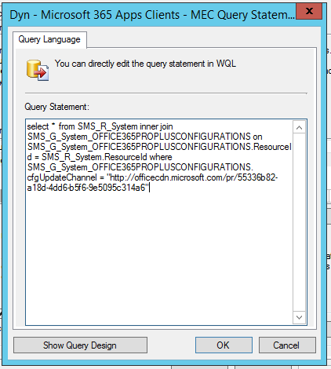
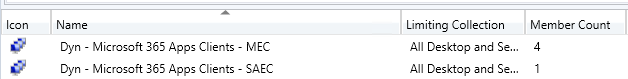

# Best practices from the field: Build dynamic collections for Microsoft 365 Apps with Configuration Manager

> [!NOTE]
> This article was written by Microsoft experts in the field who work with enterprise customers to deploy Office.

Managing Microsoft 365 Apps in larger organizations using Configuration Manager can be a complex task. Maybe you have multiple [update channels](../overview-update-channels.md) deployed in your environment, maybe not all devices have Microsoft 365 Apps yet, but you want to target updates correctly or you want to identify devices with configuration drifts easily. This article will share some best practices on how to leverage [dynamic collections](https://docs.microsoft.com/mem/configmgr/core/clients/manage/collections/create-collections) to cover such scenarios. For dynamic collections, Configuration Manager automatically evaluates the membership of devices based on rules and queries. So these collections will update themselves and always give you a currnet view into your estate.

This article covers the following scenarios:

- [Set up collections that automatically add and remove devices based on the installed update channel](build-dynamic-lean-configuration-manager.md#catch-devices-on-specific update-channels). This help you to quickly identify how many devices are running on each channel and also to move devices to a new channel.
- [Set up a collection that automatically add all devices running Microsoft 365 Apps](build-dynamic-lean-configuration-manager.md#catch-devices-running-microsoft-365-apps). This helps you to easily target Microsoft 365 Apps updates.
- [Set up a collection that captures all devices on update channels which your IT department doesn't support](build-dynamic-lean-configuration-manager.md#catch-devices-on-other-update-channels). In case you don't support all available update channels internally, this implementation helps you to quickly identify and mitigate any configuration drift.

For each scenario, you will find a detailed step-by-step implementation guide as well as some notes on how these collections can be leveraged during day-to-day admin operations.

## Catch devices on specific update channels

Follow these steps to create a dynamic collection that will add devices based on a specific, installed update channel. After the collection is set up, devices will be added and dropped automatically. This enables you to see and target all devices on a certain channel easily. We recommend that you set up one collection per update channel that your IT organization supports internally.

Once those collections are set up, you can use them e.g. to publish applications which allow users to initiate an [update channel change](../change-update-channels.md#change-the-update-channel-with-configuration-manager) for themselves. Or make it a required deployment, in case you want to switch away from an update channel completely. E.g. when moving from [Semi-Annual Enterprise Channel (Preview)](../overview-update-channels.md#preview-upcoming-new-features-of-semi-annual-enterprise-channel) (SAEC-P) and [Semi-Annual Enterprise Channel](../overview-update-channels.md#semi-annual-enterprise-channel-overview) to [Monthly Enterprise Channel](../overview-update-channels.md#monthly-enterprise-channel-overview).

**Deploy an application that allows a user to revert from, for example, Monthly Enterprise Channel to Semi-Annual Enterprise Channel in case there are problems. If your devices are receiving updates from the Office CDN, you can use the same approach as described previously. If you manage updates by using Configuration Manager, you must offer a reinstall of Microsoft 365 Apps to users, because Configuration Manager [can't perform a downgrade](../change-update-channels.md#considerations-when-changing-channels) for the installed build version.**

Here is how to implement these collections:

1. Navigate to **Assets and Compliance**, select **Device Collections** and then **Create Device Collection** on the **Home** menu.
2. Provide a name and choose a limiting collection. Select **Next**.
3. Select **Add Rule** and choose **Query Rule**. Provide a **Name** and select **Edit Query Statement**. Then select **Show Query Language**.
4. Paste the following sample query into the editor window.
   ```sql
   select * from SMS_R_System inner join SMS_G_System_OFFICE365PROPLUSCONFIGURATIONS on SMS_G_System_OFFICE365PROPLUSCONFIGURATIONS.ResourceId = SMS_R_System.ResourceId where SMS_G_System_OFFICE365PROPLUSCONFIGURATIONS.cfgUpdateChannel = "ReplaceThis"
   ```

5. Replace the ***ReplaceThis*** string in the query with the matching update channel value for the channel that you want to capture in this collection from the following table:

   |Update channel                           |Update channel value                                                  |
   |:----------------------------------------|:---------------------------------------------------------------------|
   |Beta Channel                             |http://officecdn.microsoft.com/pr/5440fd1f-7ecb-4221-8110-145efaa6372f|
   |Current Channel (Preview)                |http://officecdn.microsoft.com/pr/64256afe-f5d9-4f86-8936-8840a6a4f5be|
   |Current Channel                          |http://officecdn.microsoft.com/pr/492350f6-3a01-4f97-b9c0-c7c6ddf67d60|
   |Monthly Enterprise Channel               |http://officecdn.microsoft.com/pr/55336b82-a18d-4dd6-b5f6-9e5095c314a6|
   |Semi-Annual Enterprise Channel (Preview) |http://officecdn.microsoft.com/pr/b8f9b850-328d-4355-9145-c59439a0c4cf|
   |Semi-Annual Enterprise Channel           |http://officecdn.microsoft.com/pr/7ffbc6bf-bc32-4f92-8982-f9dd17fd3114|

   The final query should look similar to the following screenshot. Make sure to keep the quotation marks.

   

7. Select **OK** and then **OK** again. We recommend that you select the incremental updates check box, but this is optional.
8. Select **Summary**, **Next**, and then **Close** to complete the wizard.

Repeat these steps for each update channel that you want to be captured in a separate collection. The result might look like this:



## Catch devices running Microsoft 365 Apps

Follow these steps to create a dynamic collection that will add all devices that have Microsoft 365 Apps for enterprise installed. After the collection is set up, devices will be added and dropped automatically. This kind of collection is often used to [deploy updates](../manage-microsoft-365-apps-updates-configuration-manager.md) from all update channels that you support internally. It's important to *not* deploy updates to the individual collections, because devices that are performing a channel change must have access to an update from the newly assigned channel to complete the transition. Devices will only download applicable updates. So if a device is offered SEAC, SAEC-P and MEC updates, it will only download the delta from the update channel that the device is currently on or is instructed to switch to. Updates from other channels won't be downloaded.

Here is how to implement this collection:

1. Navigate to **Assets and Compliance**, select **Device Collections** and then **Create Device Collection** on the **Home** menu.
2. Provide a name and choose a limiting collection. Select **Next**.
3. Select **Add Rule** and choose **Query Rule**. Provide a **Name** and select **Edit Query Statement**. Then select **Show Query Language**.
4. Paste the following sample query into the editor window.

   ```sql
   select SMS_R_System.ResourceId, SMS_R_System.ResourceType, SMS_R_System.Name, SMS_R_System.SMSUniqueIdentifier,      SMS_R_System.ResourceDomainORWorkgroup, SMS_R_System.Client from  SMS_R_System inner join SMS_G_System_OFFICE_PRODUCTINFO on SMS_G_System_OFFICE_PRODUCTINFO.ResourceID = SMS_R_System.ResourceId where SMS_G_System_OFFICE_PRODUCTINFO.IsProPlusInstalled = 1
   ```
   > [!NOTE]
   > This sample query checks for Microsoft 365 Apps for enterprise. You might want to adjust the query for other licenses.

5. Select **OK** and then **OK** again. We recommend that you select the incremental updates check box, but this is optional.
6. Select **Summary**, **Next**, and then **Close** to complete the wizard.

The result is a collection that will automatically add all devices that are running Microsoft 365 Apps regardless of their update channel.

## Catch devices on other update channels

After you create collections for the update channels that you support, you might also want to create one to catch all devices that are running other channels. This can help you find configuration drift and implement measures to reestablish the desired configuration on those devices. For this we use the collections from above. We take all devices running Microsoft 365 Apps and subtract the devices which are on update channels that you support internally.

You can then use this collection to deploy e.g. a required appplication which performs a reinstallation of Microsoft 365 Apps to get the device back onto a supported channel and configuration.

1. Navigate to **Assets and Compliance**. Select **Device Collections** and then **Create Device Collection** on the **Home** menu.
2. Provide a name and select a limiting collection. Select **Next**.
3. Select **Add Rule** and choose **Include Collections**. Select the collection that you created to [catch all devices running Microsoft 365 Apps](build-dynamic-lean-configuration-manager.md#catch-devices-running-microsoft-365-apps). Select **OK**.
4. Select **Add Rule** again and choose **Select Exclude Collections**. Select the collections you created that [catch devices on supported update channels](build-dynamic-lean-configuration-manager.md#catch-devices-on-specific update-channels). Select **OK**.

   

5. Select **OK** again. We recommend that you select the incremental updates check box, but this is optional.
6. Select **Summary**, **Next**, and then **Close** to complete the wizard.

This collection will now automatically add all devices that have Microsoft 365 Apps installed but are not a member of one of the other collections that we created. This collection will catch all devices that are running on an update channel that you haven't created a separate collection for.

## Notes

- If the configuration of a device is changed, there are two timers that are relevant on the Configuration Manager side:
    - First, the device must upload the [hardware inventory](https://docs.microsoft.com/mem/configmgr/core/clients/manage/inventory/introduction-to-hardware-inventory), which includes the information about the selected update channel.
    - Second, the Configuration Manager infrastructure must recalculate the memberships of the collections.
- "Update channels supported by the IT department" in this article refers to channels that the IT department supports as approved configurations in the organization. The created collection will not catch devices that are running a build which is no longer supported by Microsoft.
