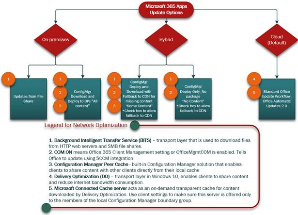

# Choose how to deliver updates for the Microsoft 365 Apps

- Both for new implementations or when re-evaulating exisitng update processes
- Explain the big buckets like cloud, on-prem and hybrid
- For each bucket, explain the network implications
- Then per bucket, go into the details and options.

Include picture for the buckets

include picture for each option

> [!NOTE]
> This article was written by Microsoft experts in the field who work with enterprise customers to deploy Office.

There are a variety of options to choose from when delivering software updates for Microsoft 365 Apps in managed environments. This article outlines the advantages and disadvantages of each approach to help you make the right choice. A given update deployment implementation can be changed later on, so the options below apply both to scenarios where you start fresh with the Microsoft 365 Apps as well as when re-evaluating your current implementation.

This article will describe the fundamental differences and network implications when deploying udpates from the cloud, on-prem locations or in a combination of both (hybrid). It will then drill deeper into each source and lay out the options for managing updates with the individual benefits and challenges.

> [!NOTE]
> The Office Update Engine will always update all products and apps build on top of Click-to-Run in one pass and with the same mechanism. For example, if a device has the Microsoft 365 Apps as well as Visio desktop app installed and the updates are configured to happen through Servicing profiles, both products will be updated in one pass to the same release. No mix&match is possible for updates (e.g., Visio desktop app updates from the Office CDN, but the Microsoft 365 Apps from an on-premises file share.).

## Update sources: Cloud, on-premises location or hybrid

The Microsoft 365 Apps can get updates from three different sources: cloud, on-premises locations as well as a mix of both, often referred to as hybrid. The following section will lay out these sources and call out the individual benefits and challenges of these locations.

### Updates from the cloud
When the Microsoft 365 Apps are pulling updates from the Microsoft Office Content Delivery Network (aka Office CDN), this is referred to as **cloud-based updates**. Microsoft operates a worldwide, distributed network of datacenters which hosts all updates for the Microsoft 365 Apps for all available update channels, in both 32 and 64 bit. The Office CDN also contains a history of released updates, so updating to specific releases or rolling back to older ones is also possible.

There are two core benefits when levering the cloud as your udpate source:
- **Delta updates**: When the Microsoft 365 Apps pull down the latest udpate, only the difference between the currently installed release and the targeted one is downloaded. So instead of having to handle the whole source files package, only delta differences, down to sub-file level, are pulled down by the device. This conserves a lot of network bandwidth compared with other approaches.
- **No source files maintenance** needed: As the updates are hosted worldwide in Microsoft's datacenters, there is no need for downloading, packaging and distributing the source files in your on-prem network. Especially in environments wich multiple deployedd languages, an 32 and 64 bit mix or running multiple update channels, this can become a major, re-occuring effort.

When using the cloud as your update source, there are also some **considerations**:
- **Network connectivity**: Devices must be able to connect to the Office CDN. For this the URLs and IPs listed in URL-ARTICLE LINK HERE must be accessible for devices. Microsoft recommends to allows devices to connect to the Office CDN on a system level and with bypassing any proxy servers to ensure best performance. We recommend to review the [MONTHLY UPDATE SIZES LINK HERE] to assess the impact on the network.
- **Delivery Optimization**: In all cloud-based update scenarios, the update mechanism can and will leverage Delivery Optimization (LINK) when available. This will allow devices to share the requires sources in a Peer-to-Peer mode and reduces the amount of data which needs to be downloaded from the internet. Microsoft recommends the usage of Delivery Optimization. If [Connected Caches] LINK!! are deployed and configured, those will also be leveraged. Especially [CC on SCCM] is straight forward to implement and is recommended, when an Configuration Manager infrastructure is available.
- **VPN bypass**: When using virtual private network (VPN) solutions, it is recommend devices to bypass the VPN tunnel when downloading data from the Office CDN. This reduced the load on the VPN infrastucture and allows devices to download data directly.

- 
- 
- Devices will automatically pick the closest datacenter.

The overwhelming majority of customers we work with in the field remain on-premises when delivering software updates for Microsoft 365 Apps for enterprise.  The original version of Office 2013 Click-to-Run was released years ago when update options were  limited and network transport optimizations didn't exist.  Many customers used an on-premises file share and mirrored Office CDN content each month.  Microsoft 365 Apps for enterprise has evolved since then to provide customers with many more options, including multiple channels, languages, and 64-bit architecture. These additional options can lead to a large increase in the number of content IT Pros must download and replicate on-premises.

Since that time, there have been tremendous innovations in Windows and Configuration Manager that provide many new capabilities for servicing Office.  With so many choices and combinations, a visual aid may help you choose how to manage updates.  The flowchart below is a comparison of update options, with a special focus on network transport. Choosing an update option also determines what process is delivering notifications to the end user (Office or Configuration Manager or both).  For example, if the customer wants to hide or control the precise timing of software updates and the level of notifications, then Configuration Manager should be considered.  If the customer values network optimization and lowest cost of ownership to service Office, then update from CDN with Delivery Optimization (DO) should be considered.  

By default, Microsoft 365 Apps for enterprise will update from Office CDN.  If you are a customer who currently delivers updates using one of the on-premises selections, you must [reverse policies and configurations to restore default behavior](../manage-microsoft-365-apps-updates-configuration-manager.md).  For example, if Office 365 Client Management was enabled to support Configuration Manager integration, those steps must be reversed. Configuration Manager client settings or domain policy should be set so that Office 365 Client Management is disabled. Once the change is made, Office will update against CDN  after the next restart of the  Microsoft Office Click-to-Run service. It is always a good idea to perform such an action with phased deployment processes to monitor compliance and network impact.

## Network options for updates

Network optimization is an important consideration when delivering Office updates.  Microsoft recommends selecting an update option that includes peer-to-peer sharing technologies such as Configuration Manager or Office CDN. 

- File share: Server Message Block (SMB)
- Configuration Manager: Office 365 Client Management is Enabled, Background Intelligent Transfer Service (BITS) is used.
- Office CDN (optional Configuration Manager Connected Cache), Delivery Optimization (DO) is used.

By default, Office Click-To-Run installer uses  Windows built in implementation of DO to download the content from the CDN.  When Configuration Manager has Office 365 Client Management enabled, BITS will be used.

## End-user notifications

End-user notifications for software updates are a key concern for any IT department.  By default, Microsoft 365 Apps for enterprise updates automatically in the background.  If Office is open, notifications will be delivered to the end user over a period of days. For a full description of notifications and end-user experience, see [End-user update notifications for Microsoft 365 Apps](../end-user-update-notifications-microsoft-365-apps.md). IT Pros can optionally silence all end-user Office notifications by using the "Hide update notifications from users" policy. 

> [!NOTE]
> Notifications related to deadlines cannot be suppressed.

When Office 365 Client Management is enabled (OfficeMgmtCom=1), Configuration Manager will also deliver notifications. To learn more, see [Understanding Office 365 ProPlus Updates for IT Pros](https://techcommunity.microsoft.com/t5/office-365-blog/understanding-office-365-proplus-updates-for-it-pros-cdn-vs-sccm/ba-p/795728). It is important to carefully consider ramifications of user notifications when considering an update strategy. 

- File share: Office notifications only
- Configuration Manager: Configuration Manager notifications only unless Office updates are pre-staged.
- Office CDN: Office notifications only

Office and Configuration Manager notifications can both occur when Office 365 Client Management Enabled (OfficeMgmtCom=1) and when Configuration Manager software deployment has Available time prior to deadline.  Meaning, the IT Pro pre-staged Office content using Configuration Manager on the machine prior to deadline. In this scenario, both Configuration Manager and Office will deliver end-user notifications independently based on deadline defined in Configuration Manager. 

## Considerations for choosing how to deliver updates

The section below compares update approaches to help you choose the right option for your environment. For customers who are exclusively on-premises today, moving to a hybrid model is a likely outcome.  For customers who are green field or have goal to reduce long-term dependency on on-premises infrastructure, cloud only is best.

### Updates delivered from Office CDN (Microsoft recommended)

Advantages: 
- Supports advanced network optimization technologies like Delivery Optimization and Configuration Manager Connected Cache.  These solutions also support other Microsoft workloads such as Windows 10 updates (feature updates and quality updates), Windows 10 drivers, Windows Store files, Windows Store for Business files, Windows Defender definition updates, Win32 apps for Intune and Configuration Manager Express Updates.
- IT Pro remains in control, but clients pull what is needed automatically.  No need for admin to micro-manage intentional downloads each month.
- Office was designed to update from the Office CDN, which allows additional capabilities such as rollback or roll forward based on group policy configuration.
- Aligns with Microsoft's "Modern Workplace" where users roam and work remotely.

Considerations:
- The IT Pro must transition from push mentality to allow clients to pull content dynamically.
- The IT Pro will need to review the network topology to ensure clients are performing peer to peer sharing is optimal.
- Extensive controls of Delivery Optimization are available and require review.
- Microsoft validates signals from builds released prior to broad deployment referred to as "Throttling". This throttling means not all clients will receive the update at the same time and not appropriate for traditional Configuration Manager "maintenance windows" scenarios.

End-user notifications: Delivered by Office only.

### Updates delivered by Configuration Manager (on-premises)

Advantages: 
- Office clients fetch updates only from the closest distribution point.
- Full control over end-user notifications from Configuration Manager.

Disadvantages:
- Requires the IT Pro to download all the content required to support every permutation of channel, architecture, and combination of languages the organization supports.
- Every permutation of Office supported leads to exponential growth of package content. This content must then be replicated to every Distribution Point.
- By default, any required content not found on the Distribution Point will result in Office 365 client update failure.

> [!NOTE]
> A managed device downloads only the required changes from a Distribution Point. So when making multiple channels and architectures available to clients, they will not download all the content, but only what's required for that client.

End-user notifications: Delivered by Configuration Manager only when Available time and Deadline are the same.  If Available time is prior to Deadline updates may be pre-staged, notifications may be delivered either by Configuration Manager or Office prior to deadline.

### Updates delivered by Configuration Manager (on-premises and cloud)

Advantages: 
- Optimizes bandwidth where IT Pro can stage the on-premises content that is required and offload content that isn't required to the CDN. A great example is languages. Use Configuration Manager inventory to identify primary languages and stage only those on-premises, offload secondary languages and proofing tools to pull from CDN. Fallback for non-downloaded content can be achieved by selecting 'If software updates are not available on distribution point in current, neighbor or site boundary groups, download content from Microsoft Updates' within Configuration Manager software deployment.
- Supports Configuration Manager Peer Cache feature but only for content which is staged on Distribution Points.

Disadvantages:
- The IT Pro must carefully consider which content to download and what should come from CDN.
- The IT Pro must make intentional decisions regarding specific builds\versions by channels to download each month.

Consideration:
- A subset of content not found on the Distribution Point is downloaded using BITS from the Office CDN. (Note that the Configuration Manager Peer Cache feature does not support content that is downloaded from the Office CDN.)

End-user notifications: Delivered by Configuration Manager only when available time and deadline are the same.  If available time is prior to deadline updates may be pre-staged, notifications may be delivered either by Configuration Manager or Office prior to deadline.

### Updates delivered by Configuration Manager (cloud)

Advantages: 
- IT Pro remains in full control of software deployment available vs deadlines using Configuration Manager.  

Disadvantages:
- Each workstation will egress to the internet to download content via BITS from the Office CDN. (Note that the Configuration Manager Peer Cache feature does not support content that is downloaded from the Office CDN.)
- The IT Pro must make intentional decisions regarding specific builds\versions by channels to download each month.

Consideration:
- All content will download from CDN as content is not present on distribution points.

End-user notifications: Delivered by Configuration Manager only when Available time and Deadline are the same.  If Available time is prior to deadline updates may be pre-staged, notifications may be delivered either by Configuration Manager or Office prior to deadline.

### Updates delivered from file share

Advantages: none

Disadvantages: This method is discouraged due to the high cost of ownership and repetitive, manual intensive processes.  Modern network peer to peer solutions like Delivery Optimization and Peer Cache don't apply when updating Microsoft 365 Apps for enterprise update from a file share.

End-user notifications: Delivered only by Office.
