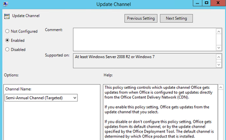
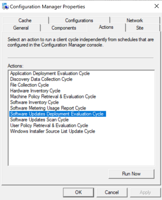

# How to manage Office 365 ProPlus Channels for IT pros

We recommend that enterprise customers include validation as a part of their Office 365 ProPlus deployment processes. Microsoft provides "channels" that control the rate of change of features and quality fixes. For most customer deployments, this means a minimum of two channels, such as Semi-Annual Channel and Semi-Annual Channel (Targeted). Many IT pros broadly deploy a single channel (usually Semi-Annual Channel) and use Group Policy to assign validation computers to a faster channel, such as Semi-Annual Channel (Targeted). In this way, they can preview what’s coming four months before production release.
 
This article explains how Office 365 ProPlus processes channel change requests.
 
> [!TIP]
> New Semi-Annual Channel versions are released in January/July. Semi-Annual Channel (Targeted) versions are released in March/September. All channels receive a minimum of one build per month that contain security and critical customer-escalated fixes. (The latter has a very high bar.)

To read more about channels, see [Overview of update channels for Office 365 ProPlus](https://docs.microsoft.com/deployoffice/overview-of-update-channels-for-office-365-proplus).
 
Ideally, minimizing the number of Office 365 ProPlus packages reduces overall cost of ownership. Therefore, the next step is to develop a process where machines receive a standard package by placing them on Semi-Annual Channel but dynamically move validation machines to a faster channel, such as Semi-Annual Channel (Targeted).

## Change the update channel via the ODT

**Step 1: Before you begin, make sure the "Office Automatic Update 2.0" scheduled task  is enabled** on the client devices. This task, which updates the assigned channel, is a required part of managing updates for Office 365 ProPlus, whether you use Group Policy, the Office Deployment Tool (ODT), or Configuration Manager.
 
**Step 2: Download the latest version of the ODT (*setup.exe*)** from the [Microsoft Download Center](https://go.microsoft.com/fwlink/p/?LinkID=626065).
 
**Step 3: Create a configuration file that specifies the new channel name.** In the following example, the channel changes to Monthly. For more information on channel names, see [Channel attribute](https://docs.microsoft.com/deployoffice/configuration-options-for-the-office-2016-deployment-tool#channel-attribute-part-of-updates-element) in the configuration options article.

```
<Configuration>
	<Updates Channel="Targeted" />
</Configuration>
```

**Step 4: Deploy the configuration file by using your standard processes.** After execution of the Office Deployment Tool, the Office Automatic Update 2.0 task will automatically run based on the trigger definition in the scheduled task. That task  detects the updated policy and updates the assigned channel. When the task runs again, it detects the new assigned channel, and Office updates to a new build from that channel. The Office user interface on the client device won't show the updated channel until a build of Office from the new channel is installed.
 
## Change the update channel via Group Policy
**Step 1: Deploy your standard Office 365 ProPlus package based on the Semi-Annual Channel.**
 
**Step 2: Assign GPO to validation machines or add a policy registry key that specifies Semi-Annual Channel (Targeted).**
 
Using [Office ADMX](https://www.microsoft.com/download/details.aspx?id=49030) files, use Update Channel GPO to set Semi-Annual Channel (Targeted).



Group Policy refreshes in the background every 90 minutes by default. Use **gpupdate /force** to expedite. Alternatively, add the registry key manually to the policy key:

```
HKLM\SOFTWARE\Policies\Microsoft\office\16.0\common\officeupdate "updatebranch"="FirstReleaseDeferred"
```

**Step 3: Allow the Microsoft\Office\Office Automatic Updates 2.0 scheduled task to run.**
Group Policy will set registry keys. That’s all. Office 365 ProPlus uniquely leverages a scheduled task named *Office Automatic Updates* to maintain product configuration, including channel management. The name itself "Automatic Updates" can cause confusion for IT pros in enterprise environments where System Center Configuration (SCCM) is used to deploy updates. When OfficeMgmtCom (COM) is enabled, updates will be delivered only from SCCM. The Office Automatic Updates scheduled task will fire based on a default set of triggers, regardless of whether COM is enabled. By manually running the task instead, you can compress the time frame to validate changes.
 
> [!WARNING] 
> Microsoft recommends that *Automatic Updates* remains enabled (the default configuration) in all update scenarios. This task does more than the name implies. If you disable it, you may have a diminished channel management experience and disable the feature to apply updates when the system is idle.

For more information about the CDN update workflow, see 2:00 in the [Managing Office with SCCM (2019)](https://www.youtube.com/watch?v=9lFyyj-V2AA) video.
 
> [!TIP]
> List of channels and URL identifiers CDNBaseUrl represents the channel where product was installed. If no channel was defined in *unattend,* Semi-Annual Channel is the default selection.

```
Monthly Channel 
(formerly *Current Channel*):
CDNBaseUrl = http://officecdn.microsoft.com/pr/492350f6-3a01-4f97-b9c0-c7c6ddf67d60

Semi-Annual Channel 
(formerly *Deferred Channel*):
CDNBaseUrl = http://officecdn.microsoft.com/pr/7ffbc6bf-bc32-4f92-8982-f9dd17fd3114

Monthly Channel (Targeted)
(formerly *First Release for Current Channel*):
CDNBaseUrl = http://officecdn.microsoft.com/pr/64256afe-f5d9-4f86-8936-8840a6a4f5be

Semi-Annual Channel (Targeted) 
(formerly *First Release for Deferred Channel*):
CDNBaseUrl = http://officecdn.microsoft.com/pr/b8f9b850-328d-4355-9145-c59439a0c4cf
```

> [!TIP]
> IT pros can monitor several registry keys to confirm that change has occurred after the scheduled task has completed. Registry subkeys of interest for monitoring can be found under the key HKLM\SOFTWARE\Microsoft\Office\ClickToRun\Configuration. Editing keys directly can lead to unintended consequences and should be avoided. Rather, monitor keys for the desired outcome.
                                               
**UpdateChannel:** This is the channel configuration "winner." This is dynamically managed by the Automatic Updates scheduled task and should not be edited directly.
 
In our example where we use GPO to move Office 365 ProPlus to Semi-Annual Channel (Targeted), the Office Automatic Updates scheduled task will discover the policy key and then change *UpdateChannel* to a new value, in this case from *http://officecdn.microsoft.com/pr/7ffbc6bf-bc32-4f92-8982-f9dd17fd3114 (SAC)* to *http://officecdn.microsoft.com/pr/b8f9b850-328d-4355-9145-c59439a0c4cf (SAC-T)*. Additionally, *UpdateChannelChanged* will be set to *True*. As of the next successful Office 365 client update, *UpdateChannelChanged* will reset to *False*. The product can only accept one channel change request at a time. Successful update is a prerequisite for accepting another change.
 
If you've completed the steps described previously and the channel change still isn't shown, you may be blocked by a temporary *discovery period*. Generally, updates won't happen during the discovery period, which can last up to 24 hours after initial installation. IT pros may encounter this scenario during compressed time validation in lab scenarios.
 
After *UpdateChannel* is successfully changed, Office 365 clients that point to CDN will download the latest build from the faster channel. Clients that have COM enabled for SCCM integration will download a newer build the next time that the Software Updates Deployment Evaluation cycle runs, based on the Software Deployment configuration in SCCM. IT pros can expedite testing channel migration by deploying a desired build to validation collection. (It should be a build from Semi-Annual Channel (Targeted).) Use the Configuration Manager control panel item to perform Machine Policy Retrieval, followed by the Software Updates Deployment Evaluation cycle.



## Office 365 ProPlus behavior: Slower to faster vs. faster to slower

**Slower -> faster (Example: Semi-Annual Channel to Semi-Annual Channel Targeted)**
- The client will always gracefully move forward when a now-available build number is higher. For example, a client on June 2019 Semi-Annual Channel with build version 1808 (build 10730.20348) will move to Semi-Annual Channel Targeted with build version 1902 (build 11328.20318). No  administrative intervention is required. The normal update process/workflow applies the change.

**Faster -> slower (Example: SAC-T to SAC)**
- In an SCCM-managed environment where COM is enabled, Office will not auto downgrade when the channel is changed. It will only move forward once the build advertised is later than what’s currently installed. For example, an Office ProPlus client on Semi-Annual Targeted build June 2019 version 1902 (build 11328.20318) will have to wait until the Semi-Annual Channel build number is greater to move forward, such as July 2019 version 1902 (build 11328.20368). The supported downgrade method is to rerun Office Deployment Tool with the desired build and channel. Keep in mind that during the waiting period, the Office 365 client won't receive any updates, including security updates.
- In a non-COM-managed environment such as default configuration CDN, your new version will be downgraded to match the Group Policy that's assigned.

*Since we can’t do binary delta compression (BDC) the download will be larger. As a result, network considerations should be considered when downgrading from CDN.
 
## Frequently asked questions

**How does channel management work when Office 2019 is installed and GPO "Upgrade Office 2019 to Office 365 ProPlus" is enabled?**

Some customers may need to have one factory image of Windows that includes Office 2019 and later upgrade a subset of machines to Office 365 ProPlus. The steps outlined previously still apply in terms of mechanics and how channel changes are processed. The only difference is that Office 2019 will initially have *CDNBaseURL*, and *UpdateChannel* will show *http://officecdn.microsoft.com/pr/f2e724c1-748f-4b47-8fb8-8e0d210e9208*. First, the GPO above will set the policy key. Second, the Office Automatic Updates 2.0 scheduled task will flip the *UpdateChannel* to *Semi-Annual Channel (3114)* by default and dynamically convert the product to *Semi-Annual Channel*. In short, Office 2019 is just an older version of Office 365 ProPlus, so differences in content between the two products will download from CDN or from the SCCM distribution point, depending on your configuration. (Size will be significant for one-time conversion.) For CDN, this process is automatic. For SCCM, IT pros only need to deploy the latest Semi-Annual Channel build software update to the collection, just like any monthly "Patch Tuesday" process. SCCM will find the applicable build and upgrade like any other Office update. Licensing/activation will switch from volume activation (KMS) to subscription-based (Office Licensing Service).
 
**Why does this guidance differ from what's described on the SCCM page [Change the update channel after you enable Office 365 clients to receive updates from Configuration Manager](https://docs.microsoft.com/configmgr/sum/deploy-use/manage-office-365-proplus-updates#bkmk_channel)?**

We recommend that customers use Group Policy to change Office 365 ProPlus channels because it's easier for IT pros. Group Policy sets a registry key under the policy hive and Office Automatic Updates scheduled task to processes channel change. The link above references *CDNBaseURL*. Notice in the following list that this is the fourth item evaluated for priority by the scheduled task. So, if the first three priorities listed aren't configured and *CDNBaseURL* doesn't match *UpdateChannel*, the scheduled task will align them, resulting in channel change.  This article leads with Group Policy where the link above requires a direct registry change through Group Policy Preferences or Compliance Item in SCCM.
 
```
1st Priority : GPO "UpdatePath" - HKLM\software\policies\microsoft\office\16.0\common\officeupdate!updatepath
2nd Priority : GPO "UpdateChannel" - HKLM\software\policies\microsoft\office\16.0\common\officeupdate!updatebranch
3rd Priority : "UpdateURL" or UpdatePath="\\Server\Share" HKLM\SOFTWARE\Microsoft\Office\ClickToRun\Configuration
4th Priority : CDNBaseURL - HKLM\SOFTWARE\Microsoft\Office\ClickToRun\Configuration\CDNBaseUrl
```
 