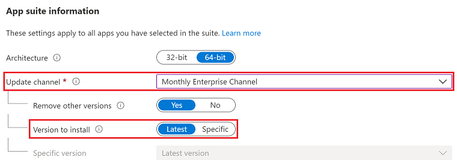

# Best practices from the field: Network guidance for deploying and servicing Microsoft 365 Apps

> [!NOTE]
> This article was written by Microsoft experts in the field who work with enterprise customers to deploy Office.

Microsoft 365 Apps is a version of Office that offers you the latest security and feature updates on a manageable and predictable cadence. With this modern servicing approach there are multiple scenarios to consider for optimizing your network. Whether you are planning your first deployment, or have the apps deployed to your entire organization, network optimization is something you will need to plan for. In this article we are going to look at some of the most common scenarios when managing Microsoft 365 Apps, along with Microsoft’s recommendations for optimizing deployment and servicing across your network. 

## Managing Microsoft 365 Apps for remote users
The key objective for this section is to help you understand what options are available when managing Microsoft 365 Apps for a remote workforce. More specifically, we will review solutions that can significantly reduce or eliminate content distribution across your VPN (if relevant), and cloud-based services that will simplify management and maintenance for Microsoft 365 Apps. 

If you are supporting a remote workforce, you likely fall into 1 of 2 scenarios: 
- Scenario A: your company provides a VPN service to users, enabling them to access internal company resources. In this scenario you want to eliminate any unnecessary traffic from the VPN tunnel (e.g., software updates from the Office CDN).

- Scenario B: your company has adopted cloud-friendly technologies such as Windows Virtual Desktop (WVD) and/or web-based applications, enabling users to connect from anywhere without a VPN. In this scenario you may be dealing with a wider set of unmanaged devices (e.g., BYOD), but still need to maintain the Microsoft 365 Apps that are connected to your tenant.

The following solutions will address these 2 groups. In general, you will see the biggest benefits to your network and endpoints by leveraging cloud-based services for managing your Microsoft 365 Apps. 

### Split Tunneling
[Split tunneling for Microsoft 365 Apps](https://docs.microsoft.com/en-us/microsoft-365/enterprise/microsoft-365-vpn-split-tunnel?view=o365-worldwide) is recommended if you are supporting a remote workforce that is frequently connected to your company’s VPN. With split tunneling enabled, all traffic coming from the Office CDN will bypass the VPN tunnel and go directly to the internet. This includes full installs of Microsoft 365 Apps and monthly updates. For more information on implementing VPN split tunneling for Microsoft 365 Apps, refer to the following article: [Implementing VPN split tunneling for Office 365](https://docs.microsoft.com/en-us/microsoft-365/enterprise/microsoft-365-vpn-implement-split-tunnel?view=o365-worldwide).

### Deploying Microsoft 365 Apps with Intune
If you are using Microsoft Intune to manage your devices, there is native integration for [creating and deploying Microsoft 365 Apps](https://docs.microsoft.com/en-us/mem/intune/apps/apps-add-office365), including the option to [provide a custom configuration XML](https://docs.microsoft.com/en-us/mem/intune/apps/apps-add-office365#step-2---option-2-configure-app-suite-using-xml-data). When creating the app consider setting the following options:

1.	Under **App suite information**, set **Update channel** to **Monthly Enterprise Channel**.
2.	Set **Version to install** to **Latest**. 

    

Using these values will help achieve the following benefits:

- The latest version of Monthly Enterprise Channel will be used for each new install.

- All devices will receive the recommended monthly updates.

- Minimize the need for an administrator to make changes to the app moving forward.

Once the app is assigned to your enrolled devices, install requests will pull all required content from the Office CDN. If your users are on VPN, make sure you have split tunneling enabled.

### Managing Microsoft 365 Apps with Servicing Profiles
After deploying the Microsoft 365 Apps to your organization you can leverage Servicing Profiles to manage monthly updates. [Servicing Profiles](https://docs.microsoft.com/en-us/deployoffice/admincenter/servicing-profile) is available today in public preview as a new cloud-based management solution for Microsoft 365 Apps. With this technology you can leverage the data insights from [Apps Admin Center](https://config.office.com/) to monitor [inventory](https://docs.microsoft.com/en-us/deployoffice/admincenter/inventory), [health](https://docs.microsoft.com/en-us/deployoffice/admincenter/microsoft-365-apps-health), and [update compliance](https://docs.microsoft.com/en-us/deployoffice/admincenter/security-update-status). From there you can enable Servicing Profiles to start managing all Microsoft 365 Apps signed into your tenant, regardless of the device being managed or unmanaged. Devices enabled for servicing profiles will be configured to receive updates using the [Monthly Enterprise Channel](https://docs.microsoft.com/en-us/deployoffice/overview-update-channels#monthly-enterprise-channel-overview).

### Cloud Management Gateway
If you have Microsoft Endpoint Configuration Manager in your environment, a [Cloud Management Gateway (CMG)](https://docs.microsoft.com/en-us/mem/configmgr/core/clients/manage/cmg/overview) is recommended for supporting remote devices. The CMG is an Azure cloud service that extends the capabilities of Configuration Manager by enabling device management over the internet. With a CMG deployed, managed devices that are not connected to your corporate network can still receive their Microsoft 365 Apps and updates. For this solution Microsoft recommends the following:

- Implement split tunneling. In combination with a CMG, devices that are connected to the corporate VPN (where split tunneling has been enabled) will receive update instructions but pull content directly from the Office CDN.

- When deploying new installs of Microsoft 365 Apps using CMG, be sure to [right-size your initial deployment](https://docs.microsoft.com/en-us/deployoffice/fieldnotes/right-sizing-initial-deployment) and consider [building dynamic, lean, and universal packages](https://docs.microsoft.com/en-us/deployoffice/fieldnotes/build-dynamic-lean-universal-packages). Leveraging these techniques will reduce egress costs from the CMG and instead utilize the Office CDN for content download. 

For more information on deploying a CMG in Configuration Manager, refer to the following article: [Plan for the cloud management gateway in Configuration Manager](https://docs.microsoft.com/en-us/mem/configmgr/core/clients/manage/cmg/plan-cloud-management-gateway).

## Managing Microsoft 365 Apps for on-prem users
The key objective for this section is to help you understand what options are available when managing Microsoft 365 Apps for on-prem users. More specifically, we will review solutions that can help optimize content distribution across your network and look at utilizing cloud-based services that will simplify management and maintenance for Microsoft 365 Apps.

### Microsoft Intune
If your organization is using Intune (or Co-Management), the following technologies are recommended for optimizing network traffic with Microsoft 365 Apps:

- [Delivery Optimization (DO) for Intune enrolled devices](https://docs.microsoft.com/en-us/mem/intune/configuration/delivery-optimization-windows). DO is a cloud-based peer-to-peer technology introduced with Windows 10. DO supports content for both Windows Update and Microsoft 365 Apps. We recommend implementing DO when devices on the same network are pulling content from the Office CDN (e.g., devices on-prem).

- [Microsoft Connected Cache](https://techcommunity.microsoft.com/t5/windows-it-pro-blog/introducing-microsoft-connected-cache-microsoft-s-cloud-managed/ba-p/963898) (non- Configuration Manager) is an Azure technology available in private preview, enabling you to configure a local server to act as a DO source. Devices that have DO configured will now utilize your Connected Cache server as another source for retrieving content. This will help reduce the number of direct downloads to the Office CDN. For more information about the Microsoft Connected Cache private preview, refer to the following article: [Introducing Microsoft Connected Cache: Microsoft’s cloud-managed cache solution](https://techcommunity.microsoft.com/t5/windows-it-pro-blog/introducing-microsoft-connected-cache-microsoft-s-cloud-managed/ba-p/963898)

- [Servicing Profiles](https://docs.microsoft.com/en-us/deployoffice/admincenter/servicing-profile) are a cloud-based management technology now available in public preview. With this technology you can leverage the data insights from [Apps Admin Center](https://config.office.com/) to monitor inventory, health, and update compliance. From there you can enable Servicing Profiles to start managing all Microsoft 365 Apps signed into your tenant, regardless of the device being managed or unmanaged. Devices enabled for servicing profiles will be configured to receive updates using the [Monthly Enterprise Channel](https://docs.microsoft.com/en-us/deployoffice/overview-update-channels#monthly-enterprise-channel-overview). For management of on-prem devices, DO is going to play an important role in order to offset the number of devices connected to the Office CDN.

### Configuration Manager
If your organization is using Configuration Manager there are multiple technologies available to help with network optimization. In this section we will look at the native site technologies, along with modern peer-to-peer capabilities.

The first 4 technologies that we will look at can be enabled independently or in combination with one another. Microsoft’s recommendation is to review each technology and leverage them in combination where it makes sense (e.g., you may enable BranchCache and Client Peer Cache, but BITS throttling isn’t necessary). This will help maximize efficiency and reduce traffic to your distribution points. Once enabled, you can review the [Client data sources](https://docs.microsoft.com/en-us/mem/configmgr/core/servers/deploy/configure/monitor-content-you-have-distributed#client-data-sources-dashboard) dashboard to monitor content distribution for Client Peer Cache, BranchCache, Distribution Points, and Cloud Distribution Points.

- Client Peer Cache is another peer-to-peer technology. This technology is native to Configuration Manager and does require devices to be domain joined and managed by Configuration Manager. With Client Peer Cache you have additional controls over your network segmentation and peer-to-peer traffic. Refer to Enabling Client Peer Cache to get started.

- BranchCache is a Windows technology focused on peer-to-peer content delivery. Clients that support BranchCache, and have downloaded a deployment configured for BranchCache, will serve as a content source to other BranchCache-enabled clients. Refer to Enabling BranchCache  to get started.

- Windows Low Extra Delay Background Transport (LEDBAT) is a network congestion control feature of Windows Server to help manage background network transfers. For distribution points running on supported versions of Windows Server, enable an option to help adjust network traffic. Then clients only use network bandwidth when it's available. Refer to Enabling Windows LEDBAT to get started.

- Background Intelligent Transfer Service (BITS) throttling for clients is another option for reducing network saturation when you deploy your Microsoft 365 Apps and updates. Configuration Manager provides several settings that to establish a scheduled and predictable transfer rate. Refer to Enabling BITS throttling for clients to get started.

These next 2 technologies leverage the modern peer-to-peer capabilities in Windows 10. Configuration Manager offers native support for enablement, but configuration will require Group Policy and/or a Configuration Baseline to setup.

- Delivery Optimization (DO) is a cloud-based peer-to-peer technology introduced with Windows 10. DO supports content for both Windows Update and Microsoft 365 Apps. We recommend implementing DO when devices on the same network are pulling content from the Office CDN. Devices that are internet-facing or connected over VPN are note ideal candidates, as they are unlikely to have local peers to share content with. For more information on implementing DO in Configuration Manager, refer to the following article: Network optimization tips for on-premises Office installs and updates

- Microsoft Connected Cache is a technology available in Configuration Manager, enabling you to configure your distribution points to act as DO sources. Devices that have DO configured will now utilize your distribution point as another source for retrieving content, reducing the number of direct downloads to the Office CDN. For more information on implementing Connected Cache in Configuration Manager, refer to the following article: Network optimization tips for on-premises Office installs and updates

