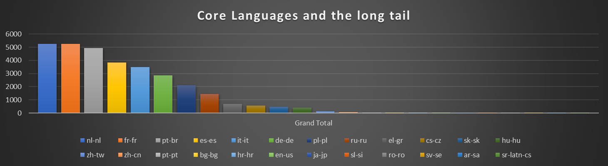

# Best practices from the field: Right-sizing your initial deployment of Microsoft 365 Apps

> [!NOTE]
> This article was written by Microsoft experts in the field who work with enterprise customers to deploy Office.

When you are planning a Microsoft 365 Apps rollout in a multi-language enterprise environment, you might face the challenge to balance two aspects which come into play when using Microsoft Endpoint Configuration Manager:
- Including as many source files for different languages in the on-prem deployment package prevents overloading your corporate internet connections.
- At the same time, it increases the on-prem LAN/WAN traffic as all Distribution Points and managed clients will sync down the whole package regardless what is actually needed.

So leaning towards the two extremes (host everything or nothing on-premises) is not feasible for most organizations as whether internet bandwidth nor internal LAN/WAN links have unlimited bandwidth. This article will show you how to find the sweet spot, so that you can balance the impact on internet and local resources.

There are three goals that we are trying to achieve here:

- Reduce the impact on your company’s internet circuits as much as possible.
- Reduce the impact on your internal network as much as possible.
- Go with the minimum number of deployment packages to reduce maintenance costs going forward.

The below will mainly apply to deployments to devices which are on-premises. We also have guidance for scenarios when users are[(working from home (WFH)](https://techcommunity.microsoft.com/t5/office-365-blog/deploy-office-365-proplus-to-remote-workers/ba-p/1258514) or we are looking at [subsequent installs like Visio, Project or Language Packs](build-dynamic-lean-universal-packages.md).

Let’s first look at a sample scenario and how we identified the right balance, then we will walk you through the steps to implement the solution in your organization.

## Sample scenario and solution

Below is a sample scenario based on an actual customer engagement. It is pretty typical when it comes to the setup and characteristics of an enterprise environment: 

- IT supports 24 different languages for Microsoft 365 Apps.
- IT manages 50,000 devices around the globe using Microsoft Endpoint Configuration Manager.
- There is a low number of internet breakouts and those always congested.
- Goal is to complete upgrade in six months.

So we could include all languages in one on-prem deployment package to reduce impact on the internet breakouts to zero. Including 24 languages bumps the package size up to ~8 gigabyte. As Configuration Manager will sync the full package to each device, regardless of what the device actually needs, this will cause 50,000 devices \* 8 gigabyte = ~400 terabyte of LAN traffic. Not good.

If we go the other extreme, we could remove all source files and use Configuration Manager to just initiate the install. We would rely on the Office CDN to provide just the required source files. This will ensure that devices will only download what they actually need, but it all comes from the internet. If we assume that every other device needs one additional language, we are looking at 50,000 devices \* 1.7 gigabyte = ~85 terabyte of traffic from internet. That’s a great reduction in overall traffic, but it will contribute to internet access congestion.

We could also break the one, big deployment package up into a core package and individual language packs. This will reduce that amount of content being synced unnecessarily, but it increases complexity. Targeting the packages to the right devices becomes more complex and we would have to maintain 25 individual deployment packages going forward.

As indicated above, we don’t have to think in extremes. With Click-to-Run we can leverage a feature called “AllowCdnFallback”. When enabled, the installation engine is allowed to fall back to Office CDN for each language pack it can’t find in the local (ccmcache) folder.

This allows us to substitute required LAN/WAN bandwidth with far lower internet bandwidth. A language pack is ~250 megabyte is size on average. If we remove just one from the deployment package, this will save 50,000\*0,25 gigabyte = ~12 Terabyte of LAN/WAN network bandwidth. If just on device required the language pack we removed, it will download just ~250 megabyte from internet as it will use the locally synced source files from the ccmcache for everything else. So we are saving 12 Terabyte for the price of one device downloading ~250 megabyte from the internet. This sounds like a pretty good deal!

In order to be able to identify which language packs we should exclude, we can generate an overview of how often each language pack is installed in our environment. Typically, the distribution if not even and we will have a pretty large number of language packs which are only installed on a hand-full of devices. We can then add up the number all language packs and calculate the share of each one. Let’s have a look at some sample data and how many language packs represent 90+% of all installed language packs:



So in this example (which is based on a real customer example), we could include less than 50% of all supported languages in the deployment package and still cover 92% of all device configurations. We’ve crafted a table which show the impact on the network:


We can see the two extremes (no/all language packs) and the impact on the LAN/WAN traffic as well as internet bandwidth consumed. If we go with including just 9 language packs, we will reduce the package size by nearly 50% and save more than 180 terabyte of LAN/WAN network traffic. The trade-in is that ~1,800 devices will have to download one of the excluded languages, generating approx. 3,100 gigabyte of traffic. If we stretch this over all work days from our targeted 3 month rollout window, this is ~24 gigabyte per day. If we add [Client Peer Cache](https://docs.microsoft.com/mem/configmgr/core/plan-design/hierarchy/client-peer-cache), [Delivery Optimization](https://docs.microsoft.com/deployoffice/delivery-optimization) and [Microsoft Connected Cache](https://docs.microsoft.com/mem/configmgr/core/plan-design/hierarchy/microsoft-connected-cache) to the mix, we might be able to reduce the network impact even further.

Therefore we went with 9 language packs in this scenario which saved a lot of time and network bandwidth during the initial sync across all Distribution Points as well as client devices. Going forward, we also applied this on-prem/cloud split to Office updates, so this customer is benefiting from the split basically every month, not only during the initial deployment.

## Hands-on: Implement a right-sized deployment in your environment

### Identify your most commonly used language packs

First off, you need an overview on how often each individual language pack is installed in your environment. If you are using Configuration Manager, you can directly query the database for an overview and count of installed language packs with the below query:
```
select count (distinct resourceid) as total, DisplayName0 from v_Add_Remove_Programs where DisplayName0 like 'Microsoft Office Language Pack%' group by resourceid, DisplayName0

(A big shout out to Tom Ferguson, one of our ConfigMgr experts for this!)
```

Feel free to adjust the query to your needs, keep in mind that getting a rough understanding of the distribution of language packs is just fine. Copy the data into Excel, sort by number of installs and calculate the total number of installs. Then calculate the individual share of each Language Pack and start summing those up. The result might look similar to this:


This will allow you to quickly access three important factors:

- Which group of language packs is representing 80%/90%/95%/99% of your install base?
- How many installs of language packs are not covered by this group?
- What is the saving on WAN/LAN network traffic and impact on internet bandwidth?

For the last bullet, perform these calculations for each group:

- Saved WAN/LAN bandwidth: Multiply the number of managed devices with 0,25 gigabyte times the number of language packs excluded.
- Required internet bandwidth: Multiply the sum of the install count for excluded language packs with 250 megabyte

For the above table, it would look like this:


Multiply this number by 250 megabyte to get a rough count on how much data needs to be downloaded from the internet. Multiply the number of all managed devices by 250 megabyte to understand, how much on-premises network traffic is saved.

Make a decision which language packs you want to include and note them down. In above example we would go with the Top 8 LPs and our list would be: nl-nl, fr-fr, pt-br, es-es, it-it, de-de, pl-pl and ru-ru.

### Adjust your Configuration Manager application

Next step is to craft a deployment package which includes the selected language packs and allows devices to fall back to Office CDN for missing content.
Launch your Configuration Manager, navigate to **Software Library**, open the **Office 365 Client Management** node and launch the **Office 365 Installer** wizard. Click through the wizard and make sure to select all the languages you want to include. Once the wizard has finished its work, we have to adjust the configuration file to allow Office CDN fallback and instruct the setup engine to dynamically determine which languages to install instead of hard coding them.

Navigate to your content source folder and open the configuration.xml in an editor. Remove all the hard coded languages and replace them by a combination of:

- Specify languages you want to always install.
- Add ID="[MatchPreviousMSI](../upgrade-from-msi-version.md#install-the-same-language-resources)" if you want to carry forward any already installed languages. 
- Add ID="[MatchOS](../overview-deploying-languages-microsoft-365-apps.md#install-the-same-languages-as-the-operating-system)" if you want to install languages matching the Windows Display Language.

Also add [AllowCdnFallback="True"](../office-deployment-tool-configuration-options.md#allowcdnfallback-attribute-part-of-add-element) to the `<Add …>` element. Below is an example of such a configuration.xml:

```
<Configuration ID="0f7c243e-b0f4-4e6f-bbe1-290875b7c685" Host="cm">
	<Add OfficeClientEdition="64" Channel="MonthlyEnterprise" AllowCdnFallback="True" OfficeMgmtCOM="TRUE" Version="16.0.12624.20588" ForceUpgrade="TRUE" >
		<Product ID="O365ProPlusRetail">
			<Language ID="en-us" />
			<Language ID="MatchPreviousMSI" />
			<Language ID="MatchOS" />
			<ExcludeApp ID="Groove" />
			<ExcludeApp ID="Lync" />
		</Product>
	</Add>
	<RemoveMSI />
	<Display Level="Full" AcceptEULA="TRUE" />
</Configuration>
```

Save the file and return to the Configuration Manager console. Navigate to **Software Library** > **Application Management** > **Applications**, select your application, switch to the **Deployment Types** tab, right-click the appropriate entry and click **Update Content**.


Once all Distribution Points have synced the changes, you can deploy your application as usual.

### Further reduce network impact

We recommend to employ additional technologies to further reduce the network impact:

- Leverage [Client Peer Cache](https://docs.microsoft.com/mem/configmgr/core/plan-design/hierarchy/client-peer-cache) to allow clients to share content which is coming from Distribution Points. As this is the bulk of the download, enabling this is highly recommended and will benefit all your on-prem deployments, not just Office.
- Configure [Delivery Optimization](https://docs.microsoft.com/deployoffice/delivery-optimization) on your devices to allow them to peer cache content coming from the Office CDN. Note the minimum version of Office required to leverage this feature of Windows as described in the linked article.
- Optionally enable [Microsoft Connected Cache](https://docs.microsoft.com/mem/configmgr/core/plan-design/hierarchy/microsoft-connected-cache) on your Distribution Points. This allows your DPs to act as a persistent cache for your devices and is easy to set up. It will leverage already existing information within Configuration Manager about your network infrastructure and preferred DPs.

## Prerequisites

There are some prerequisites you must meet to make this concept work in your environment:

- Make sure, that the account (user or SYSTEM) used to install the apps is able to connect to the internet.
- In order to leverage Delivery Optimization during Office install, you should deploy version 1908 or later. For version 1908 to 1911, you have to set a specific registry key as [described here](../delivery-optimization.md#configure-microsoft-365-apps-to-use-delivery-optimization).
