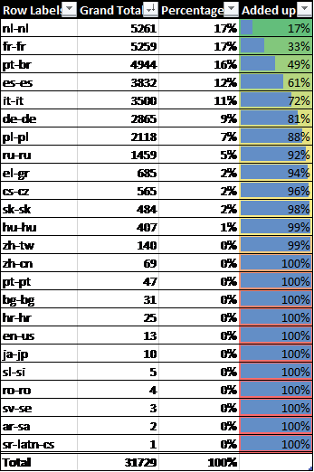
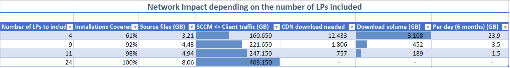

# Best practices from the field: Right-sizing your initial deployment of Microsoft 365 Apps

> [!NOTE]
> This article was written by Microsoft experts in the field who work with enterprise customers to deploy Office.

When you plan a Microsoft 365 Apps deployment with Configuration Manager in a multi-language enterprise environment, you might face the following challenge:

- To prevent overloading your corporate internet connections, you want to include  as many source files for different languages as possible in the on-premises deployment package.
- At the same time, including that many languages increases the on-premises LAN/WAN traffic, as all distribution points and managed clients will download the whole package, regardless of what is actually needed.

Leaning toward the two extremes (host everything on-premises or host nothing) is usually not feasible for most organizations. This article will show you how to find the sweet spot that balances the impact on internet and on local resources.

There are three goals that we are trying to achieve:

- Reduce the impact on your company’s internet circuits as much as possible.
- Reduce the impact on your internal network as much as possible.
- Go with the minimum number of deployment packages to reduce on-going maintenance costs.

The guidance in this article applies to the initial on-premises deployment of Microsoft 365 Apps. In other articles, we cover how to best support [remote work](https://techcommunity.microsoft.com/t5/office-365-blog/deploy-office-365-proplus-to-remote-workers/ba-p/1258514) and optimize [subsequent installs of Visio, Project, or additional language packs](build-dynamic-lean-universal-packages.md).

Let’s first look at a sample scenario and how we identified the right balance, then we will walk you through the steps to implement the solution in your organization.

## Sample scenario and solution

Below is a sample scenario based on an actual customer engagement. It is pretty typical when it comes to the setup and characteristics of an enterprise environment: 

- IT supports 24 different languages for Microsoft 365 Apps.
- IT manages 50,000 devices around the globe using Microsoft Endpoint Configuration Manager.
- There is a small number of internet breakouts and those are always congested.
- Goal is to complete upgrade in six months.

So, we could include all languages in one on-premises deployment package to reduce impact on the internet breakouts to zero. Including 24 languages bumps the package size up to approximately 8 gigabytes. As Configuration Manager synchronizes the full package to each device, regardless of what the device actually needs, this package size causes 400 terabytes of LAN traffic (8 gigabytes times 50,000 devices).

If we go the other extreme, we could remove all source files and use Configuration Manager to just initiate the install. We would rely on the Office CDN (content delivery network) to supply just the required source files. This will ensure that devices will only download what they need, but it all comes from the internet. If we assume that every other device needs one additional language, we are looking at roughly 81 terabytes of traffic from the internet (50,000 devices * 1.5 GB plus 25,000 devices * 0,25 GB). That is a great reduction in overall traffic, but it will contribute to internet access congestion.

We could also break the one, big deployment package up into a smaller core package and individual language packs. This will reduce that amount of content being synchronized unnecessarily, but it increases complexity. Targeting each device with the right set of packages is complex and we would have to maintain 25 individual deployment packages going forward.

The good news is that we do not have to think in extremes. Instead, we can use a feature called “AllowCdnFallback”. When enabled, the installation engine is allowed to fall back to Office CDN for each language pack it cannot find locally in the Ccmcache folder. This allows us to substitute LAN/WAN bandwidth with internet bandwidth. If only one device needs a specific language pack, this device will have to download approx. 250 megabytes. But it will save 49,999 devices from synchronizing the source files from Distribution Points (~12.5 terabyte), if we remove this language from the source file set. This sounds like a pretty good deal!

To be able to identify which language packs we should exclude; we can generate an overview of how often each language pack is installed. We can then add up the number of all language pack installs and calculate the share of each one. Typically, the distribution is not even and a small subset of language packs accounts for the majority of installs as shown below:



In this case, just 8 out of 24 language packs (nl-nl, fr-fr, pt-br, es-es, it-it, de-de, pl-pl and ru-ru) account for 92% of all language pack installations. The remaining 16 language packs are only installed on 8% of all devices. Based on this data, we can calculate the impact on the on-prem WAN/LAN as well as internet connections (caused by devices having to to download additional source files):



We can see the two extremes (no/all source files) and the impact on the LAN/WAN traffic as well as internet bandwidth consumed. But if we include just the 8 language packs mentioned above, we can balance out those. Compared to handling everything on-prem, package size will be reduced by about 50% and we will save more than 180 terabytes of LAN/WAN network traffic. The trade-off is that 1,800 devices will now have to download one of the excluded languages, generating approximately 450 gigabytes of traffic. Across all workdays from our targeted 6-month rollout window, this is approximately 3.5 gigabytes per day. If we add [Client Peer Cache](https://docs.microsoft.com/mem/configmgr/core/plan-design/hierarchy/client-peer-cache), [Delivery Optimization](../delivery-optimization.md) and [Microsoft Connected Cache](https://docs.microsoft.com/mem/configmgr/core/plan-design/hierarchy/microsoft-connected-cache) to the mix, we might be able to reduce the network impact even further.

Therefore, we went with 8 language packs in this scenario, which saved a lot of time and network bandwidth during the first sync across all distribution points as well as client devices. Going forward, we also applied this on-premises/cloud split to Office updates, so this customer is benefiting from the split every month, not only during the initial deployment.

## How to implement a right-sized deployment in your environment

### Identify your most used language packs

First off, you need an overview on how often each individual language pack is installed in your environment. If you are using Configuration Manager, you can directly query the database for an overview and count of installed language packs with the below query:

```sql
select count (distinct resourceid) as total, DisplayName0 from v_Add_Remove_Programs where DisplayName0 like 'Microsoft Office Language Pack%' group by resourceid, DisplayName0

```

Feel free to adjust the query to your needs, keeping in mind that getting a rough understanding of the distribution of language packs is fine. Copy the data into Excel, sort by number of installs and calculate the total number of installs. Then calculate the individual share of each language pack and start summing those up as shown above.

This will allow you to quickly access three key factors:

- Which group of language packs is standing for 80%/90%/95%/99% of your install base?
- How many installs of language packs are not covered by this group?
- What is the saving on WAN/LAN network traffic and impact on internet bandwidth?

For the last bullet, perform these calculations for each group:

- Saved WAN/LAN bandwidth: Multiply the number of managed devices by 0.25 gigabytes by the number of language packs excluded.
- Required internet bandwidth: Multiply the sum of the install count for excluded language packs by 0.25 gigabytes

For the above table, it could look like this:


Decide which language packs you want to include and note them down.

### Adjust your Configuration Manager application

The next step is to craft a deployment package which includes the selected language packs and allows devices to fall back to Office CDN for missing content.

1. Make sure, that the account (user or SYSTEM) used to install Microsoft 365 Apps can connect to the internet [as documented](https://docs.microsoft.com/microsoft-365/enterprise/urls-and-ip-address-ranges#microsoft-365-common-and-office-online).
2. Launch your Configuration Manager, navigate to **Software Library**, open the **Office 365 Client Management** node, and launch the **Office 365 Installer** wizard. 
3. Click through the wizard and make sure to select all the languages you want to include. 
4. Once the wizard has finished its work, we must adjust the configuration file to allow Office CDN fallback and instruct the setup engine to dynamically determine which languages to install instead of hard coding them. Navigate to your content source folder and open the configuration.xml in an editor. 
5. Remove all the hard-coded languages and replace them by a combination of:

- Specify languages you want to always install. 
- Add ID="[MatchPreviousMSI](../upgrade-from-msi-version.md#install-the-same-language-resources)" if you want to carry forward any already installed languages. 
- Add ID="[MatchOS](../overview-deploying-languages-microsoft-365-apps.md#install-the-same-languages-as-the-operating-system)" if you want to install languages matching the Windows Display Language.

6. Also add [AllowCdnFallback="True"](../office-deployment-tool-configuration-options.md#allowcdnfallback-attribute-part-of-add-element) to the `<Add …>` element. Below is an example of such a configuration.xml:

```
<Configuration>
	<Add OfficeClientEdition="64" Channel="MonthlyEnterprise" AllowCdnFallback="True" OfficeMgmtCOM="TRUE" Version="16.0.12624.20588" ForceUpgrade="TRUE" >
		<Product ID="O365ProPlusRetail">
			<Language ID="en-us" />
			<Language ID="MatchPreviousMSI" />
			<Language ID="MatchOS" />
			<ExcludeApp ID="Groove" />
			<ExcludeApp ID="Lync" />
		</Product>
	</Add>
	<RemoveMSI />
	<Display Level="Full" AcceptEULA="TRUE" />
</Configuration>
```

7. Save the file and return to the Configuration Manager console. Navigate to **Software Library** > **Application Management** > **Applications**, select your application, switch to the **Deployment Types** tab, right-click the matching entry and click **Update Content**.


8. Once all distribution points have synchronized the changes, you can deploy your application as usual.

We are all set!

### Further reduce network impact

We recommend using these additional features to further reduce the network impact:

- Use [Client Peer Cache](https://docs.microsoft.com/mem/configmgr/core/plan-design/hierarchy/client-peer-cache) to allow clients to share content which is coming from distribution points. As this is the bulk of the download, enabling this is highly recommended and will help all your on-premises deployments, not just Office.
- Configure [Delivery Optimization](../delivery-optimization.md) on your devices to allow them to peer cache content coming from the Office CDN. To leverage Delivery Optimization during Office install, you should deploy version 1908 or later. For version 1908 to 1911, you must set a specific registry key as [described here](../delivery-optimization.md#configure-microsoft-365-apps-to-use-delivery-optimization).
- Optionally enable [Microsoft Connected Cache](https://docs.microsoft.com/mem/configmgr/core/plan-design/hierarchy/microsoft-connected-cache) on your distribution points. This allows your distribution points to act as a persistent cache for your devices. Connected cache will use already existing information within Configuration Manager about your network infrastructure and preferred distribution points.

*Special thanks to Tom Ferguson, one of our ConfigMgr experts, for the SQL example*
