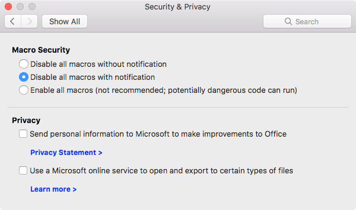

# Set a preference for macro security in Office for Mac

***Applies to:*** *Office for Mac, Office 2019 for Mac, Office 2016 for Mac*

In Office for Mac, there are three levels of macro security available, as seen in the following screen shot: 
  

  
If you're an admin, you might want to configure macro security for your users, in either of the following ways:
  
- Set a default setting, which users can change.
    
- Force a particular setting, which users can't change.
    
In either case, you can configure this setting by using a preference. The following is the information that you need to set the preference:
  
|||
|:-----|:-----|
|**Domain**   | com.microsoft.office    |
|**Key**   |VisualBasicMacroExecutionState    |
|**Possible values**   |DisabledWithWarnings  *(default)*    DisabledWithoutWarnings    EnabledWithoutWarnings  *(not recommended)*    |
   
Here is some additional information about using this preference:
  
- It's available starting with version 15.33 of Office for Mac.
    
- It applies to Word, Excel, and PowerPoint.
    
- It's CFPreferences-compatible, which means that it can be set by using enterprise management software for Mac, such as Jamf Pro.
    
## Related topics

- [Configuration Profile Reference (Apple developer documentation)](https://go.microsoft.com/fwlink/p/?linkid=852998)
- [Deploy preferences for Office for Mac](deploy-preferences-for-office-for-mac.md)

