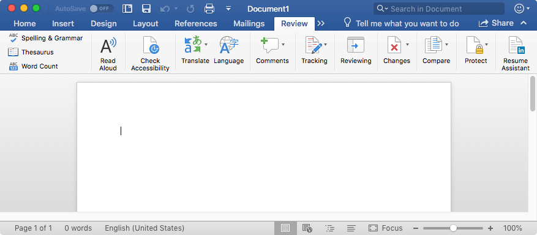

# Set a preference for Resume Assistant in Word for Mac

***Applies to:*** *Office for Mac*

In Word for Mac, the icon for [Resume Assistant](https://support.office.com/article/444ff6f0-ef74-4a9c-9091-ffd7a9d1917a) will appear on the Review tab if you are running version 16.13 or later, as shown in the following screen shot.

> [!NOTE]
> Resume Assistant is only available to Office 365 subscribers.

If you're an admin, you may want to prevent this option from being shown to users. Use the following information to configure a policy:

|||
|:-----|:-----|
|**Domain**   | com.microsoft.Word    |
|**Key**   |DisableResumeAssistant    |
|**Data Type**   |Boolean    |
|**Possible values**   |false  *(default)*    true    |

This key is CFPreferences-compatible, which means that it can be set by using enterprise management software for Mac, such as Jamf Pro.
    
## See also

[Configuration Profile Reference (Apple developer documentation)](https://go.microsoft.com/fwlink/p/?linkid=852998)

[Deploy preferences for Office for Mac](deploy-preferences-for-office-for-mac.md)

