# Microsoft 365 change guide

## Continuous change in the cloud

The Microsoft 365 cloud environment is a hyperscale suite of service offerings in which change is an undeniable constant. In the technology industry, staying cutting-edge benefits productivity, security, and end-user happiness. Change in the Microsoft cloud has purpose: to deliver customer value, secure the environment, and delight end users. The pace of change in Microsoft 365 is rapid and continuous, which are both adjectives that describe the customer value pipeline that this model facilitates. At Microsoft, we're focused on empowering your end users with innovative features and secure services that increase efficiency within your organization.

Microsoft uses an agile development model that promotes rapid development. Using this model shortens the time between change inception and implementation, to production. Our features are designed with usability in mind, and we aim to  shorten the time between feature implementation and value realization for our customers. Agile development is important in the modern cloud environment. Using it, we can nimbly adjust engineering priorities based on customer feedback, market dynamics, regulatory requirements, and emerging risks. Swift integration of changes into your environment means that we receive feedback data faster; therefore, we can iteratively improve our services.

Many changes relate to new features that are designed to enhance the user experience, but they are one category of change within a broader set. The broader set of categories of change includes service maintenance, security updates, and updates to meet the needs of the ever-changing regulatory and compliance landscape.

Microsoft is constantly improving Microsoft 365 services to empower every person and every organization on the planet to achieve more. Our commitment to enhancing the user experience means that we offer a continuous stream of updates to the service. And to ease your deployment planning, we release client updates in alignment with release cycles. We design new features to improve productivity and delight end users. Equally important is for features to operate in a secure and compliant environment. As part of the [shared responsibility model](https://docs.microsoft.com/azure/security/fundamentals/shared-responsibility), Microsoft takes extensive measures to secure our environment. And our certifications that are hosted on the Microsoft [Service Trust Portal](https://aka.ms/stp) confirm our commitment to compliance. The other half of the responsibility model – your environment – must also be secure and compliant, which is why we consider potential customer impact when we structure our changes and the surrounding processes.

Historically, the deployment of changes within customer organizations has been tightly controlled by IT departments through various mechanisms. While controlling deployments within your tenant holds a place in the modern cloud landscape, faster feature deployment is key to realizing value for your end users. As the Microsoft cloud further adopts a continuous update model, organizations’ ability to make risk-based decisions on which changes require granular evaluation and which can be implemented immediately becomes paramount.

When Microsoft adds capabilities and users leverage these capabilities, the user experience improves as supported by data. At the time of writing, a comparison of net promoter score\[1\] (NPS) between customers using the continuous update channel (Current Channel) and the Semi-Annual Enterprise Channel shows a 10-point advantage\[2\] to the continuous update channel for Microsoft 365 Apps (previously called Office 365 ProPlus). This comparison is demonstrated in *Figure 1*.

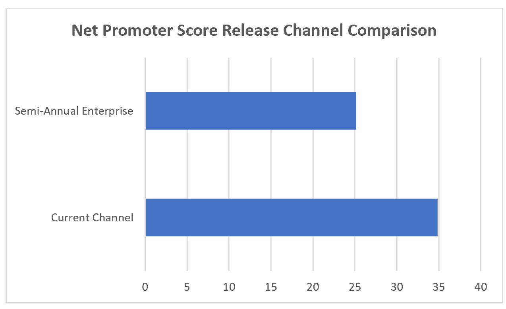

*Figure 1*

Our goal is to provide your organization with changes that can be controlled (where possible), if deemed impactful to the organization, while still allowing the majority of changes to flow to end users for enhancing value, productivity, collaboration, and security.

## Controlling change: challenges and strategy

Despite the overwhelming benefits of rapid feature release and adoption, robust change management strategy is important to employ. We recognize that managing change, especially continuous cloud change, can be challenging for organizations. IT departments and other lines of defense often believe that each change must be reviewed in depth before deployment into their environments. While this may be an advantageous strategy for a subset of high impact changes, reviewing 100% of changes is a burdensome strategy that will delay deployment of the endlessly evolving features that enable your end users.

Not all features or changes have the potential to impact your security or compliance stature, which means deep analysis may not be required for every single change. For changes that are impactful, we provide configuration options for controlling related features. In support of end user adoption of new features, these changes are generally on by default, meaning action is required on your part to disable or limit these features.

The ability to control impactful changes is a differentiator offered by Microsoft. The technology industry is predominantly focused on innovation, which is generally assumed to have positive impact on users. It is uncommon to find granularity of control over these innovations by technology leaders or other cloud providers. By respecting your right to control most impactful changes, we are demonstrating our commitment to partnership and ultimately your success. Furthermore, we are committed to improving the overall change experience. By providing transparency into our change process, procedures, and roadmap, and by monitoring customer feedback, we seek to enable our customers in evaluating and deploying the rapidly increasing volume of updates we release.

### Challenges

From industry observation, feedback, and supporting data, we have identified a key challenge our customers face when applying highly restrictive change ingestion models to the continuous release policy of Microsoft 365. The challenge lies in how frequently Microsoft updates services in the modern cloud. To illustrate the challenge, let us assume Microsoft pushes 720 changes per year released linearly. If these changes are restricted for evaluation, IT departments gating changes could be behind up to 60 changes after the first month. The resulting backlog of changes heightens the entropy in the environment and prevents users from utilizing the latest features and updates. The question becomes: is the organization capable of processing these rapid changes according to existing procedures or are changes left disabled because they cannot match the pace of release?

The challenge can be further explained by the “automobile metaphor.” Many organizations focus only on functionality and security. In the context of a vehicle, this is the equivalent of focusing on getting from point A to point B. Owners in this case are content if they can fix the vehicle, if they know how it works, and if the vehicle has seatbelts for security. However, we challenge the IT professionals reading this to consider the end user. Transportation to the average vehicle consumer is more than A to B. End users (consumer drivers) want radio for entertainment, air conditioning for climate control, and power windows for convenience. Drivers want anti-lock braking systems, airbags, and seatbelts for security. If the focus is solely on enabling users to reach the destination, you may be disenfranchising the population that wants to be more secure, comfortable, and efficient on the journey. If organizational lines of defense spend valuable time divining which features are important, which features users care about, and which are causing disruption to the IT environment, the burden becomes unsustainable. This calls for democratization of change evaluation which is described in the section [Change Evaluation Democratization](#change-evaluation-democratization).

While Microsoft does not provide a default off option, we find that very few customers take advantage of the options we provide to disable features in their environments. When organizations employ an “everything off” strategy by leveraging our provided configurations, the result is akin to managing on-prem software. The benefits originally sought by moving to the cloud are largely alienated by this approach, as the innovations end users care about are unavailable. Moreover, the Microsoft ecosystem suffers from the gap in usage data created by this strategy. Diagnostic data\[3\], for example, provides Microsoft valuable information about how our customers use features, how the features are (or are not) improving overall experience, and crash reports that help us stay apprised of widespread issues. While we provide customers control over diagnostic data, exercising these controls limits the data we have for keeping our service secure, up to date, and functioning as expected.

We cite this as a challenge because we acknowledge the delicate balance that must be reached between controlling the environment, ensuring proper training, and providing employees exciting new features. IT professionals are at the forefront of maintaining this balance, which is why Microsoft provides tools, transparency, and guidance for making risk-based deployment decisions. Configuration management tools, product roadmaps, change notifications, and documentation are manifestations of our commitment to aid you in reaching change-risk equilibrium.

The security updates that are happening in the background are not the focus of this conversation. Rather, the focus is on the features we deliver. The same features that we develop with exhaustive market research to increase productivity and user satisfaction. The features that help empower our customers to achieve more, with open feedback channels to adjust for negative feedback in an agile manner. We require customer participation to validate our features, which means features must first be deployed in customer environments for end users to leverage.

### Strategy 

Three categories of customers can be identified based on their observed change strategies: Maximize Change, Allow Most Restricting High Impact, and Restrict All Change. *Figure 2* below summarizes these categories.

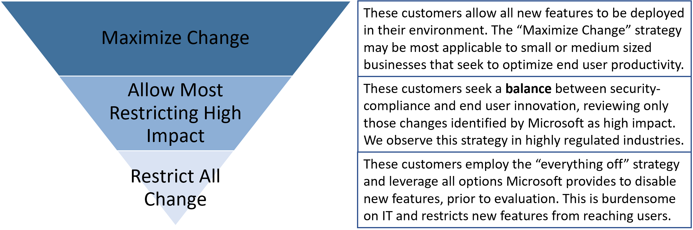

*Figure 2*

The “Maximize Change” strategy is most applicable to small or medium sized businesses that seek to optimize end user productivity, operating without compliance or regulatory requirements.

The “Allow Most Restricting High Impact” category is the strategy we recommend you target, especially if your organization operates in a regulated environment or if you have strict security requirements (e.g., financial services, healthcare, aerospace). The case for implementing a risk-based approach for evaluating changes is supported by the NPS data in *Figure 1*.

Microsoft advises customers to be intentional with their decisions to disable a change and to avoid unconsciously leaving all changes disabled. Microsoft strives to enable you to make risk-based decisions about changes that require in-depth evaluation, while allowing the rest to be deployed immediately with minimal evaluation (and risk). By proactively identifying our change impact levels, described in [change classification and notification](#change-classification-and-notification), and by keeping you apprised of upcoming changes, described in [sources of change information](#sources-of-change-information), we aid you in making risk-based decisions on which changes require evaluation.

Microsoft’s industry observation shows the “Restrict All Change” strategy to be overly burdensome and less effective at end user empowerment by limiting the benefits of continuous innovation.

### Consuming and Managing Change – Message center and Planner

Regardless of the change strategy employed, consuming and acting on any change requires communication and messaging. [Message center is the mechanism for notification of events for Microsoft 365 services](https://docs.microsoft.com/microsoft-365/admin/manage/message-center?view=o365-worldwide&preserve-view=true). Located in the Microsoft 365 Admin Center, upcoming new and changed features, planned maintenance, and other important announcements are all surfaced here. There are three categories for messages:

1.  Prevent or fix issues

2.  Plan for change, and

3.  Stay informed

Message attributes provided include Publish Date, Message ID (for tracking specific messages), Title, and (change/event) Description. The Message center is a critical source of information important for change planning and update consumption across Microsoft 365. Building projects and tasks from these often-actionable notifications is critical to successful change strategy. To help you better consume this content, [Planner has been integrated with Message center allowing messages to be directly synced with Planner.](https://docs.microsoft.com/office365/planner/track-message-center-tasks-planner)

Features include:

  - Syncing messages from Message center.

  - Selecting the type(s) of messages synced.

  - Setting a cadence for the message sync.

Once a message has been synced to Planner, it will show up in Planner as a task. Messages center post titles will be prefixed with the associated service in brackets. If a message is updated, that update will also sync to the Planner task.

The task will be structured as:

  - The message post Title prefixed with the associated service in brackets, i.e. *\[SharePoint\] New Feature*, as shown in the below screenshot.

  - The Start Date will be set to the time the task was created in Planner.

  - The Published Date of the message post can be found in the Notes.

Taking advantage of Planner to manage tasks, group tasks, and formulate a plan of action for completing tasks strategically, allows for review boards and change management teams to track change efficiently.

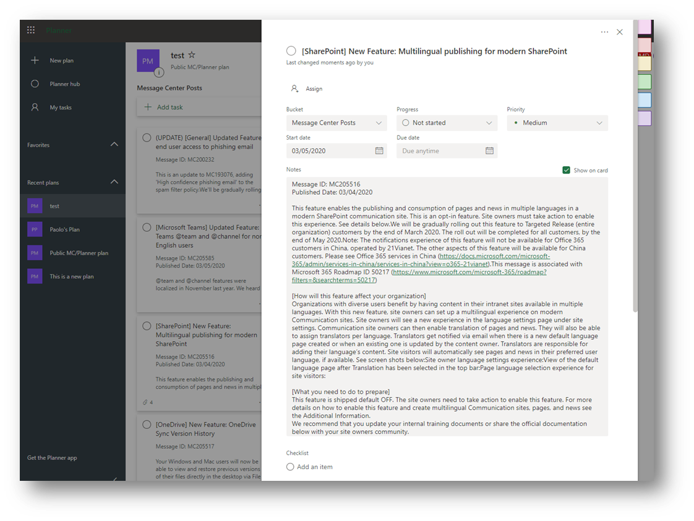

## Change types and control methods

Microsoft provides various release options and tools to aid you in controlling and deploying changes in a manner that aligns with your strategy. We discussed our recommended strategy in the section above and describe in this section how you can implement this strategy.

Changes are released to both Microsoft 365 *services* (e.g. SharePoint Online, Teams) and to *clients*, referred to as Microsoft 365 Apps (e.g. Microsoft Word, Excel, PowerPoint). Release channels and deployment controls differ between services and clients, which are important to understand as you implement your release management strategy.

### Types of changes for Microsoft 365 services and clients

Changes may be planned or unplanned by their nature. For example, security updates are not always planned, as they are reactions to emergent risks or issues in our products or services. Depending on the type of change, the communication channel may also vary. Communication channels are further described in the section [Change classification and notification](#change-classification-and-notification). A summary of change types for both services and client applications is available in *Table 1* below.

<table>
<thead>
<tr class="header">
<th>CHANGE TYPES FOR MICROSOFT 365 SERVICES AND CLIENT APPLICATIONS</th>
<th></th>
<th></th>
<th></th>
</tr>
</thead>
<tbody>
<tr class="odd">
<td></td>
<td></td>
<td></td>
<td></td>
</tr>
<tr class="even">
<td></td>
<td><strong> 
Functionality</strong></td>
<td><strong> 
Non-security updates</strong></td>
<td><strong> 
Security</strong></td>
</tr>
<tr class="odd">
<td>Type of change</td>
<td>Feature updates 
New features or applications 
Deprecated features</td>
<td>Client hotfixes for issues</td>
<td>Security patches</td>
</tr>
<tr class="even">
<td>Advance notice?</td>
<td>30 days’ notice for changes that require action</td>
<td>No, these are included in the monthly build for all channels</td>
<td>No, these are included in the monthly build for all channels</td>
</tr>
<tr class="odd">
<td>Communication channel</td>
<td>Message center 
<a href="https://go.microsoft.com/fwlink/p/?LinkID=529454">Microsoft 365 Roadmap</a> 
<a href="https://go.microsoft.com/fwlink/p/?LinkId=626089">Microsoft 365 blog</a> 
<a href="https://go.microsoft.com/fwlink/p/?linkid=860047">Microsoft 365 </a>area of the Microsoft Tech Community</td>
<td><a href="https://go.microsoft.com/fwlink/p/?LinkID=626090">Release information for updates to Microsoft 365 Apps</a></td>
<td>Security bulletin or CVE</td>
</tr>
<tr class="even">
<td>Requires admin action?</td>
<td>Sometimes</td>
<td>Rarely</td>
<td>Rarely</td>
</tr>
<tr class="odd">
<td>What kind of action?</td>
<td>Change settings 
Communicate changes to users 
Validate customizations</td>
<td>Change admin settings</td>
<td></td>
</tr>
<tr class="even">
<td>Requires testing?</td>
<td>Rarely - check business critical Add-ins</td>
<td>Sometimes - testing the fix against processes or customizations</td>
<td>Rarely</td>
</tr>
<tr class="odd">
<td>Examples of changes</td>
<td>Feature updates: PowerPoint - simpler process for embedding videos 
 
New features or applications: Microsoft Teams</td>
<td>Hotfixes based on customer reported bugs</td>
<td></td>
</tr>
</tbody>
</table>

*Table 1*

Responsibility for managing these changes is shared between Microsoft and you as the administrator of your Microsoft 365 tenant. Refer to the [Microsoft shared responsibility model](https://docs.microsoft.com/azure/security/fundamentals/shared-responsibility) for more information.

Now that we have outlined the types of changes you can expect from Microsoft 365 services and client applications, including associated responsibilities, the next section explores the different release channels and the controls available for each.

### Service release channels & controls

#### Service Release Channels

Microsoft 365 services provide two channels for receiving new product updates and features as they become available: Standard Release and Targeted Release.\[4\] These release options help you manage how your organization receives service updates. We provide you controls to designate which users receive updates, based on their association to one of the release channels.

As Microsoft develops products and features, new releases are validated in a ring deployment model. *Figure 3* depicts the validation rings, with each deployment ring reaching a broader audience. Before moving to the next ring, a threshold of deployments in the prior ring must complete without issue.

Microsoft feature teams are first to validate the features they develop (Ring 0).

Once identified bugs or issues are resolved, the feature is released to the Microsoft 365 organization spanning a wider user base for validation (Ring 1).

Once deemed ready, the feature is released to the whole of Microsoft (Ring 2), which is referred to internally as “dogfooding” our products to identify issues, prior to updates reaching the public.

Rings 3 and 4 are public releases, with Ring 3 comprised of customers who have configured their tenant, or specific users, to be on the Targeted Release channel. Substantial feedback and product performance data is collected in this ring as our customers perform integration testing and broad validation across many countries, cloud architectures, and IT professionals or power users. If your tenant, or a subset of your users, are configured for Standard Release, Ring 4 is when these users – and the rest of the world – will receive the new features.

To implement the [democratization of change](#change-evaluation-democratization) strategy within your organization, leverage Targeted Release (Ring 3) for both IT and power users.

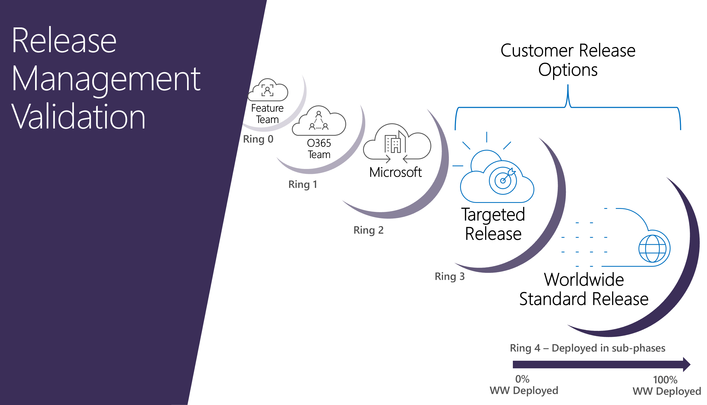

*Figure 3*

#### Service Release Controls

Your primary control for receiving service updates is the configuration of your release channels. While Microsoft provides you control over the cadence at which your users receive updates, these changes are deployed to our hyperscale cloud services and not to installations of software running in your IT infrastructure. It would be impractical for Microsoft to manage, update, and secure a global cloud with specific versions of our services running for specific tenants. This means that service changes do not provide you the same granularity of control over deployment, as compared to Microsoft 365 Apps which have both release channels and various deployment tools available.

Configuration of release options can be done from the Microsoft 365 admin portal as described in [Set up the release option in the admin center](https://docs.microsoft.com/microsoft-365/admin/manage/release-options-in-office-365?view=o365-worldwide#set-up-the-release-option-in-the-admin-center&preserve-view=true). After navigating to the portal, select **Settings** \> **Org Settings** \> **Organizational Profile** \> **Release Preferences**. *Figure 4* shows the configuration pane where you can select to have everyone on Standard Release, everyone on Targeted Release, or specific users on Targeted Release.

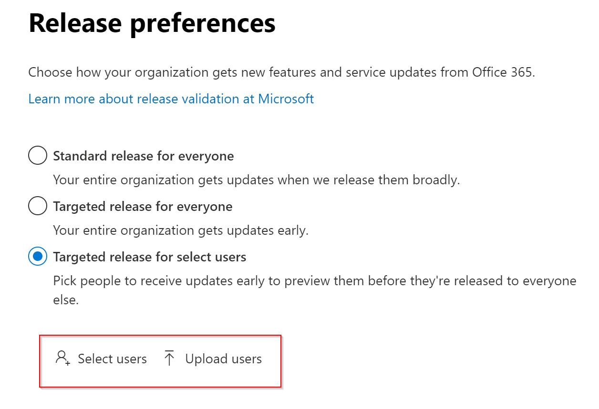

*Figure 4*

Having a staging or test tenant as part of your change strategy is important. Certain features require tenant changes prior to manifestation in the user experience. These tenant changes can be implemented in the staging tenant, allowing for feature preview, while preserving production tenant configurations.

### Client release channels & controls

#### Client Release Channels

Microsoft offers different update channels to which customers may subscribe for updates to our click-to-run clients, Microsoft 365 Apps (previously Office 365 ProPlus). These channels determine how frequently changes are released to their entire tenant or subscribed subdivisions their tenant, depending on customer configuration. Channels are a powerful mechanism through which IT departments and power users can evaluate and test upcoming changes without hindering their release to the greater end user population. Refer to [Overview of update channels for Microsoft 365 Apps](https://docs.microsoft.com/deployoffice/overview-update-channels) for more information.

*Table 2* below provides a comparison of Current Channel, Monthly Enterprise Channel, and Semi-Annual Enterprise Channel for Microsoft 365 Apps:

<table>
<thead>
<tr class="header">
<th>MICROSOFT 365 APPS UPDATE CHANNELS</th>
<th></th>
<th></th>
<th></th>
</tr>
</thead>
<tbody>
<tr class="odd">
<td>Channel Name</td>
<td><strong>Current 
Channel</strong></td>
<td><strong>Monthly Enterprise 
Channel</strong></td>
<td><strong>Semi-Annual Enterprise 
Channel</strong></td>
</tr>
<tr class="even">
<td>Recommended use</td>
<td>Provide your users with new Office features as soon as they are ready, but on no set schedule.</td>
<td>Provide your users with new Office features only once a month and on a predictable schedule.</td>
<td>For select devices in your organization, where extensive testing is needed before rolling out new Office features. For example, to comply with regulatory, governmental, or other organizational requirements.[5]</td>
</tr>
<tr class="odd">
<td>rnRelease frequency</td>
<td>At least once a month (likely more often), but on no set schedule</td>
<td>Once a month, on the second Tuesday of the month</td>
<td>Once a month, on the second Tuesday of the month</td>
</tr>
<tr class="even">
<td>Feature updates</td>
<td>As soon as they are ready (usually once a month), but on no set schedule</td>
<td>Once a month, on the second Tuesday of the month</td>
<td>Twice a year (in January and July), on the second Tuesday of the month</td>
</tr>
<tr class="odd">
<td>Security updates 
(if needed)</td>
<td>Once a month, on the second Tuesday of the month</td>
<td>Once a month, on the second Tuesday of the month</td>
<td>Once a month, on the second Tuesday of the month</td>
</tr>
<tr class="even">
<td>Non-security updates 
(if needed)</td>
<td>Usually at least once a month (possibly more often), but no set schedule</td>
<td>Once a month, on the second Tuesday of the month</td>
<td>Once a month, on the second Tuesday of the month[6]</td>
</tr>
<tr class="odd">
<td>Support duration for a given version</td>
<td>Until the next version is released with new features, which is usually about one month</td>
<td>Two months</td>
<td>Fourteen months</td>
</tr>
</tbody>
</table>

*Table 2*

Microsoft provides three main methods for modifying Microsoft 365 Apps update channels for devices in your organization:

1.  [Change the update channel with Group Policy](https://docs.microsoft.com/deployoffice/change-update-channels#change-the-update-channel-with-group-policy)

2.  [Change the update channel with the Office Deployment Tool (ODT)](https://docs.microsoft.com/deployoffice/change-update-channels#change-the-update-channel-with-the-office-deployment-tool-odt)

3.  [Change the update channel with Configuration Manager](https://docs.microsoft.com/deployoffice/change-update-channels#change-the-update-channel-with-configuration-manager)

Certain considerations exist when switching channels, such as loss of features when switching users from Current Channel to Semi-Annual Enterprise Channel. Refer to [Considerations when changing channels](https://docs.microsoft.com/deployoffice/change-update-channels#considerations-when-changing-channels) for a complete list.

#### Client Release Controls

In conjunction with release channels, which are inherently controls themselves, Microsoft provides you a selection of tools and configurations for further deploying, controlling, and managing your Microsoft 365 clients. The tools for managing your devices and the Microsoft 365 clients installed on them have historically been decentralized. In addition to a multitude of third-party options available in the market, the Microsoft offered solutions included the following tools:

  - [Microsoft Endpoint Configuration Manager](https://docs.microsoft.com/configmgr)

  - [Intune](https://docs.microsoft.com/intune)

  - [Desktop Analytics](https://docs.microsoft.com/mem/configmgr/desktop-analytics/overview)

  - [Autopilot](https://docs.microsoft.com/mem/configmgr/desktop-analytics/overview)

  - [Microsoft 365 Apps admin center](https://docs.microsoft.com/deployoffice/admincenter/overview#:~:text=The%20Microsoft%20365%20Apps%20admin%20center%20provides%20modern,features%20and%20services%20available%20in%20the%20admin%20center.) ([config.office.com](https://config.office.com/)), which integrates with the [Office cloud policy service](https://docs.microsoft.com/deployoffice/overview-office-cloud-policy-service)

  - And other features in the [Device Management Admin Console](https://techcommunity.microsoft.com/t5/enterprise-mobility-security/microsoft-intune-rolls-out-an-improved-streamlined-endpoint/ba-p/937760)

While the capabilities these tools represent are still available, we have listened market feedback and consolidated these tools to create one single integrated solution: **Microsoft Endpoint Configuration Manager**.

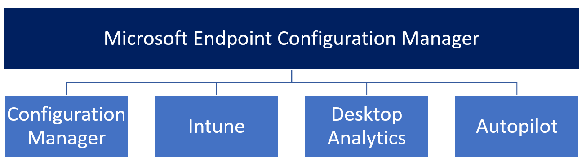

As of 2019, Microsoft refers to our suite of management solutions under this single brand. By attaching Intune to your Configuration Manager deployment (referred to as “Co-Management”), we empower you to attach the intelligence from the Microsoft 365 cloud to your workflows in powerful ways. You can completely automate compatibility testing for Windows upgrades, you can deploy client updates faster to make your organization secure and compliant quickly, and you can take immediate actions on your devices.

[Manage updates to Microsoft 365 Apps with Microsoft Endpoint Configuration Manager](https://docs.microsoft.com/deployoffice/manage-microsoft-365-apps-updates-configuration-manager) is your source for understanding:

  - Prerequisites required when using Microsoft Endpoint Configuration Manager to update Microsoft 365 Apps

  - How to enable Configuration Manager to receive Microsoft 365 client package notifications

  - How to enable Microsoft 365 clients to receive updates from Configuration Manager

  - Your options for enabling clients to receive updates from Configuration Manager\[7\]

The [Microsoft Endpoint Configuration Manager documentation](https://docs.microsoft.com/mem/configmgr/) provides comprehensive instructions for configuring your deployment strategy.

The [Microsoft 365 Apps admin center](https://docs.microsoft.com/deployoffice/admincenter/overview#:~:text=The%20Microsoft%20365%20Apps%20admin%20center%20provides%20modern,features%20and%20services%20available%20in%20the%20admin%20center.) is designed to help admins lower their total cost of ownership while being able to quickly deliver features, security, and quality updates with Microsoft 365 Apps. The insight and control capabilities can provide deeper and near-real-time deployment information, issue notification, and quick actions (snooze, restore, pause, and resume) to ensure minimal end-user downtime.

The Microsoft 365 Apps admin center offers [inventory](https://docs.microsoft.com/deployoffice/admincenter/inventory) and [servicing profiles](https://docs.microsoft.com/deployoffice/admincenter/servicing-profile) to better manage device updates for Microsoft 365 Apps.

**Office Inventory**

  - Drill into detailed views of Office devices and add-in information.

  - View insights like channel/build spread, add-in diversity, and more.

  - Export the data.

**Security Currency**

  - View a dashboard for security update compliance status cross-channel.

  - Set your target goal and timeline to track and report.

  - Identify failing devices and take mitigating action.

**Servicing Profiles**

  - Setup profiles for devices to automatically receive updates based on custom requirements.

  - Throttle based on network congestion and location.

  - Takes advantage of Win10 DO.

  - Act using the tool to Pause, Restore, and Snooze deployments.

  - Maintain device compliance with update deadlines and update date exclusions.

> [!NOTE]
> The Microsoft 365 Apps admin center is available to enterprise customers with E3 SKUs and above at the time of publishing.

#### Client Configuration Controls

After Microsoft 365 Apps are deployed to devices and users, at your defined cadence and with enterprise-grade tools, Microsoft provides you granular client configuration controls. Microsoft 365 Apps have over 2,000 configuration options allowing you to alter client behavior to suit your organization’s risk, compliance, and operational profiles.

Although group policy has historically been used to enforce client settings and is still a viable method, we have developed a cloud-based synchronization nexus service that allows policies to roam with users: the [Office cloud policy service](https://docs.microsoft.com/deployoffice/overview-office-cloud-policy-service) (OCPS). OCPS lets you enforce policy settings for Microsoft 365 Apps for enterprise on a user's device, even if the device is not domain joined or otherwise managed. When a user signs into Microsoft 365 Apps for enterprise on a device, the policy settings roam to that device. You can also enforce some policy settings for Office web apps, both for users who are signed in and for users who access documents anonymously.

*Figure 5* shows the portal and the vast number of policy settings available for configuration in the [Microsoft 365 Apps admin center](https://config.office.com/). You can also use the Office cloud policy service directly in the [Microsoft Endpoint Manager admin center](https://go.microsoft.com/fwlink/p/?linkid=2109431).

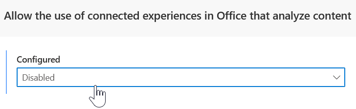
Some configuration options control basic client behavior, such as scroll bar visibility in Excel or availability of Live Subtitles in PowerPoint, while other configurations may be important to your security, compliance, or risk departments. For example, OCPS allows you to enable or disable connected experiences in Microsoft 365 Apps, which provide users with web-based services from their desktop clients (e.g. Translator, Bing image search, or 3D Maps).

Microsoft provides customers privacy controls so you can meet compliance and security obligations on a global scale, regardless of operational localities. Modifying these settings with a simple dropdown menu, and having those settings apply across the devices leveraging that profile is the power of OCPS.

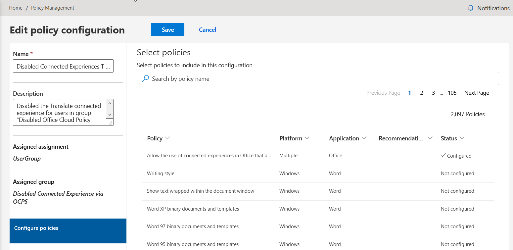

*Figure 5*

### Change evaluation democratization 

Earlier, we shared data supporting the end user value of being on Current Channel, which provides continuous updates. We recommend this channel and Monthly Enterprise Channel as two solutions for expediting update evaluation and testing. Microsoft recommends two models for using these channels:

**Test Tenant:** Customers utilize a test tenant that mimics production to evaluate and test incoming features. We recommend the test tenant is subscribed to Current Channel or Monthly Enterprise Channel, for clients, and to the Targeted Release channel for services. Test tenants are used for integration testing and product evaluation separate from production. Traditionally, IT owns tests tenants and operates the test accounts within. This is an IT-centric model that may cause bottlenecks and incomplete evaluations to occur. We recommend inclusion of users from various departments and roles in your test tenant. IT departments are not experts on every product and are not always best suited to perform certain product evaluations. For Microsoft 365 services, Targeted Release and Standard Release channels are available.

  - **Microsoft 365 Apps**: Information on the benefits and how to enroll or change update channels is available in the article: [Change the Microsoft 365 Apps update channel for devices in your organization](https://docs.microsoft.com/deployoffice/change-update-channels), with the benefits described in the [Client release channels](#client-release-channels) section of this document.

  - **Microsoft 365 Services:** Information on the benefits and how to enroll into these update channels is available in the article: [Set up the Standard or Targeted release options](https://docs.microsoft.com/microsoft-365/admin/manage/release-options-in-office-365?view=o365-worldwide&preserve-view=true), with the channels outlined in the above section [Service release channels & controls](#service-release-channels--controls).

**Power User (Expertise):** Democratize update evaluations by identifying power users within your production tenant and subscribing them to Current Channel or Monthly Enterprise Channel (Microsoft 365 Apps) and the Targeted Release channel (services). Only the power users specified will receive continuous or early updates and will serve as an essential source of feedback, bugs, and experience across various lines of business and user expertise.

These two models may be used concurrently to provide comprehensive, effective, and efficient evaluation of incoming updates. Moving away from the IT-centric acceptance model and democratizing evaluation across your organization will improve the speed and quality of the effort. If the remainder of your organization subscribes to Semi-Annual Enterprise Channel or Standard release channels (Microsoft 365 Apps and Microsoft 365 services respectively), the updates evaluated in the test tenant, by IT and by power users, will be ready to deploy with reduced friction.

Internally, Microsoft employs these change evaluation strategies in a program called Microsoft Elite. The Microsoft Elite program is beyond dogfood and serves as our early adopter program. Our employees test features and specific scenarios, providing quality feedback that improves programs and features before they are released to our customers and colleagues. You may use the release cadences and strategy described above to mimic this program in your own environment.

## Microsoft’s change plan, policies, & procedures

Microsoft’s change mission is to enable rapid delivery, improve productivity, and delight customers with new applications and features while minimizing friction and disruption. Managing change is an evergreen program delivering continuous innovation to end users. Changes are necessary to keep products and services secure, up to date, and working as expected. While innovation is key to delivering end user value, we recognize that impactful changes to your environment may create legal, regulatory, security, or compliance risks. To reduce potential risk, Microsoft commits to:

1.  Following defined change control policies and procedures

2.  Notifying you of impactful changes at least 30 days in advance

3.  Listening to community feedback to improve the change release process

### Change management plan

The Microsoft 365 Change Management Plan is essential for enabling customers to plan for and manage change. The pillars of the plan are pictured below:

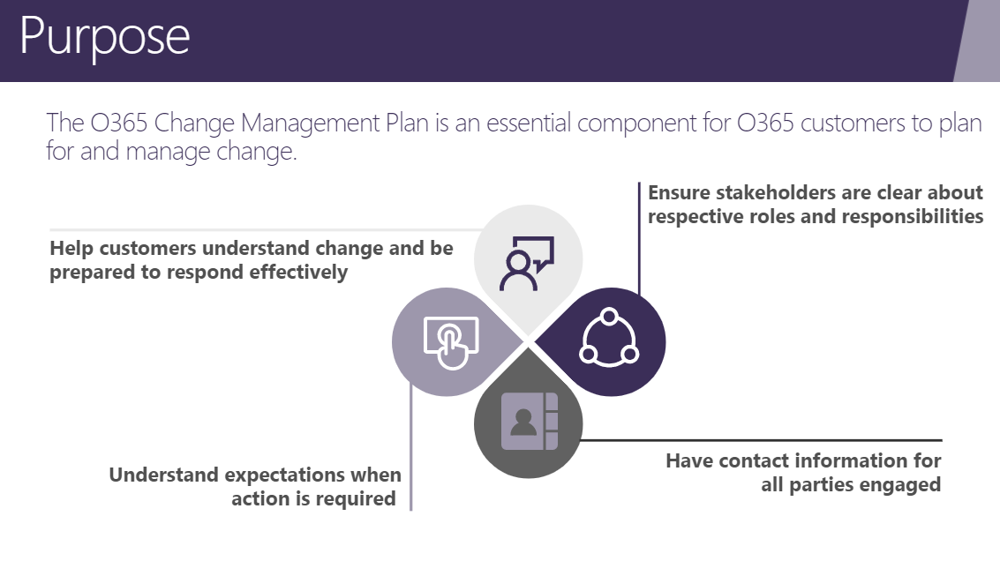

The Microsoft Change Management Plan outlines three change phases with recommended customer actions associated with each, as illustrated in *Table 3* below:

<table>
<thead>
<tr class="header">
<th>MICROSOFT CHANGE MANAGEMENT PLAN PHASES</th>
<th></th>
<th></th>
<th></th>
</tr>
</thead>
<tbody>
<tr class="odd">
<td>Phases</td>
<td><ol type="1">
<li>
<strong>Before Change</strong>
</li>
</ol></td>
<td><ol start="2" type="1">
<li>
<strong>During Change</strong>
</li>
</ol></td>
<td><ol start="3" type="1">
<li>
<strong>After Change</strong>
</li>
</ol></td>
</tr>
<tr class="even">
<td></td>
<td>
Identify a change center of excellence or cloud governance board with representatives from each line of defense in the business.

Validate existing change policies and create policies as required.
</td>
<td>Consider the change’s impact to your organization and your end users</td>
<td>Provide feedback in the <a href="https://docs.microsoft.com/services-hub/support/customer-pulse">Customer Pulse</a>, or using the Message center communication</td>
</tr>
<tr class="odd">
<td></td>
<td>
Know about the change:

<ul>
<li>
Check <a href="https://www.microsoft.com/en-us/microsoft-365/roadmap?filters=">Product Roadmap</a>
</li>
<li>
Check the Message center in the Microsoft 365 <a href="https://portal.office.com">admin</a> center
</li>
</ul></td>
<td>Stay aware of workflow changes to help deployment teams and increase end user productivity through proactive adoption and change management</td>
<td>Review factors that drive successful deployment in your organization and adapt to reduce impact and increase awareness and efficiency</td>
</tr>
<tr class="even">
<td></td>
<td>Provide feedback about an upcoming service change in the <a href="https://docs.microsoft.com/services-hub/support/customer-pulse">Customer Pulse</a> or by using the Message center communication.</td>
<td>Ensure the stakeholders and contacts section of your customer profile is complete and provided to your Technical Account Manager (TAM)</td>
<td>Changes are designed to benefit customers. Help your users be aware of changes, understand them, and get the most out of them.</td>
</tr>
</tbody>
</table>

*Table 3*

Regardless of change strategy, ensuring your users are aware of and understand incorporated changes is key to business success. The criticality of adoption and change management will continue to trend upward as Microsoft and the greater market move toward continuous change.

### Change classification and notification

Microsoft classifies changes to assist customers in understanding and planning appropriately for each update. “Major updates” should be a key focus for customers evaluating and analyzing upcoming changes. If a change is classified as a major update, Microsoft commits to notifying customers at least 30 days prior to implementation when an action may be required.

To be classified as a **major update**, changes must meet one or more of the following criteria:

  - Changes to daily productivity such as inbox, meetings delegations, sharing, and access.

  - Changes to the themes, web parts, and other components that may impact customizations.

  - Increases or decreases to visible capacity such as storage, number of rules, items, or durations.

  - Rebranding that may cause end-user confusion or result in help desk / collateral changes or URL changes.

  - A new service or application.

  - Changes requiring an admin action (exclusive of prevent / fix).

  - Changes to where data is stored (may impact regulatory or legal requirements).

The Message center in the Microsoft 365 [admin center](https://portal.office.com/) is your primary source of change information. Message center marks changes of high importance (major updates) with a red exclamation mark (❗), enabling easy identification and tracking of significant updates across various stages of release:

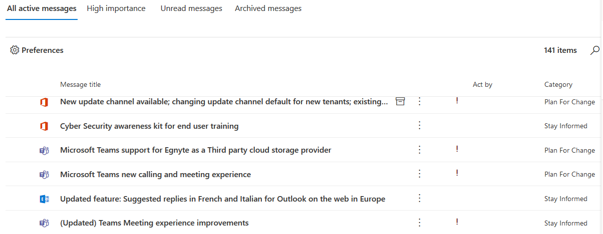

Alluded to earlier and further described here, messages are identified in the right-hand column above by one of three categories:  
  
**Prevent or Fix Issues**: These messages inform you of known issues affecting your organization and may require that you take action to avoid disruptions in service. Prevent or fix issues are different than Service health messages because they prompt you to be proactive to avoid issues.  
  
**Plan for Change**: These messages inform you of changes to Microsoft 365 that may require you to act to avoid disruptions in service. For example, we will let you know about changes to system requirements or about features that are being removed. We strive to provide at least 30 days' notice of any change that requires an admin to act to keep the service running normally.  
  
**Stay Informed**: This is where we tell you about new or updated features that we are turning on in your organization. The features are usually announced first in the [Microsoft 365 Roadmap](https://go.microsoft.com/fwlink/?linkid=2070821). Stay informed messages may also let you know about planned maintenance in accordance with our Service Level Agreement. Planned maintenance may result in down time, where you or your users cannot access Microsoft 365, a specific feature, or a service such as email or OneDrive for Business. Review the [Message center documentation](https://docs.microsoft.com/microsoft-365/admin/manage/message-center?view=o365-worldwide&preserve-view=true) for more information.

Both “Prevent or Fix Issues” and “Plan for Change” messages may require action from admins. An action required date is provided in the “Act by” column to assist customers in prioritization and planning.

The Message center admin user interface is one way to obtain service change information. The [Office 365 Service Communications API](https://docs.microsoft.com/office/office-365-management-api/office-365-service-communications-api-reference) allows you to build automated solutions for querying the following relevant data:

  - **Get Services:** Returns the list of services to which you are subscribed.

  - **Get Current Status:** Returns a real-time view of current and ongoing services incidents.

  - **Get Historical Status:** Get a historical view of service incidents.

  - **Get Messages:** Find incident and Message center communications, which include change information.

We commit to continuously improving our change classification and notification processes. Our efforts to predict which changes may impact customer environments are the basis of our change classifications, but these predictions are limited without input from our community of customers. The customer feedback we receive through various channels enhances our ability to respond to change concerns in an agile, democratized, customer-centric manner.

## Sources of information and feedback channels

Microsoft publishes change information in a variety of locations to ensure broad dissemination and accessibility. The [Message center](https://docs.microsoft.com/microsoft-365/admin/manage/message-center?view=o365-worldwide&preserve-view=true) in the Microsoft 365 Admin Portal is a key source of tenant-specific information, but you should pay attention to the entire suite of sources to ensure they are holistically informed in a timely manner.

### Sources of change information

[**Microsoft 365 Roadmap**](https://www.microsoft.com/en-us/microsoft-365/roadmap?filters=)

The Microsoft 365 Roadmap is a public website that relays the status of products that are in development, rolling out, or launched. You can view the status of each feature or workload, search using tags, and confirm release dates from a single portal. Filtering allows you to easily find services or features of interest.

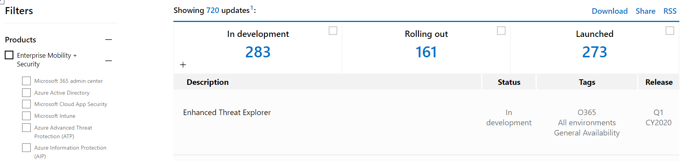

[**Message center Weekly Digest**](https://techcommunity.microsoft.com/t5/change-alerts/office-365-message-center-weekly-digest/m-p/46692)

The Message center weekly digest allows your admins to review Message center communications via email in a digestible, easily shared, summary format. The digest was created in response to customer feedback and demonstrates the innovative ways the Microsoft community effects change in our processes. Customers may choose to opt out of digest emails by changing settings in the Admin Portal. An example of the digest is included below.

:::image type="content" source="images/message-center-announcement.png" alt-text="Sample Message center announcement":::

[**Mobile Admin App**](https://docs.microsoft.com/microsoft-365/admin/admin-overview/admin-mobile-app?view=o365-worldwide&preserve-view=true)

The Microsoft 365 admin mobile app has over 80 features that help you manage your company when you’re on the go. The app is available for download in the Apple or Google Play store for iOS and Android, respectively. Common tasks that can be performed from the app include user password reset, adding users to a group, and reviewing change notifications and alerts. We recommend enabling mobile alerts, so you stay apprised of updates the moment they are released.

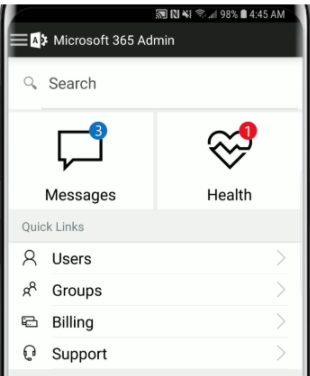 [Download the mobile admin app](https://www.microsoft.com/en-us/microsoft-365/business/manage-office-365-admin-app)

**Other Change Information Resources**

We make changes to our services, but we also update Microsoft 365 clients. Both sets of changes follow our Change Management Plan and are communicated in the Message center. Documentation on client changes can be found at the following locations:

  - [Overview of update channels for Microsoft 365 Apps](https://technet.microsoft.com/library/mt455210.aspx)
    
      - These update channels mirror those described above in the Change Management Plan

  - [Change management for Microsoft 365 clients](https://technet.microsoft.com/library/mt584223)
    
      - This documentation describes the servicing model for updates and reinforces what was discussed in the Change Management Plan section.

  - [Release information for updates to Microsoft 365 Apps](https://docs.microsoft.com/eofficeupdates/release-notes-microsoft365-apps?redirectedfrom=MSDN)
    
      - Client release notes provide a wealth of information on the latest security updates, update sizes, and updates for different platforms (e.g. Mac)

  - [Microsoft 365 news and announcements](https://blogs.office.com)
    
      - Read about the latest releases and features in our blog posts, which are separate from our formal documentation at [docs.microsoft.com](https://docs.microsoft.com/).

  - [Microsoft 365 Service Descriptions](https://technet.microsoft.com/library/office-365-service-descriptions.aspx)
    
      - Review Microsoft 365 services and features to learn more about existing features you can leverage for improving security and productivity.

Outside of formal documentation, we recommend customers join the [Microsoft Tech Community](https://aka.ms/office365network) to keep a pulse on how changes are managed and deployed by industry peers. The Microsoft Tech Community is an active, raw, real-time source of information and we actively monitor the platform to better understand how changes are being received.

### Feedback channels

Microsoft establishes a virtuous feedback loop between customers and our products. There are several examples of changes that have been rolled back or modified resulting from feedback submitted by customers. Customers may provide feedback through multiple channels.

  - Customer Pulse

  - Microsoft 365 Admin Portal

  - Message center

  - Microsoft Tech Community

[**Customer Pulse**](https://docs.microsoft.com/services-hub/support/customer-pulse)  
It only takes a few minutes to provide valuable feedback through Customer Pulse. Sign into the [Services Hub](https://docs.microsoft.com/microsoft-365/admin/manage/message-center?view=o365-worldwide&preserve-view=true), expand the “Management” menu, select “Customer Pulse,” and follow the on-screen instructions. This feedback is aggregated and routed directly to engineering.

[**Microsoft 365 Admin Portal**](https://portal.office.com/)  
At the bottom-right of each page in the Admin Portal, customers can provide feedback by clicking the “Give feedback” button.

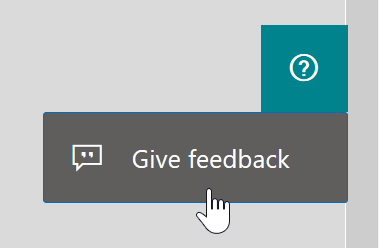

[**Center**](https://admin.microsoft.com/Adminportal/Home?source=applauncher#/MessageCenter)

The “Give feedback” button also exists in the Message center so you can provide feedback on incoming changes or other notifications without switching portal pages. The feedback from the Message center goes directly to the owning engineering and marketing teams within Microsoft. Microsoft owners receive a daily report of new feedback provided. If your feedback is regarding a specific change or message, be sure to include the Message center ID so the feedback can be properly correlated.

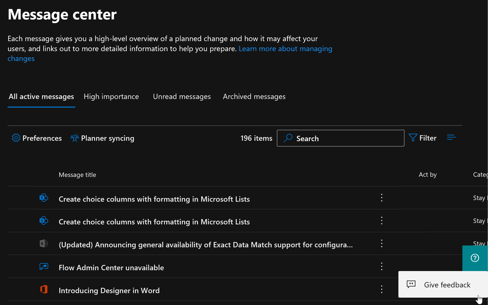

The Message center also supports “like” and “dislike” buttons for each message, allowing you to provide feedback without much time input. We aggregate this feedback and use it to understand general customer reception of our recent changes.

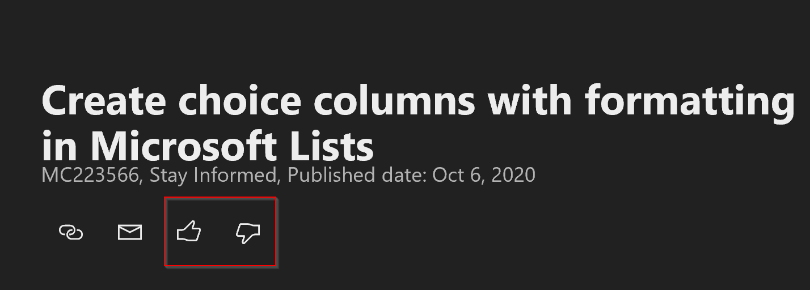

[**Microsoft Tech Community**](https://aka.ms/office365network)

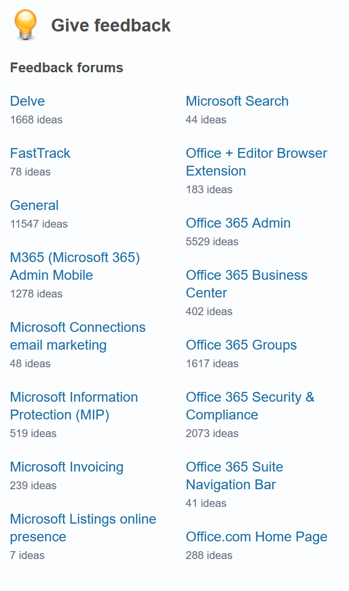 This community serves both as a source of change information from your peers and as a forum for providing feedback. We monitor the Tech Community forums for valuable feedback and use the information to influence internal decisions.

1.  NPS is an industry calculation measuring end user preferences for a product or service. NPS is calculated by accounting for users who detract, support, or are neutral toward the target of the examination. Subtracting the percentage of Detractors from the percentage of Promoters yields the Net Promoter Score, which can range from a low of -100 (if every customer is a Detractor) to a high of 100 (if every customer is a Promoter).

2.  With a 1.5 margin of error

3.  Microsoft provides controls over the diagnostic data collected from user endpoints, as described in [Use policy settings to manage privacy controls for Microsoft 365 Apps for enterprise](https://docs.microsoft.com/DeployOffice/privacy/manage-privacy-controls). To the extent Microsoft is a processor or subprocessor of Personal Data subject to the GDPR, the GDPR Terms in the [Microsoft Online Services Data Protection Addendum](https://www.microsoft.com/en-us/licensing/product-licensing/products#:~:text=Online%20Services%20Data%20Protection%20Addendum%20%28DPA%29%20When%20you,The%20DPA%20is%20an%20addendum%20to%20the%20OST.) Attachment 3 govern that processing and the parties also agree to the following terms in this sub-section (“Processing of Personal Data; GDPR”).

4.  Guidance for opting into these service release channels can be found in the article [Set up the Standard or Targeted release options](https://microsoft-my.sharepoint-df.com/:x:/p/tabriggs/EagrVwgMlWxAiQhXZaOxcnoBpJvtc1e79KkMNjszu9gPqg).

5.  If your entire organization is on a semi-annual cadence, you may find that the six-month period between feature updates causes your clients to fall out of compliance with regulatory requirements or internal policies as you wait an such an extended period between releases.

6.  This consists of a selected subset of non-security updates for Semi-Annual Enterprise Channel.

7.  For Configuration Manager to be able to manage Office updates, an Office COM object needs to be enabled on the computer where Office is installed. The Office COM object takes commands from Configuration Manager to download and install client updates. You can enable the Office COM object by using client policy in Configuration Manager, Group Policy, or the Office Deployment Tool. If you use more than one method, the Group Policy setting determines the final configuration.

## Microsoft Corporation Non-Disclosure Agreement for Compliance Materials

  
Legal Disclaimer

READ THIS! THIS IS A LEGAL AGREEMENT BETWEEN MICROSOFT CORPORATION ("MICROSOFT") AND THE RECIPIENT OF THESE MATERIALS, WHETHER AN INDIVIDUAL OR A CORPORATION OR OTHER ENTITY ("YOU"). BY CLICKING "I ACCEPT", DOWNLOADING OR USING THE MATERIALS, YOU AGREE TO THESE TERMS. IF THIS AGREEMENT IS ATTACHED TO MATERIALS, BY ACCESSING OR USING THE ATTACHED MATERIALS, YOU AGREE TO THESE TERMS. 
1. For good and valuable consideration, the receipt and sufficiency of which are acknowledged, You and Microsoft agree as follows:  
&nbsp;&nbsp;&nbsp;&nbsp;&nbsp;&nbsp;(a) If You are an authorized representative of a corporation or other entity ("Company"), and such Company  has executed a Microsoft Corporation Non-Disclosure Agreement that is not limited to a specific subject matter or event ("Microsoft NDA"), You represent that  You have authority to act on behalf of Company and agree that the Confidential Information, as defined in the Microsoft NDA, is subject to the terms and  conditions of the Microsoft NDA and that Company will treat the Confidential Information accordingly;  
&nbsp;&nbsp;&nbsp;&nbsp;&nbsp;&nbsp;(b) If You are an individual, and have executed a  Microsoft NDA, You agree that the Confidential Information, as defined in the Microsoft NDA, is subject to the terms and conditions of the Microsoft NDA and  that You will treat the Confidential Information accordingly; or  
&nbsp;&nbsp;&nbsp;&nbsp;&nbsp;&nbsp;(c) If a Microsoft NDA has not been executed, You (if You are an individual), or Company (if You  are an authorized representative of Company), as applicable, agrees:  
&nbsp;&nbsp;&nbsp;&nbsp;&nbsp;&nbsp;&nbsp;&nbsp;&nbsp;(a) to refrain from disclosing or distributing the Confidential Information to any third party  for five (5) years from the date of disclosure of the Confidential Information by Microsoft to Company/You;  
&nbsp;&nbsp;&nbsp;&nbsp;&nbsp;&nbsp;&nbsp;&nbsp;&nbsp;(b) to refrain from reproducing or summarizing the  Confidential Information; and  
&nbsp;&nbsp;&nbsp;&nbsp;&nbsp;&nbsp;&nbsp;&nbsp;&nbsp;(c) to take reasonable security precautions, at least as great as the precautions it takes to protect its own confidential information,  but no less than reasonable care, to keep confidential the Confidential Information. You/Company, however, may disclose Confidential Information in  accordance with a judicial or other governmental order, provided You/Company either   
&nbsp;&nbsp;&nbsp;&nbsp;&nbsp;&nbsp;&nbsp;&nbsp;&nbsp;&nbsp;&nbsp;&nbsp;(i) gives Microsoft reasonable notice prior to such disclosure and to allow  Microsoft a reasonable opportunity to seek a protective order or equivalent, or  
&nbsp;&nbsp;&nbsp;&nbsp;&nbsp;&nbsp;&nbsp;&nbsp;&nbsp;&nbsp;&nbsp;&nbsp;(ii) obtains written assurance from the applicable judicial or governmental entity  that it will afford the Confidential Information the highest level of protection afforded under applicable law or regulation. Confidential Information shall not  include any information, however designated, that:  
&nbsp;&nbsp;&nbsp;&nbsp;&nbsp;&nbsp;&nbsp;&nbsp;&nbsp;&nbsp;&nbsp;&nbsp;&nbsp;&nbsp;&nbsp;(i) is or subsequently becomes publicly available without Your/Company’s breach of any obligation owed to  Microsoft;  
&nbsp;&nbsp;&nbsp;&nbsp;&nbsp;&nbsp;&nbsp;&nbsp;&nbsp;&nbsp;&nbsp;&nbsp;&nbsp;&nbsp;&nbsp;(ii) became known to You/Company prior to Microsoft’s disclosure of such information to You/Company pursuant to the terms of this Agreement;  
&nbsp;&nbsp;&nbsp;&nbsp;&nbsp;&nbsp;&nbsp;&nbsp;&nbsp;&nbsp;&nbsp;&nbsp;&nbsp;&nbsp;&nbsp;(iii)  became known to You/Company from a source other than Microsoft other than by the breach of an obligation of confidentiality owed to Microsoft; or  
&nbsp;&nbsp;&nbsp;&nbsp;&nbsp;&nbsp;&nbsp;&nbsp;&nbsp;&nbsp;&nbsp;&nbsp;&nbsp;&nbsp;&nbsp;(iv) is  independently developed by You/Company. For purposes of this paragraph, "Confidential Information" means nonpublic information that Microsoft designates as being confidential or which, under the circumstances surrounding disclosure ought to be treated as confidential by Recipient. "Confidential Information" includes, without limitation, information in tangible or intangible form relating to and/or including released or unreleased Microsoft software or hardware products, the marketing or promotion of any Microsoft product, Microsoft's business policies or practices, and information received from others that Microsoft is obligated to treat as confidential.  
2. You may review these Materials only  
&nbsp;&nbsp;&nbsp;&nbsp;&nbsp;&nbsp;(a) as a reference to validate the platform and assist you in evaluating the referenced product(s) for purchase and use. All other rights are retained by Microsoft; this agreement does not give You rights under any Microsoft patents. You may not  
&nbsp;&nbsp;&nbsp;&nbsp;&nbsp;&nbsp;&nbsp;&nbsp;&nbsp;(i) duplicate any part of these Materials,  
&nbsp;&nbsp;&nbsp;&nbsp;&nbsp;&nbsp;&nbsp;&nbsp;&nbsp;(ii) remove this agreement or any notices from these Materials, or  
&nbsp;&nbsp;&nbsp;&nbsp;&nbsp;&nbsp;&nbsp;&nbsp;&nbsp;(iii) give any part of these Materials, or assign or otherwise provide Your rights under this agreement, to anyone else.  
3. If You are an entity and  
&nbsp;&nbsp;&nbsp;&nbsp;&nbsp;&nbsp;(a) merge into another entity or  
&nbsp;&nbsp;&nbsp;&nbsp;&nbsp;&nbsp;(b) a controlling ownership interest in You changes, your right to use these Materials automatically terminates and You must destroy them.  
4. Monetary damages may not sufficiently compensate a breach of these terms. Microsoft may seek court orders to stop the disclosure of Confidential Information in breach of these terms without the obligation of posting a bond.  
5. This agreement is governed by the laws of the State of Washington. Any dispute involving it must be brought in the federal or state superior courts located in King County, Washington, and You waive any defenses allowing the dispute to be litigated elsewhere. If there is litigation, the losing party must pay the other party’s reasonable attorneys’ fees, costs and other expenses. If any part of this agreement is unenforceable, it will be considered modified to the extent necessary to make it enforceable, and the remainder shall continue in effect. This agreement is the entire agreement between You and Microsoft concerning these Materials; it may be changed only by a written document signed by both You and Microsoft. 

