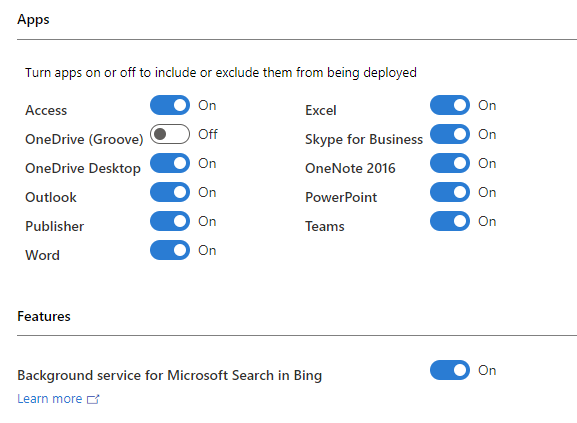
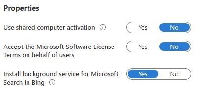

# Microsoft Search in Bing and Microsoft 365 Apps for enterprise

Microsoft Search in Bing helps the users in your organization quickly find work-related information, including people, files, internal sites, and more. Searching for this information is as easy as searching the web. For more information, see [What is Microsoft Search in Bing?](#what-is-microsoft-search-in-bing)

To help your users take advantage of the benefits of Microsoft Search in Bing, we’re making an extension available for the Google Chrome web browser. This optional extension will be available only in specific [locations](#which-locations-will-receive-the-microsoft-search-in-bing-extension) for domain-joined devices running Windows. If you decide to deploy this extension, it sets Bing as the default search engine for Google Chrome and provides easier access to Microsoft Search capabilities. If Bing is already the default search engine, the extension doesn't get installed. Even after the extension is installed, a simple [On/Off](#change-whether-bing-is-the-default-search-engine-for-google-chrome) toggle easily allows your users to stop using Bing as the default search engine.

Deployment of this optional extension relies on a background service, which we’re making available with Microsoft 365 Apps for enterprise (previously named Office 365 ProPlus). Even with the background service installed, you have control over the deployment of the extension. For example, the extension won’t get installed on devices in your organization unless you opt in. You can opt in by selecting a specific setting in the Microsoft Search section of the Microsoft 365 admin center. For more information, see [How does the Microsoft Search in Bing extension for Google Chrome get installed?](#how-does-the-microsoft-search-in-bing-extension-for-google-chrome-get-installed)

This extension is expected to be available gradually starting with Version 2005 of Microsoft 365 Apps for enterprise, for both new installations and for updates to existing installations. For more information about the schedule, [review this table](#which-versions-of-microsoft-365-apps-for-enterprise-include-the-background-service-for-microsoft-search-in-bing).

## What is Microsoft Search in Bing?

Microsoft Search in Bing enables your users to use the familiar browser address bar and search box to find workplace information more easily. For example, documents, internal sites and business tools, people and org charts, and other relevant information from within your organization. Microsoft Search in Bing searches across files, SharePoint sites, OneDrive content, Teams and Yammer conversations, and other shared data sources in your organization, as well as the web.

Microsoft Search is the native search experience in Microsoft 365, so no initial setup is required for access within Office apps. Microsoft Search in Bing enables easier access through the address bar.  You can improve the search experience for your users by adding content, such as bookmarks, Q&As, acronyms, building locations, and floor plans. For more information, see [How to enhance Microsoft Search in Bing results for your organization](#how-to-enhance-microsoft-search-in-bing-results-for-your-organization).

Users must be signed in with their work or school account to receive results from Microsoft Search in Bing. For more information, see [Security and Privacy for Microsoft Search in Bing](https://docs.microsoft.com/microsoftsearch/security-for-search).

For more information about features and capabilities, see the following resources:

- [Intelligent search for work](https://www.microsoft.com/edge/business/intelligent-search-with-bing)
- [Microsoft Search and How to Set it Up](https://www.youtube.com/watch?v=a5oXeaV1LEI) *(Microsoft Mechanics video)*
- [Overview of Microsoft Search](https://docs.microsoft.com/microsoftsearch/overview-microsoft-search) *(documentation)*

## How does the Microsoft Search in Bing extension for Google Chrome get installed?

Several things have to happen for the Microsoft Search in Bing extension to be installed for Google Chrome on the user’s device.

- You must opt in by configuring a setting in the Microsoft Search section of the Microsoft 365 admin center.
- A background service for Microsoft Search in Bing must be installed on the user’s device. This background service is included with Microsoft 365 Apps for enterprise.
- The device must meet specific criteria  for the extension to be installed.

For more details, see the following sections.

### Configure the setting in the Microsoft 365 admin center to allow the extension to be installed

To allow the extension to be installed, sign in to the Microsoft 365 admin center with your admin account. Then, go to **Show all** > **Settings** > **Microsoft Search** > **Configurations**, and then choose **Edit**.

There you'll see the **Install extension and set Bing as the default search engine** check box. The check box is not selected by default, as shown in the following screenshot.


To allow the extension to be installed, select the check box, and then choose **Save**.

If the extension has been installed on devices in your organization, and you clear the check box and choose **Save**, the extension is removed and Bing is no longer the default search engine on those devices. These changes might take up to 24 hours to take effect on those devices.

#### Assign the extension to groups of users

You can choose to provide the extension to everyone in your organization or just specific groups of users. The option to provide the extension only to specific groups of users allows you to do the following in your organization:
- Pilot the use of Microsoft Search in Bing to a subset of users before deploying more broadly.
- Deploy the extension only to groups of users that will benefit most from using Microsoft Search in Bing.

Changes that you make to which users get the extension can take up to 24 hours to take effect on their devices.

### Install the background service for Microsoft Search in Bing on the user’s device

Another requirement is that a background service for Microsoft Search in Bing needs to be installed on the user’s device. This background service is included with Microsoft 365 Apps for enterprise, starting with Version 2005. For more information about the schedule, [review this table](#which-versions-of-microsoft-365-apps-for-enterprise-include-the-background-service-for-microsoft-search-in-bing).

Once the background service is installed, it checks whether the setting in the Microsoft 365 admin center is selected. That check is made once a day.

This background service gets installed automatically on the user’s device only if all of the following criteria are met:

- You’re installing or updating to Version 2005 or later of Microsoft 365 Apps for enterprise.
- The device is running Windows.
- The device is joined to an Active Directory Domain Services (AD DS) domain in Windows Server.

> [!NOTE]
> The background service is **not** installed if the device is joined only to an Azure Active Directory (AAD) domain.
>
> Also, the background service is **not** included with any of the following types of Office:
> - Microsoft 365 Apps for business (previously named Office 365 Business)
> - Office for Mac
> - Volume licensed versions of Office 2019, such as Office Professional Plus 2019

You can also [manually download and install the background service](#manually-download-and-install-the-background-service).

If you don't want the background service installed, see [How to prevent the background service for Microsoft Search in Bing from being installed](#how-to-prevent-the-background-service-for-microsoft-search-in-bing-from-being-installed-with-microsoft-365-apps-for-enterprise).

### Criteria that need to be met to install the extension

If the check box is selected in the Microsoft 365 admin center and the background service is installed on the user’s device, the background service then looks to see if the following criteria are met:

- The device is located in one of the specified [locations](#which-locations-will-receive-the-microsoft-search-in-bing-extension).
- Google Chrome is installed on the device.
- Bing is not already the default search engine for Google Chrome.

If all those criteria are met, then the extension is installed on the user’s device and Bing is made the default search engine for Google Chrome with easier access to Microsoft Search capabilities. 

For what happens next, see [What your users will see with Microsoft Search in Bing](#what-your-users-will-see-with-microsoft-search-in-bing).

> [!TIP]
> If you’re expecting the extension to be installed, but it isn’t getting installed, check to make sure that you haven’t done anything to prevent the background service from being installed with Microsoft 365 Apps for enterprise. Also, using a policy setting to enforce a different default search engine or to control extensions on Google Chrome will prevent the extension from being installed. For example, if you're using the [ExtensionInstallForceList](#extensioninstallforcelist-policy-for-google-chrome) policy.

## Which versions of Microsoft 365 Apps for enterprise include the background service for Microsoft Search in Bing?

Version 2005 is expected to be the first version of Microsoft 365 Apps for enterprise that will install this background service on domain-joined devices running Windows. The background service will be included with new installations and with updates to existing installations of Microsoft 365 Apps for enterprise.

The following table shows the tentative release schedule for Version 2005 for the various update channels of Microsoft 365 Apps for enterprise.

> [!NOTE]
> All the italicized information in the table is tentative and subject to change. We will update the table as specific versions and release dates are determined.

|Update channel      | Version  | Release date  |
|---------|---------|---------|
|Current Channel (Preview) |Version 2005   | May 14, 2020  |
|Current Channel   | Version 2005  | June 2, 2020  |
|Monthly Enterprise Channel | *To be determined*  | *To be determined*   |
|Semi-Annual Enterprise Channel (Preview) | *To be determined*  | *To be determined*   |
|Semi-Annual Enterprise Channel    | *To be determined*  |*To be determined*   |

Not all devices with Version 2005 or later will receive the background service right away. That’s because we’re gradually rolling out this change. So if you’re installing or updating to Version 2005 or later, and the background service isn’t installed, that is probably expected and not necessarily an error. It’s likely a future installation or update will install the background service.


## Which locations will receive the Microsoft Search in Bing extension?

At this time, the Microsoft Search in Bing extension for Google Chrome will only be installed on devices in the following locations, based on the IP address of the device:

- Australia
- Canada
- France
- Germany
- India
- United Kingdom
- United States

The location of the device is checked once every month. At that time, if the device has moved to a location listed above, and you’ve selected the setting in the Microsoft 365 admin center, then the extension for Google Chrome will be installed and Bing will be made the default search engine.

Other locations might be added over time. Before any new locations are added, we’ll notify you through the Message Center in the Microsoft 365 admin center and we’ll update the list above accordingly.

> [!TIP]
> If you want to set Bing as the default search engine for Google Chrome for locations that aren’t listed, you can [follow these steps](https://docs.microsoft.com/microsoftsearch/set-default-search-engine#google-chrome-on-windows-xp-sp2-or-later).


## How to prevent the background service for Microsoft Search in Bing from being installed with Microsoft 365 Apps for enterprise

If you don’t want the background service for Microsoft Search in Bing to be installed with Microsoft 365 Apps for enterprise, you can use the Office Deployment Tool or Group Policy. There are also ways to prevent the background service from being installed if you’re using Microsoft Endpoint Configuration Manager (current branch) or Microsoft Intune.

Whichever method you use, be sure to implement it before you install or update to a version of Microsoft 365 Apps for enterprise that includes the background service. If you implement the method after the background service has been installed, the background service won’t be removed from the device. To remove the background service, see [How to remove the background service for Microsoft Search in Bing after it’s been installed](#how-to-remove-the-background-service-for-microsoft-search-in-bing-after-its-been-installed).

### Office Deployment Tool

If you use the Office Deployment Tool, you can use the ExcludeApp element in your configuration.xml file, as shown in the following example. This method is probably best used for new installations of Microsoft 365 Apps for enterprise.

```xml
<Configuration>
   <Add OfficeClientEdition="64" Channel="Current">
      <Product ID="O365ProPlusRetail">
       <Language ID="en-us" />
       <ExcludeApp ID="Bing" />
      </Product>
   </Add>
</Configuration>
```

> [!NOTE]
> - Be sure to [download](https://www.microsoft.com/download/details.aspx?id=49117) the most current version of the Office Deployment Tool.
> - We recommend that you use the [Office Customization Tool](overview-of-the-office-customization-tool-for-click-to-run.md) to help you create your configuration.xml file with the appropriate settings.

### Group Policy

If you use Group Policy in your organization, you can enable the *Don't install a background service for Microsoft Search in Bing* policy setting. This method is probably best used for existing installations of Microsoft 365 Apps for enterprise.

You can find this policy setting under Computer Configuration\Policies\Administrative Templates\Microsoft Office 2016 (Machine)\Updates. This policy setting is available in the [Administrative Template files (ADMX/ADML) download](https://www.microsoft.com/en-us/download/details.aspx?id=49030) starting with version 5011.1000, which was released on May 5, 2020.

> [!NOTE]
> In previous releases of the Administrative Template files, this policy setting was named *Don't install extension for Microsoft Search in Bing that makes Bing the default the search engine*.
>
> If you configured the previously named policy setting, the setting you chose still applies.

### Configuration Manager (current branch)

If you’re deploying Microsoft 365 Apps for enterprise  by using the Office 365 Client Installation wizard in Configuration Manager, you can set the **Background service for Microsoft Search in Bing** toggle to **Off** in the **Features** section.



### Microsoft Intune

If you're deploying Microsoft 365 Apps for enterprise by using Intune, on the **Configure app suite** page, you can set the **Install background service for Microsoft Search in Bing** toggle to **No** in the **Properties** section.



## How to enhance Microsoft Search in Bing results for your organization

If your organization is new to Microsoft Search in Bing, we suggest reviewing the [Microsoft Search in Bing Admin Essentials Guide](https://go.microsoft.com/fwlink/p/?linkid=2127979) for configuration and deployment information. To help increase your user's awareness of Microsoft Search in Bing, our [adoption kit](https://go.microsoft.com/fwlink/p/?LinkID=2114710) includes training and communication resources.

There are tools for Microsoft Search that you can use to provide a better search experience for your users so that your users can find the content that they’re looking for more easily. For example, you can do the following:

- [Create bookmarks](https://docs.microsoft.com/microsoftsearch/manage-bookmarks) for frequently searched internal web sites and tools, such as employee benefits, time and expense reporting, and self-help IT services.
- [Create Q&As](https://docs.microsoft.com/microsoftsearch/manage-qas) to instantly answer frequently asked questions in your company, such as “How do I change my password?” or “How do I create a purchase order?”
- [Add building locations](https://docs.microsoft.com/microsoftsearch/manage-locations) or [upload office floor plans](https://docs.microsoft.com/microsoftsearch/manage-floorplans) to help your users navigate large company campuses with ease.
- [Define acronyms](https://docs.microsoft.com/microsoftsearch/manage-acronyms) that are commonly used within your organization.

For more information, see [Plan your content](https://docs.microsoft.com/microsoftsearch/plan-your-content).

## What your users will see with Microsoft Search in Bing

After the extension for Microsoft Search in Bing is installed and Bing is set as the default search engine, your users will see a Welcome screen similar to the following screenshot:


As they use Microsoft Search in Bing, your users will see work-related information in their search results when searching from the address bar, similar to what is shown in the following screenshot:


### Change whether Bing is the default search engine for Google Chrome

If your users decide they want to stop using Bing as their default search engine, they can click on the magnifying glass icon next to the address bar in Google Chrome and click the **Use Bing as your default search engine** toggle to the **Off** position. For the change to take effect, they need to close Google Chrome and then open it again. Selecting **Off** doesn’t remove the extension. This allows your users to still easily search work content through the extension flyout.


 If your users want to go back to using Bing as their default search engine and access Microsoft Search capabilities, they can click the toggle in Google Chrome to the **On** position. For the change to take effect, they need to close Google Chrome and then open it again.

## How to remove the background service for Microsoft Search in Bing after it’s been installed

You don’t need to remove the background service to revert back to back the original search engine settings. Your users can use the simple [On/Off](#change-whether-bing-is-the-default-search-engine-for-google-chrome) toggle or you can [clear the setting in the Microsoft 365 admin center](#configure-the-setting-in-the-microsoft-365-admin-center-to-allow-the-extension-to-be-installed) that affects all users in your organization.

But if you want, you can remove the background service from the device. If the extension is installed on the device, then uninstalling the background service also removes the extension. Bing will no longer be set as the default search engine. Also, the background service won't be installed again in a future update of Microsoft 365 Apps for enterprise.

To remove the background service from an individual device, go to **Control Panel** > **Programs** > **Programs and Features**. Then, under the list of installed programs, right-click on **Microsoft Search in Bing** and choose **Uninstall**.

If you want to remove the background service from multiple devices in your organization, you can run the following command as an administrator in a script:

```console
"%ProgramFiles(x86)%\Microsoft\DefaultPackMSI\MainBootStrap.exe" uninstallAll 
```

## Additional information about Microsoft Search in Bing and Microsoft 365 Apps for enterprise

### Manually download and install the background service

You can manually [download](https://aka.ms/AA6im0l) the background service for Microsoft Search in Bing and then deploy it to devices in your organization. For example, on devices running a version of Microsoft 365 Apps for enterprise earlier than Version 2005 or on devices with Microsoft 365 Apps for business. Even if manually deployed, the background service will use the same [criteria](#criteria-that-need-to-be-met-to-install-the-extension) to determine whether to install the extension on the device.

### ExtensionInstallForceList policy for Google Chrome

If you use the [Configure the list of force-installed apps and extensions](https://cloud.google.com/docs/chrome-enterprise/policies/?policy=ExtensionInstallForcelist) *(Extension​Install​Forcelist)* policy to restrict which Chrome extensions are installed on devices in your organization, then you need to include the following value when you configure the policy:

`obdappnhkfoejojnmcohppfnoeagadna;https://clients2.google.com/service/update2/crx`

If you don't include this value, the extension for Microsoft Search in Bing will be removed from devices.

### Support for Firefox web browser

Support for the Firefox web browser is planned for a later date. We'll keep you informed about support for Firefox through the Microsoft 365 Admin Center and this article.