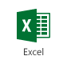
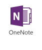
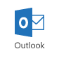
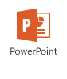
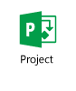
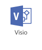

# End user resources for learning about Office 2016

 **Summary:** List of articles to help your organization learn about Office 2016 applications. 
  
 **Audience**: Admins who deploy and manage Office in organizations
  
The following table contains a list of resources to help the users in your organization learn about Office 2016 applications. These resources can also assist your Help desk personnel get ready to support Office 2016.
  
**Office 2016 resources for end users**

|
|
|**Office application**|**Resources**|
|:-----|:-----|
|              Office suite    |[What's New and Improved in Office 2016](https://support.office.com/article/95c8d81d-08ba-42c1-914f-bca4603e1426)   [Office 2016 Quick Start Guides](https://support.office.com/article/25f909da-3e76-443d-94f4-6cdf7dedc51e)   |
|             |[What's new in Access 2016](https://support.office.com/article/76454345-f85d-47af-ace1-98a456cb3496)   |
|             |[What's new in Excel 2016 for Windows](https://support.office.com/article/5fdb9208-ff33-45b6-9e08-1f5cdb3a6c73)   [Excel 2016 Quick Start Guide](https://support.office.com/article/25f909da-3e76-443d-94f4-6cdf7dedc51e)   |
|             |[What's new in OneNote 2016 for Windows](https://support.office.com/article/46ac4be4-8907-404e-8380-bc00921b264f)   [OneNote 2016 Quick Start Guide](https://support.office.com/article/25f909da-3e76-443d-94f4-6cdf7dedc51e)   |
|             |[What's new in Outlook 2016 for Windows](https://support.office.com/article/51c81e7a-de25-4a34-a7fe-bd79f8e48647)   [Outlook 2016 Quick Start Guide](https://support.office.com/article/25f909da-3e76-443d-94f4-6cdf7dedc51e)   |
|             |[What's new in PowerPoint 2016 for Windows](https://support.office.com/article/e8ef980c-5b12-4fff-ae3f-0819e6a21a1f)   [PowerPoint 2016 Quick Start Guide](https://support.office.com/article/25f909da-3e76-443d-94f4-6cdf7dedc51e)   |
|             |[What's new in Project 2016](https://support.office.com/article/111bcaf9-bc27-4c15-80e6-85e726307520)   |
|             |[What's new in Visio 2016](https://support.office.com/article/798f4f39-2833-486b-9ae9-55162672102e)   |
|             |[What's new in Word 2016 for Windows](https://support.office.com/article/4219dfb5-23fc-4853-95aa-b13a674a6670)   [Word 2016 Quick Start Guide](https://support.office.com/article/25f909da-3e76-443d-94f4-6cdf7dedc51e)   |
   
## See also

#### 

[Office Training Center](https://office.com/training)
  
[Office 2016 for Mac Quick Start Guides](https://support.office.com/en-US/article/Office-2016-for-Mac-Quick-Start-Guides-5bccb480-0e5b-4b51-b072-66d3793ccad8)
  
[Office Mobile Quick Start Guides](https://support.office.com/article/c957c048-00fa-4793-8b40-4f564f9d58c6)

