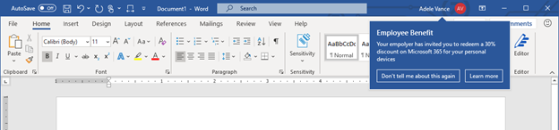

# (Preview) In-product notification for Home Use Program (HUP) employee benefit

> [!IMPORTANT]
> - The information in this article only applies to organizations that receive a [Message center](https://go.microsoft.com/fwlink/p/?linkid=2070717) post about this preview program. The post is expected to be sent on or about November 4, 2020.
> - This is documentation for a preview program that isn’t available to everyone and is subject to change.

Microsoft is releasing a limited preview to a new in-product notification feature that informs qualifying end users about the Home Use Program (HUP) employee benefit. The notification will be shown in their desktop Windows Word, Excel, PowerPoint, and Outlook applications for Office 365 (or Microsoft 365) subscription clients. The preview is available for your organization as part of Version 2008 or later of Microsoft 365 Apps for enterprise, and this article outlines how users in your organization can see the preview if enabled by you.

## Goal of the HUP in-product notification feature

The goal of this feature is to raise awareness about the Home Use Program among your employee community. This notification will only appear for employees of organizations that meet the qualification criteria for the Home Use Program.

The preview is meant to give organizations an opportunity to test the user experience and understand what this feature will mean for their users, as well as to decide on what policy setting they want to keep for which users. This is also an opportunity for Microsoft to gain an understanding on what to expect during the full release as well as to seek feedback from customers. Microsoft may receive aggregated (non-identifiable) user data such as impression count, click count for these notifications.

## What is the Home Use Program (HUP)?

The Home Use Program (HUP) is an employee purchase program for Microsoft’s valued customers. HUP provides employees of qualifying organizations a significant discount on Microsoft 365 Personal and Family subscriptions for their home use. If you belong to a qualifying organization, this benefit is included in your license agreement with Microsoft and you do not need to take any additional steps to activate the benefit for your users. If you are unsure of whether your organization is eligible for this program, visit https://www.microsoft.com/home-use-program/resources.

The Home Use Program helps your employees become more proficient and productive with Microsoft 365 at home, increasing employee satisfaction while lowering the cost of IT help and training. Skill and experience grow from personal use and translate to higher productivity, satisfaction, and savings for your company.

## What is the user experience?

If this feature is enabled by you for a user, they will see one notification total per month across all their apps. The notification will be similar to one of the following screenshots, localized to the language setting of the user’s device.

When the user clicks on **Learn more and sign up**, they will be taken to the HUP webpage (https://aka.ms/huplearnmore) where they can learn more about the program and sign up for it if they would like. The subscription will be separate from any organizational subscription enabled by you.

End users will be able to opt out of all HUP-related messaging on their device by clicking on the **Don’t tell me about this again** button on any notification. This opt-out is device-specific.

## How can you get the preview?

This notification feature is available with Version 2008 or later of Microsoft 365 Apps for enterprise and is switched off by default. You can enable the notification for some or all of your users through a policy setting. Once enabled, users with Version 2008 or higher will see a notification in their Word, Excel, PowerPoint, and Outlook apps.

The notifications will be controlled by a policy setting that can be enabled by using the Office cloud policy service or Group Policy. The notifications will be OFF by default unless you enable them by using the policy setting.

> [!IMPORTANT]
> - By enabling this policy setting, you authorize Microsoft to provide in-product notifications about the benefits of Microsoft 365 Home Use Program to your enterprise end users.
> - Microsoft may change or discontinue this preview at any time without notice. We may also choose not to make the preview service generally available.

### Use the Office cloud policy service to enable the policy setting

For instructions on how to use the Office cloud policy service, see [Overview of the Office cloud policy service for Microsoft 365 Apps for enterprise](../overview-office-cloud-policy-service.md).

In the Office cloud policy service, search for the policy setting, which is named "Show in-product notifications for the Microsoft Home Use Program," and then set it to Enabled.

> [!NOTE]
> This policy setting is expected to be available in the Office cloud policy service by Friday October 30, 2020.

### Use Group Policy to enable the policy setting

To enable the *Show in-product notifications for the Microsoft Home Use Program* policy setting, [download the Administrative Template files (ADMX/ADML) for Office](https://www.microsoft.com/download/details.aspx?id=49030) from the Microsoft Download Center. You must be using at least version 5086.1000 of the Administrative Template files, which were released on October 22, 2020.

You can find this policy setting under User Configuration\Policies\Administrative Templates\Microsoft Office 2016\Miscellaneous.

## What happens after the preview?

Depending on the performance and feedback of this optional preview, Microsoft may release this feature more broadly for HUP-eligible customers. The user experience will be as outlined above. We will post an update on the Microsoft 365 admin center before any changes to the feature roll-out plans to ensure you are aligned. As the admin you will always have the choice to disable or enable the feature for any of your users. Your users will always have the right opt their device out from receiving any future in-product notifications about the Home Use Program, even if you have enabled the feature for them.

## User privacy

User data in the Microsoft 365 enterprise applications described above continues to be governed by the Online Service Terms while receiving and interacting with HUP messages, but once a user selects the **Learn more** option in the HUP offering, a Microsoft consumer website will open in their browser and further interaction with HUP will be governed by the [Microsoft Services Agreement](https://www.microsoft.com/servicesagreement) and the [Microsoft Privacy Statement](https://privacy.microsoft.com/privacystatement).

In order to ensure that only the right enterprise users see HUP notifications, our services will utilize the following data: Tenant ID associated with the device.

We will be looking at basic user engagement data to draw insights on the program design, such as how many users saw notifications, and how many clicked on them. This data is collected as diagnostic data as it is for all user in-product notifications; under the provisions of the Online Services Terms, and governed by the Tenant Admin setting for diagnostic data collection: optional/required/neither.

## Confidentiality and Feedback

Customer may provide feedback, suggestions, comments, ideas, or know-how to Microsoft regarding this feature preview (“Feedback”).  Any Feedback provided by Customer is voluntary. By providing Feedback, Customer irrevocably and perpetually grants to Microsoft and its affiliates a worldwide, non-exclusive, fully paid up, royalty-free transferable, sub-licensable right and license to make, use, reproduce, prepare derivative works based upon, distribute, publicly perform, publicly display, transmit, and otherwise commercialize the Feedback (including by combining or interfacing products, services or technologies that depend on or incorporate Feedback with other products, services or technologies of Microsoft or others), without attribution in any way and for any purpose. Customer warrants that 1) it will not provide Feedback that is subject to a license requiring Microsoft to license anything to third parties because Microsoft exercises any of the above rights in Customer’s Feedback; and 2) it owns or otherwise controls all of the rights to such Feedback and that no such Feedback is subject to any third-party rights (including any personality or publicity rights).
