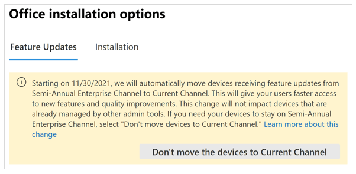

# Move devices with Office to Current Channel

> [!IMPORTANT]
> The information in this article applies only to organizations that received a Message center post (in the Microsoft 365 admin center) about their devices with Office being moved from Semi-Annual Enterprise Channel to Current Channel.

In June 2020, we changed the default update channel selection on the **Office installation options** page in the Microsoft 365 admin center to Current Channel. We made that change because customers on Current Channel have reported higher satisfaction than those customers on Semi-Annual Enterprise Channel, the previous default. That change only applied to new customers.

With the goal of improving the experiences of all our customers, we're now transitioning existing customers to Current Channel, which is our recommended channel. This includes making sure that the default channel selection under **Feature updates** on the **Office installation options** page is set to Current Channel. For more about Current Channel, see [What is Current Channel?](#what-is-current-channel)

In the next several weeks, we'll begin automatically moving devices with Office to Current Channel, but not any devices that are already managed by other admin tools. For more information, see [Which installations of Office are affected by this change?](#which-installations-of-office-are-affected-by-this-change)

If you don't want those devices moved to Current Channel, [you can opt out](#how-to-opt-out-of-moving-devices-to-current-channel) and you can choose a different update channel.

> [!TIP]
> - To get to the **Office installation options** page, sign in to the Microsoft 365 admin center with your admin account, and then go to **Show all** > **Settings** > **Org settings** > **Services** > **Office installation options**.
> - For more information, see [Manage Office installation options in the Microsoft 365 admin center](../manage-software-download-settings-office-365.md).

## Which installations of Office are affected by this change?

The selection under **Feature updates** on the **Office installation options** page applies to both new and existing installations of the Office apps in your organization. The Office apps are those apps that come with Microsoft 365 Apps, which is included with your subscription plan. For example, Word, Excel, and PowerPoint.

Your choice under **Feature updates** won't apply if you're already using some other method to manage Office on devices in your organization.

For example, if you’re using Office policy settings (with Group Policy or Office cloud policy service), Microsoft Endpoint Configuration Manager, Microsoft Intune, or the Office Deployment Tool (either the Channel or the UpdatePath attribute in the [Updates element](../office-deployment-tool-configuration-options.md#updates-element)). You’ll need to use that method to change the update channel on those devices instead of using **Office installation options**.

If you’re using the Office Deployment Tool in a different way (for example, specifying the Channel attribute in the [Add element](../office-deployment-tool-configuration-options.md#add-element)), and not any of the other methods mentioned in the previous paragraph, then your choice under **Feature updates** will apply to those devices.

## What is Current Channel?

On Current Channel, new or updated features are usually released every month. These monthly releases might also contain security updates and non-security updates, such as stability or performance improvements for Office.

Customers on a monthly feature update cadence have reported higher satisfaction than those receiving semi-annual feature updates. In addition to receiving the latest features and fixes, having all devices on the same update frequency will enable better collaboration experience for users in your organization.

These releases are cumulative. The most current release contains all the features, security updates, and non-security updates from the previous releases.

For more information about update channels, see [Overview of update channels for Microsoft 365 Apps](../overview-update-channels.md).

## How to opt out of moving devices to Current Channel

If you don’t want your devices with Office to be moved to Current Channel, choose **Don’t move the devices to Current Channel** button in the message on the **Office installation options** page, as shown in the following screenshot.

 

> [!NOTE]
> - The date shown in the screenshot is an example. The date that applies to your organization is listed in the Message center post that you received and will be reflected in the message that appears on the **Office installation options** page.
> - After that date, the message and the **Don't move the devices to Current Channel** option will no longer appear.

If you choose **Don’t move the devices to Current Channel**, you’ll be taken to another page (similar to the one shown in the following screenshot), where you can choose to move your devices with Office to Monthly Enterprise Channel or to remain on Semi-Annual Enterprise Channel.

Of these two choices, we recommend Monthly Enterprise Channel, because you’ll still receive new features and other updates once a month, but on a predictable schedule (the second Tuesday of each month).

After you make a selection, devices will be notified within 12 hours. Once notified, the devices will move to the selected update channel the next time they check for Office updates.