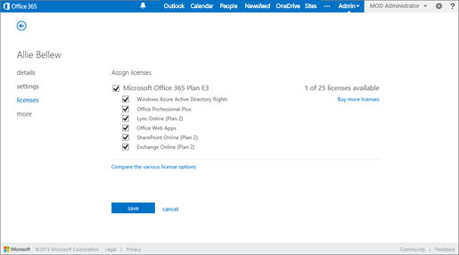
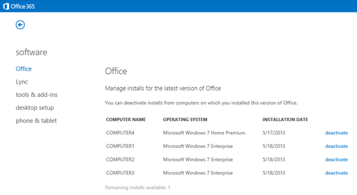
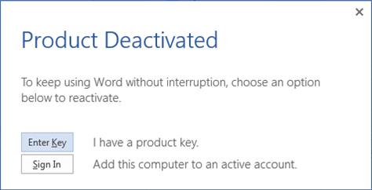

# Overview of licensing and activation in Office 365 ProPlus

> [!IMPORTANT]
> Office 365 ProPlus is being renamed to **Microsoft 365 Apps for enterprise**. To learn more about this name change, [read this blog post](https://go.microsoft.com/fwlink/p/?linkid=2120533). 
>
> For details of when this change takes effect, and what actions admins might need to take, [read this article](name-change.md).
  
To deploy Microsoft 365 Apps to users in your organization, you start by assigning licenses to your users. Then, each user can install Microsoft 365 Apps on up to five computers. Each installation is activated and kept activated automatically by cloud-based services associated with Office 365 (or Microsoft 365). This means you don't have to keep track of product keys. It also means you don't have to figure out how to use other activation methods such as Key Management Service (KMS) or Multiple Activation Key (MAK). All you have to do is make sure you purchase enough licenses, keep your Office 365 (or Microsoft 365) subscription current, and make sure your users can connect to Office Licensing Service via the Internet at least once every 30 days.
  
> [!NOTE]
> The information in this article also applies to Project Online Desktop Client and Visio Online Plan 2, which are licensed separately from Microsoft 365 Apps. 
  

## Licensing Office 365 ProPlus

The number of available licenses available for Microsoft 365 Apps depends on your organization's Office 365 (or Microsoft 365) subscription level. To assign a license to a user, you select a check box on the licenses page for the user's account. 
  

  
After that's done, the user can install Office directly from the Office 365 portal or you can deploy Office to your users from your local network. If the user hasn't been assigned a license, the user can't install Office from the Office 365 portal. 
  
You can remove a user's license (for example, if the user leaves your organization). After you do this, any installations of Microsoft 365 Apps that the user had go into [reduced functionality mode](overview-of-licensing-and-activation-in-office-365-proplus.md#BKMK_ReducedFunctionalityMode). The Office Licensing Service, a part of Office 365, keeps track of which users are licensed and how many computers they've installed Office on.
  

## Activating Office 365 ProPlus

As part of the installation process, Microsoft 365 Apps communicates with the Office Licensing Service and the Activation and Validation Service to obtain and activate a product key. Each day, or each time the user logs on to their computer, the computer connects to the Activation and Validation Service to verify the license status and extend the product key. As long as the computer can connect to the Internet at least once every 30 days, Office remains fully functional. If the computer goes offline for more than 30 days, Office enters [reduced functionality mode](overview-of-licensing-and-activation-in-office-365-proplus.md#BKMK_ReducedFunctionalityMode) until the next time a connection can be made. To get Office fully functional again, usually a user can simply connect to the Internet and let the Activation and Validation Service reactivate the installation.
  
> [!IMPORTANT]
> Because of its online activation features, Microsoft 365 Apps won't work on computers that are completely cut off from the Internet. For those computers, we recommend installing Office Professional Plus 2019 and using a [traditional activation method](vlactivation/plan-volume-activation-of-office.md) such as Key Management Service (KMS) or Active Directory Domain Services.
  
### Managing activated installations

Each Microsoft 365 Apps license allows a user to install Office on up to five computers. The user manages installations in the Office 365 portal:
  

  
If the user decides to install Microsoft 365 Apps on a sixth computer, she will need to deactivate one of the first five. Microsoft 365 Apps goes into [reduced functionality mode](overview-of-licensing-and-activation-in-office-365-proplus.md#BKMK_ReducedFunctionalityMode) on the deactivated computer.
  

## What is reduced functionality mode?

In reduced functionality mode, Microsoft 365 Apps remains installed on the computer, but users can only view and print their documents. All features for editing or creating new documents are disabled, and the user sees a message like the following:
  

  
The user can then choose one of the available options to reactivate Microsoft 365 Apps on that computer.

If the user hasn't been assigned a license, and they try to use Microsoft 365 Apps on a computer where it's installed, Office will be in reduced functionality mode. Also, the user will be prompted to sign in and activate every time they open an Office app, such as Word or Excel.
  
 

## Related topics

[Licensing and activation data sent to Office 365 by Office 365 ProPlus](licensing-and-activation-data-sent-to-office-365-by-office-365-proplus.md)
  
[About Office 365 ProPlus in the enterprise](about-office-365-proplus-in-the-enterprise.md)
  
[Choose how to deploy Office 365 ProPlus](choose-how-to-deploy-office-365-proplus.md)

