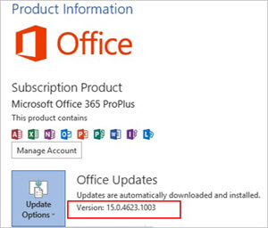
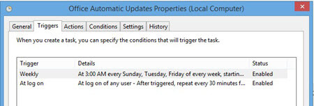

# Overview of the update process for Office 365 ProPlus

Unlike earlier versions of Office, individual security updates and other updates for Microsoft 365 Apps aren't available on Windows Update. Instead, every time that updates are released — usually the second Tuesday of each month — Microsoft creates an updated version of Microsoft 365 Apps and puts it on the internet. This updated version contains all the updates for that month, in addition to all updates from previous months. Each updated version of Microsoft 365 Apps is available on the internet for 12 months. After 12 months, that specific version is no longer supported.
  
> [!IMPORTANT]
> Because individual updates aren't available for Microsoft 365 Apps, you can't use Windows Update, Windows Server Update Services (WSUS), or Microsoft Endpoint Configuration Manager to download and apply individual updates to Microsoft 365 Apps. 
  
To determine which version of Microsoft 365 Apps is installed on a user's computer, go to **File > Account** in any Office program. The version is listed under the **Office Updates** section.
  

  
## Update process for Office 365 ProPlus

There are three steps that occur automatically when the update process runs for Microsoft 365 Apps:
  
1. Detect that updates are available
    
2. Download the updates
    
3. Apply the updates
    
### Detect that updates are available for Office 365 ProPlus

When you install Microsoft 365 Apps, a scheduled task called Office Automatic Updates is created. This scheduled task is configured to look for updates at the following times:
  
- Every Sunday, Tuesday, and Friday, at a randomly selected time between 3:00 AM and 7:00 AM.
    
- 15, 30, and 75 minutes after the user logs on to the computer.
    

  
When the task runs, it compares the version of Microsoft 365 Apps on the computer to the version of Microsoft 365 Apps on the update location. The update location is where Office looks for updates — for example, on a network share or from the internet. By default, Microsoft 365 Apps looks on the internet for updates, but you can [configure the update location](configure-update-settings-for-office-365-proplus.md).
  
If there's a difference between the two versions, the update process determines which files are different and need to be updated on the local computer. After that, the next step — downloading the updates — starts.
  
### Download the updates for Office 365 ProPlus

Only the files that are different are copied down to a Download folder on the local computer, and they're downloaded in a compressed form. This helps reduce the size of the download.
  
The size of the download depends on several factors, such as how many security and other updates are released in a given month, and which version of Microsoft 365 Apps you're updating from. For example, if you have the March version of Microsoft 365 Apps installed, and you're updating to the July version, it's likely that more files are different between those two versions, than if you're updating from the June to the July version. Therefore, the download will probably be larger.
  
> [!NOTE]
> Starting in July 2014, the update process automatically uses a technology called binary delta compression to help reduce the size of the files downloaded even more. But, this technology is only used if you're updating from the most recent version of Microsoft 365 Apps. For example, binary delta compression is used if you're updating from the June to the July version, but not if you're updating from the May to the July version. 
  
If the download process is interrupted — for example, by a temporary loss of network connectivity — the download resumes after the interruption, instead of restarting from the beginning. After the updates are downloaded, the computer doesn't have to be connected to the internet or the network for the updates to be applied. That's because all the files that are needed to apply the updates are already on the local computer.
  
### Apply the updates for Office 365 ProPlus

After the compressed files are downloaded, they're uncompressed and moved from the Download folder to the Apply folder. The scheduled task then attempts to install the updates in the background, without requiring any user intervention.
  
Updates can't be applied if the Office program that has to be updated is being used by the user. If this is the case, the task tries to apply the updates the next time that the scheduled task runs. If updates can't be applied for several days, [users see a message](end-user-update-notifications-for-office-365-proplus.md) that updates are ready to install. If the user restarts the computer and updates haven't been applied, the updates are applied as Windows starts. This won't prevent the user from logging in.
  
To make sure that users apply updates, you can [configure a deadline](configure-update-settings-for-office-365-proplus.md). The deadline specifies a date and time by when the updates must be applied. If the updates aren't applied by the deadline, Office automatically closes any open Office programs and applies the updates. Users are given [notifications leading up to the deadline](end-user-update-notifications-for-office-365-proplus.md).
  
## Related topics
[Choose how to manage updates to Office 365 ProPlus](choose-how-to-manage-updates-to-office-365-proplus.md)
  
[Configure update settings for Office 365 ProPlus](configure-update-settings-for-office-365-proplus.md)
  
[End-user update notifications for Office 365 ProPlus](end-user-update-notifications-for-office-365-proplus.md)

