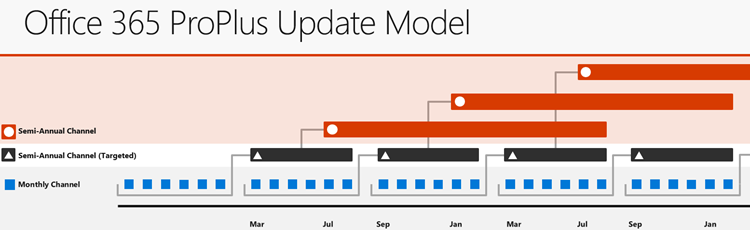

# Overview of update channels for Office 365 ProPlus

One of the benefits of Office 365 ProPlus is that Microsoft can provide new features for Office apps on a regular basis, through monthly updates. However, as the admin who deploys Office 365 ProPlus to the users in your organization, you might want to have more control over how often your users get these new features. Microsoft provides you three options, called update channels, to control how often Office 365 ProPlus is updated with new features. Here's an overview of the three options.
  
|**Update channel**|**Primary purpose**|**How often updated with new features**|**Default update channel for the following products**|
|:-----|:-----|:-----|:-----|
|[Monthly Channel](overview-of-update-channels-for-office-365-proplus.md#BKMK_MC) <br/> |Provide users with the newest features of Office as soon as they're available.  <br/> |Monthly  <br/> |Visio Online Plan 2 (previously named Visio Pro for Office 365)  <br/><br/> Project Online Desktop Client  <br/><br/>  Office 365 Business, which is the version of Office that comes with some Office 365 plans, such as Business Premium. <br/> |
|[Semi-Annual Channel](overview-of-update-channels-for-office-365-proplus.md#BKMK_SAC) <br/> |Provide users with new features of Office only a few times a year.  <br/> |Every six months, in January and July  <br/> |Office 365 ProPlus  <br/> |
|[Semi-Annual Channel (Targeted)](overview-of-update-channels-for-office-365-proplus.md#BKMK_SACT) <br/> |Provide pilot users and application compatibility testers the opportunity to test the next Semi-Annual Channel.  <br/> |Every six months, in March and September  <br/> |None  <br/> |
   
> [!NOTE]
> Prior to September 2017, these update channels were named Current Channel, Deferred Channel, and First Release for Deferred Channel. 
  
Which update channel you decide to deploy to your users depends on several factors, including how many line-of-business applications, add-ins, or macros that you need to test any time there is an updated version of Office 365 ProPlus. To help you make this decision, review the following information about the three update channels that are available for Office 365 ProPlus.
  
<a name="BKMK_MC"> </a>
## Monthly Channel for Office 365 ProPlus


Monthly Channel might be the right choice for your organization in the following situations:
  
- You want to provide your users with the newest features of Office as soon as those features are available
    
- You don't have many line-of-business applications, add-ins, or macros that you need to test to determine if they work with an updated version of Office.
    
A Monthly Channel with new features is expected to be released each month, although there is no set schedule for when a feature release occurs. In addition to new or updated features, the release might also contain non-security updates, such as updates that provide stability or performance improvements for Office. Security updates for Monthly Channel are usually released on the second Tuesday of the month. At any other time, if there is a critical non-security issue that needs to be fixed, we will provide a separate Monthly Channel release that fixes the issue.
  
Monthly Channel releases are cumulative. The most current Monthly Channel release contains all the features, security updates, and non-security updates from the previous Monthly Channel releases.
  
A Monthly Channel release is supported only until the next Monthly Channel release is available. No new security updates are provided for previous Monthly Channel releases.
  
> [!NOTE]
> - There is also Monthly Channel (Targeted). This update channel provides an early look at the upcoming Monthly Channel release. It is a supported update channel, and usually is available at least one week ahead of time when it's a Monthly Channel release that contains new features.
> - Monthly Channel (Targeted) is also part of the Office Insider program. For more information, see [Office Insider for Business](https://insider.office.com/en-us/business).
  
<a name="BKMK_SAC"> </a>
## Semi-Annual Channel for Office 365 ProPlus


If your organization doesn't want to deploy the latest features of Office right away or you have a significant number of line-of-business applications, add-ins, or macros that you need to test with Office, then Semi-Annual Channel might be the better choice for your organization. That's because new features are added to Semi-Annual Channel only twice a year, instead of every month. Semi-Annual Channel is the default update channel for Office 365 ProPlus.
  
A Semi-Annual Channel with new features is expected to be released twice a year, in January and July. New features aren't added to Semi-Annual Channel at any other time. The features that are included in Semi-Annual Channel are features that have been released previously in Monthly Channel.
  
In the four months prior to a new Semi-Annual Channel feature release, Microsoft provides builds of the upcoming release so that pilot users and application compatibility testers in your organization can work with the upcoming release. These builds are provided through the [Semi-Annual Channel (Targeted)](overview-of-update-channels-for-office-365-proplus.md#BKMK_SACT) update channel and provide the same features and functionality that will be in the next release of Semi-Annual Channel that includes new features.
  
After the January and July releases of Semi-Annual Channel, additional security updates, if needed, can also be added to Semi-Annual Channel. A release of Semi-Annual Channel with these updates usually occurs on the second Tuesday of the month. If there is a critical non-security issue that needs to be fixed in Semi-Annual Channel, that non-security update will also be included in a Semi-Annual Channel release, usually on the second Tuesday of the month.

<a name="BKMK_SACT"> </a>  
## Semi-Annual Channel (Targeted) for Office 365 ProPlus


To help your organization prepare for a Semi-Annual Channel release, Microsoft provides Semi-Annual Channel (Targeted). The primary purpose of this update channel is to give pilot users and application compatibility testers in your organization a chance to work with the upcoming Semi-Annual Channel release. During this time, which is about four months, you might identify possible issues that you need to fix with your line-of-business applications, add-ins, or macros or that you want Microsoft to fix. Semi-Annual Channel (Targeted) releases provide the same features and functionality that will be in the next release of Semi-Annual Channel that includes new features.
  
A Semi-Annual Channel (Targeted) with new features is expected to be released twice a year, in March and September. New features aren't added to Semi-Annual Channel (Targeted) at any other time. The features that are included in Semi-Annual Channel (Targeted) are features that have been released previously in Monthly Channel.
  
The March and September feature releases for Semi-Annual Channel (Targeted) also include security and non-security updates that have been released previously in Monthly Channel. After the March and September releases, additional security and non-security updates, if needed, can also be added to Semi-Annual Channel (Targeted). A release of Semi-Annual Channel (Targeted) with these updates usually occurs on the second Tuesday of the month.
  
Even though this update channel is primarily designed for your testing, it's a fully supported version of Office 365 ProPlus. 

<a name="BKMK_Visual"> </a> 
## Visual representation of the update channels for Office 365 ProPlus


The following illustration shows the relationship between the update channels for Office 365 ProPlus and the approximate release schedule. 
  

 
<a name="BKMK_Frequency"> </a> 
## Frequency of updates for the update channels for Office 365 ProPlus


As a review, the following table provides information about how often each update channel usually includes feature updates, security updates, and non-security updates. Security and non-security updates are included only as needed.
  
|**Update channel**|**Feature updates**|**Security updates**|**Non-security updates**|
|:-----|:-----|:-----|:-----|
|[Monthly Channel](overview-of-update-channels-for-office-365-proplus.md#BKMK_MC) <br/> |Monthly  <br/> |Monthly  <br/> |Monthly  <br/> |
|[Semi-Annual Channel](overview-of-update-channels-for-office-365-proplus.md#BKMK_SAC) <br/> |Every six months, in January and July  <br/> |Monthly  <br/> |Monthly <br/> |
|[Semi-Annual Channel (Targeted)](overview-of-update-channels-for-office-365-proplus.md#BKMK_SACT) <br/> |Every six months, in March and September  <br/> |Monthly  <br/> |Monthly  <br/> |
   
Security updates, if needed, are usually released on the second Tuesday of the month. Non-security updates, if needed, for Semi-Annual Channel and Semi-Annual Channel (Targeted) also are usually released on the second Tuesday of the month. 
 
<a name="BKMK_Support"> </a>
## Support duration for semi-annual feature releases for Office 365 ProPlus

The semi-annual feature update releases of Office 365 ProPlus are supported for 18 months, starting from the initial release.
  
A new version, with feature updates, will be released to Semi-Annual Channel (Targeted) in March and September. Four months later, in July and January, that version, with those feature updates, will be released to Semi-Annual Channel and will be supported for the next 14 months. 
  
For example, on September 11, 2018, Version 1808 of Office 365 ProPlus was released to Semi-Annual Channel (Targeted). On January 8, 2019, Version 1808 is scheduled to be made available to Semi-Annual Channel and will be supported in Semi-Annual Channel until March 2020. In March 2019, a new version of Office 365 ProPlus with new features will be released to Semi-Annual Channel (Targeted). That version is scheduled to be made available to Semi-Annual Channel in July 2019, and will be supported in Semi-Annual Channel until September 2020.
  
This support duration provides more time and flexibility for IT Pros to deploy releases. For example, customers who want to update once a year will be able to do so. There will always be more than one supported version of Semi-Annual Channel available. Note, however, that only the most current release of Semi-Annual Channel (Targeted) is supported.
  
> [!NOTE]
> Windows 10 also plans to target the March and September time frames for providing feature updates to Windows 10. Those releases will also be referred to as Semi-Annual Channel and also will be supported for 18 months. 

<a name="BKMK_Configure"> </a>
## Configure the update channel to be used by Office 365 ProPlus

Semi-Annual Channel is the default update channel for Office 365 ProPlus. But you can configure an Office 365 ProPlus installation to use Monthly Channel or Semi-Annual Channel (Targeted). Also, not all users in your organization have to be configured the same. For example, you might do the following:
  
- Provide a group of pilot users with Monthly Channel, so they can try out the new features of Office as they become available.
    
- Provide your finance department, which has several key line-of-business applications, with Semi-Annual Channel.
    
- Provide your application compatibility testers with Semi-Annual Channel (Targeted) so that they can test that the finance applications will work with the next Semi-Annual Channel feature release.
    
To configure the update channel for an Office 365 ProPlus installation, you can use the latest version of the [Office Deployment Tool](https://go.microsoft.com/fwlink/p/?LinkID=626065) or use the [Group Policy Administrative Template files (ADMX/ADML) for Office](https://www.microsoft.com/download/details.aspx?id=49030).
  
If you use the Office Deployment Tool, you can use the Channel attribute in the configuration.xml file. The Channel attribute can be specified in the Add element or the Update element. The relevant values are "Monthly" for Monthly Channel, "Broad" for Semi-Annual Channel, and "Targeted" for Semi-Annual Channel (Targeted). For example, if you want to download and install the Monthly Channel of Office 365 ProPlus, your configuration.xml file would look like the following example. 
  
```xml
<Configuration> 
   <Add SourcePath="\\server01\office" OfficeClientEdition="32"  Channel="Monthly"> 
    <Product ID="O365ProPlusRetail" > 
     <Language ID="en-us" /> 
    </Product> 
   </Add> 
</Configuration>
```

The name of the Group Policy setting is Update Channel. You can find this policy setting under Computer Configuration\Policies\Administrative Templates\\Microsoft Office 2016 (Machine)\\Updates. When you enable the Group Policy setting you can select the appropriate update channel from a drop-down list. 
  
 
<a name="BKMK_AddInfo"> </a>
## Additional information about the update channels for Office 365 ProPlus

Here is some additional information that might be useful to know as you determine how to configure and use Monthly Channel, Semi-Annual Channel, and Semi-Annual Channel (Targeted) in your organization.
  
- You can switch an Office 365 ProPlus installation from one update channel to another. For example, you might want to move a user from Monthly Channel to Semi-Annual Channel. To switch update channels, you can use the Office Deployment Tool or Group Policy.
    
- If the user does an Online Repair of Office 365 ProPlus, the installation reverts to Semi-Annual Channel, unless you've configured a Group Policy setting to provide a different update channel.

- If you have Visio Online Plan 2 (previously named Visio Pro for Office 365) or Project Online Desktop Client installed on the same computer as Office 365 ProPlus, they all must use the same update channel. You can't have a mix of update channels on the same computer. 

- These update channels only apply to installations on computers running Windows.

- We recommended that you use the most current version of Semi-Annual Channel. But, if you have a specific business need to delay receiving a feature update from Semi-Annual Channel in January or July, you can configure Office to not receive that feature update, but still receive the most current security updates for the previous version. For more information on how to do that, see [Delay receiving feature updates from Semi-Annual Channel](delay-receiving-feature-updates-from-deferred-channel-for-office-365-proplus.md). For information about which versions of Semi-Annual Channel are supported and until when, see [Release information for updates to Office 365 ProPlus](https://docs.microsoft.com/officeupdates/release-notes-office365-proplus).

- If you're deploying Office Professional Plus 2019, which is a volume licensed version of Office, there is a different update channel you need to use. For more information, see [Update channel for Office 2019](office2019/update.md#update-channel-for-office-2019).
    


## Related topics

[Update history for Office 365 ProPlus (listed by date)](https://docs.microsoft.com/officeupdates/update-history-office365-proplus-by-date)
  
[Change management for Office 365 clients](change-management-for-office-365-clients.md)
  
[Release information for updates to Office 365 ProPlus](https://go.microsoft.com/fwlink/?LinkId=626090)

