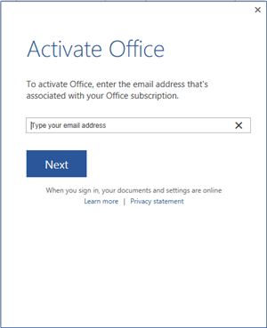

# Overview of shared computer activation for Microsoft 365 Apps

> [!IMPORTANT]
> Office 365 ProPlus is being renamed to **Microsoft 365 Apps for enterprise**, starting with Version 2004. To learn more, [read this article](name-change.md). In our documentation, we'll usually just refer to it as Microsoft 365 Apps.

> [!TIP]
> The information in this article is intended for administrators and IT Pros. For information about activating a personal copy of Office, see [Activate Office](https://support.office.com/article/5bd38f38-db92-448b-a982-ad170b1e187e). 
  
Shared computer activation lets you to deploy Microsoft 365 Apps to a computer in your organization that is accessed by multiple users. Here are some examples of supported scenarios for using shared computer activation:

- Three workers at a factory share the same physical computer, each worker using Office on that computer during their eight-hour shift.
- Fifteen nurses at a hospital use Office on ten different computers throughout the day.
- Five employees connect remotely to the same computer to run Office.
- Multiple employees use Office on a computer that's located in a conference room or some other public space in the company.


The most common shared computer activation scenario is to [deploy Microsoft 365 Apps to shared computers by using Remote Desktop Services (RDS)](deploy-microsoft-365-apps-remote-desktop-services.md). By using RDS, multiple users can connect to the same remote computer at the same time. The users can each run Office programs, such as Word or Excel, at the same time on the remote computer.
  
Shared computer activation is used for situations where multiple users share the same computer and the users are logging in with their own account. If you have users who are assigned individual computers and no other users work on those computers, you [use product key activation for Microsoft 365 Apps](overview-licensing-activation-microsoft-365-apps.md).

Normally, users can install and activate Microsoft 365 Apps only on a limited number of devices, such as 5 PCs. Using Microsoft 365 Apps with shared computer activation enabled doesn't count against that limit.
  
<a name="Enable"> </a>

## How to enable shared computer activation for Microsoft 365 Apps

To use shared computer activation, you need an Office 365 (or Microsoft 365) plan that includes Microsoft 365 Apps and also supports shared computer activation. Shared computer activation is available for the following:

- Any plan that include Microsoft 365 Apps for enterprise (previously named Office 365 Plus). For example, Office 365 E3 or Microsoft 365 E5.
- Any plan that includes the desktop version of Project or Visio. For example, Project Plan 3 or Visio Plan 2.
- The Microsoft 365 Business Premium plan, which includes Microsoft 365 Apps for business (previously named Office 365 Business).
  
> [!NOTE]
> - The Microsoft 365 Business Premium plan is the only business plan that includes support for shared computer activation. There are other business plans, such as Microsoft 365 Business Standard, that include Microsoft 365 Apps for business, But, those business plans don't include support for shared computer activation.
> - Microsoft 365 Apps for business doesn't doesn't support the use of Group Policy, so you'll need to use another method to enable shared computer activation.
> - Shared computer activation isn't available for Office for Mac.

Make sure you [assign each user a license](https://support.office.com/article/997596b5-4173-4627-b915-36abac6786dc) for Microsoft 365 Apps and that users log on to the shared computer with their own user account.
  
To enable shared computer activation when you deploy Microsoft 365 Apps, you need the current version of the Office Deployment Tool, which is available for free from the [Microsoft Download Center](https://go.microsoft.com/fwlink/p/?LinkID=626065).
  
The [Office Deployment Tool](overview-office-deployment-tool.md), combined with a simple text file, is used to install Microsoft 365 Apps on the shared computer, and to enable shared computer activation for that computer. Add the following lines when you [create the text file](office-deployment-tool-configuration-options.md).
  
```xml
<Display Level="None" AcceptEULA="True" /> 
<Property Name="SharedComputerLicensing" Value="1" />
```

After Microsoft 365 Apps is installed, you can [verify that shared computer activation is enabled](troubleshoot-shared-computer-activation.md#Enabled) on that computer.
  
> [!NOTE]
> Here are some other ways that you can enable shared computer activation:
> - Download and run the [Microsoft Support and Recovery Assistant](https://aka.ms/SaRA_OfficeSCA_Docs).
> - Use Group Policy by downloading the most current [Administrative Template files (ADMX/ADML) for Office](https://go.microsoft.com/fwlink/p/?linkid=626001) and enabling the "Use shared computer activation" policy setting. This policy setting is found under Computer Configuration\\Policies\\Administrative Templates\\Microsoft Office 2016 (Machine)\\Licensing Settings.
> - Use Registry Editor to add a string value of SharedComputerLicensing with a setting of 1 under HKEY_LOCAL_MACHINE\\SOFTWARE\\Microsoft\\Office\\ClickToRun\\Configuration.
  
<a name="Works"> </a>

## How shared computer activation works for Microsoft 365 Apps


Here's what happens after Microsoft 365 Apps is installed on a computer that has shared computer activation enabled.
  
1. A user logs on to the computer with her account.
    
2. The user starts an Office program, such as Word.
    
3. Microsoft 365 Apps contacts the Office Licensing Service on the internet to obtain a licensing token for the user.
    
    To determine whether the user is licensed to use Microsoft 365 Apps, the Office Licensing Service has to know the user's account for Office 365. In some cases, Microsoft 365 Apps prompts the user to provide the information. For example, the user might see the **Activate Office** dialog box.
    
     
  
    If your environment is configured to synchronize Office 365(AAD) and loal active directory accounts(AD), then the user most likely won't see any prompts. Microsoft 365 Apps should automatically be able to get the necessary information about the user's account in Office 365.
    
4. If the user is licensed for Microsoft 365 Apps, a licensing token is stored on the computer in the user's profile folder, and Microsoft 365 Apps is activated. The user can now use Microsoft 365 Apps.
    
These steps are repeated for each user who logs on to the shared computer. Each user gets a unique licensing token. Just because one user activates Microsoft 365 Apps on the computer doesn't mean Microsoft 365 Apps is activated for all other users who log on to the computer.
  
If a user goes to another computer that also is enabled for shared computer activation, the same steps occur. There is a different licensing token for each computer that the user logs on to.
  
If a user logs on to a shared computer again, Microsoft 365 Apps uses the same licensing token, if it is still valid.
  
<a name="Details"> </a>

## Additional details about shared computer activation for Microsoft 365 Apps

**Licensing token renewal** The licensing token that is stored on the shared computer is valid only for 30 days. As the expiration date for the licensing token nears, Microsoft 365 Apps automatically attempts to renew the licensing token when the user is logged on to the computer and using Microsoft 365 Apps.
    
If the user doesn't log on to the shared computer for 30 days, the licensing token can expire. The next time that the user tries to use Microsoft 365 Apps, Microsoft 365 Apps contacts the Office Licensing Service on the internet to get a new licensing token.
    
**Internet connectivity** Because the shared computer has to contact the Office Licensing Service on the internet to obtain or renew a licensing token, reliable connectivity between the shared computer and the internet is necessary.
    
**Reduced functionality mode** If the user is not licensed for Microsoft 365 Apps, or if the user closed the **Activate Office** dialog box, no licensing token is obtained and Microsoft 365 Apps isn't activated. Microsoft 365 Apps is now in reduced functionality mode. This means that the user can view and print Office documents, but can't create or edit documents. The user also sees a message in the Office program that most features are turned off.
    
   
  
**Activation limits** Normally, users can install and activate Microsoft 365 Apps only on a limited number of devices, such as 5 PCs. Using Microsoft 365 Apps with shared computer activation enabled doesn't count against that limit.
    
Microsoft allows a single user to activate Microsoft 365 Apps on a reasonable number of shared computers in a given time period. The user gets an error message in the unlikely event the limit is exceeded.
    
   
  
**Single sign-on recommended** The use of single sign-on (SSO) is recommended to reduce how often users are prompted to sign in for activation. With single sign-on configured, Microsoft 365 Apps is activated using the user credentials that the user provides to sign in to Windows, as long as the user has been assigned a license for Microsoft 365 Apps. For more information, see [Understanding Office 365 identity and Azure Active Directory](https://support.office.com/article/06a189e7-5ec6-4af2-94bf-a22ea225a7a9).
    
If you don't use single sign-on, you should consider using roaming profiles and include the %localappdata%\\Microsoft\\Office\\16.0\\Licensing folder as part of the roaming profile.
    
**Licensing token roaming** Starting with Version 1704 of Microsoft 365 Apps, you can configure the licensing token to roam with the user's profile or be located on a shared folder on the network. Previously, the licensing token was always saved to a specific folder on the local computer and was associated with that specific computer. In those cases, if the user signed in to a different computer, the user would be prompted to activate Microsoft 365 Apps on that computer in order to get a new licensing token. The ability to roam the licensing token is especially helpful for non-persistent VDI scenarios.
  
To configure licensing token roaming, you can use either the Office Deployment Tool or Group Policy, or you can use Registry Editor to edit the registry. Whichever method you choose, you need to provide a folder location that is unique to the user. The folder location can either be part of the user's roaming profile or a shared folder on the network. Microsoft 365 Apps needs to be able to write to that folder location. If you're using a shared folder on the network, be aware that network latency problems can adversely impact the time it takes to open Office programs. The location is only needed if you prefer to not use the default location of %localappdata%\\Microsoft\\Office\\16.0\\Licensing
    
- If you're using Group Policy, download the most current [Administrative Template files (ADMX/ADML) for Office](https://go.microsoft.com/fwlink/p/?linkid=626001) and enable the "Specify the location to save the licensing token used by shared computer activation" policy setting. This policy setting is found under Computer Configuration\\Policies\\Administrative Templates\\Microsoft Office 2016 (Machine)\\Licensing Settings.
    
- If you're using the Office Deployment Tool, include the SCLCacheOverride and SCLCacheOverrideDirectory in the Property element of your configuration.xml file. For more information, see [Configuration options for the Office Deployment Tool](office-deployment-tool-configuration-options.md).
    
- To edit the registry, go to HKEY_LOCAL_MACHINE\\SOFTWARE\\Microsoft\\Office\\ClickToRun\\Configuration, add a string value of SCLCacheOverride, and set the value to 1. Also, add a string value of SCLCacheOverrideDirectory and set the value to the path of the folder to save the licensing token. 
    
  >[!NOTE]
  > If you're using Microsoft Application Virtualization (App-V) to deploy Microsoft 365 Apps, the registry location is HKEY_LOCAL_MACHINE\\SOFTWARE\\Microsoft\\Office\\16.0\\Common\\Licensing. 
  


   
## Related topics
[Deploy Microsoft 365 Apps by using Remote Desktop Services](deploy-microsoft-365-apps-remote-desktop-services.md)

[Troubleshoot issues with shared computer activation for Microsoft 365 Apps](troubleshoot-shared-computer-activation.md)

[Overview of licensing and activation in Microsoft 365 Apps](overview-licensing-activation-microsoft-365-apps.md)
  

