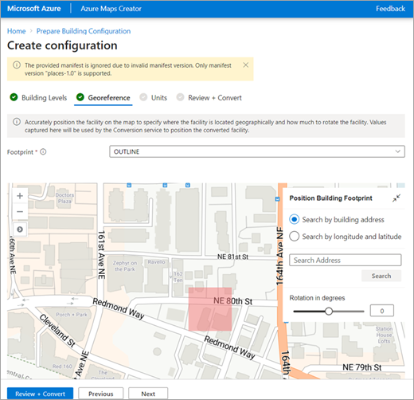
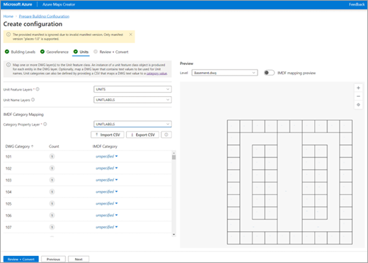
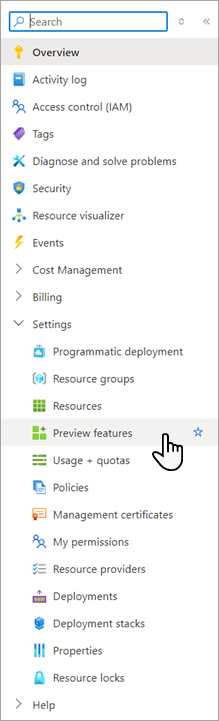
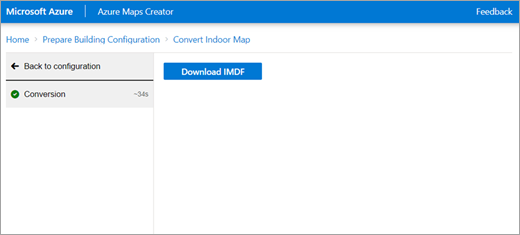

# Azure Maps Creator Guide for Microsoft Places

This guide shows you how to convert your drawing/DWG floor plans to Indoor Mapping Data Format/IMDF for indoor mapping in Microsoft Places using the Azure Maps Creator tool. IMDF is currently the required file format for floorplans in Places.

You can choose any CAD software to open and prepare your facility drawing files. However, procedures in this guide were created using Autodesk's AutoCAD® software. Any commands referenced in this guide are meant to be executed using Autodesk's AutoCAD software.

## Glossary of terms

This guide uses the following terms and definitions.

|Term  |Definition  |
|-----------|---------|
|Layer      |An AutoCAD DWG layer from the drawing file|
|Entity     |An AutoCAD DWG entity from the drawing file|
|Level      |An area of a building at a set elevation (for example, the floor of a building)|
|Feature    |An object that combines a geometry with more metadata information|

## File requirements

When preparing your building drawing files for conversion, make sure to follow these preliminary requirements and recommendations:  

- Building drawing files must be saved in DWG format, which is the native file format for Autodesk's AutoCAD software.  
- The Conversion service works with the AutoCAD DWG file format. AC1032 is the internal format version for the DWG files. It's a good idea to select AC1032 for the internal DWG file format version.
- A DWG file can only contain a single floor. A floor of a facility must be provided in its own separate DWG file. Therefore, if you have five floors in a facility, you must create five separate DWG files.

### Prepare the DWG files

This part of the guide shows you how to use CAD commands to ensure that your DWG files meet the requirements of the Conversion service.  

You can choose any CAD software to open and prepare your facility drawing files. However, this guide is created using Autodesk's AutoCAD software. Any commands referenced in this guide are meant to be executed using Autodesk's AutoCAD software.  

A single DWG file is required for each level of the building. All data of a single level must be contained in a single DWG file. Any external references (xrefs) must be bound to the parent drawing. For example, a building with three levels has three DWG files.

### DWG layer requirements

Each DWG layer must adhere to the following rules:

- A layer must exclusively contain features of a single class and category. For example, units of category room and wall can’t be on the same layer.
- A single class or category of features is represented by multiple layers.
- Feature must be drawn as a closed geometry of the following entity types: POLYGON, POLYLINE (closed), CIRCLE, or ELLIPSE (closed).
- Feature text properties must be of entity type TEXT or MTEXT.
- Feature text properties must not contain additional information. For example, one MTEXT can’t contain both the name and category of a Unit.
- TEXT and MTEXT justification point must fall within the bounds of the closed geometry.
- Feature properties must be on their own layer. For example, all Unit names must be on a separate layer and can’t be on the same layer as the unit category.
- Unsupported DWG entity types are ignored.

### Level geometry

- Level geometry must be provided as one closed geometry that contains all Units.
- Closed geometries must be the following entity types: POLYGON, POLYLINE (closed), CIRCLE, or ELLIPSE (closed).
- Level geometry must not be self-intersecting.

#### Facility levels

The facility level specifies which DWG file to use for which level. A level must have a level name and ordinal that describes the vertical order of each level in the facility.  

The following screenshot is an example of a sample building. The building has three levels uploaded through three DWG files: basement.dwg, ground.dwg, and level_2.dwg. The file name is read from the ZIP file and prefilled. You need to provide a friendly level name and ordinal (or, the position of the floor within the building) of the level.

#### Georeferences

Georeferencing is used to specify the exterior profile, location, and rotation of the facility.  

You begin by selecting the DWG layer that represents the building footprint. The name of this layer can vary across different files because it's a user-defined value. You then position the map by searching for a location/address or latitude/longitude. Once you see where your position should be, pan the map and rotate the building to the desired position.

#### Units

Map one or more DWG layers to the Unit feature class. An instance of a Unit feature class object is produced for each entity in the DWG layer. Optionally, you can map a DWG layer that contains text values to be used for Unit names. Unit categories can also be defined by providing a CSV that maps a DWG text value to a category value.

## Azure Maps Creator Setup  

You can use the Azure Maps DWG building conversion tool to convert your floor plan to a file that can be used in Places for indoor mapping.

To process DWG files, enter the geography of your Azure Maps Creator resource, the subscription key of your Azure Maps account, and file name of the ZIP package containing all your DWG files, then select **Process**. This process can take several minutes to complete.

1. Sign in to the [Azure portal](https://ms.portal.azure.com/#home), or create an Azure subscription. For more information on Azure products, see [Build in the cloud with an Azure free account](https://azure.microsoft.com/free/search/).
2. Register for the feature flag. Sign on to your Azure account and navigate to subscriptions.
3. Under **Create a resource**, select **Subscriptions**.

   

4. Navigate to **Preview features**.

   

5. Search for **Microsoft 365 Places Preview**.
6. Register for **Microsoft 365 Places Preview**.

### Create the Azure Maps Resource

1. From the [Azure portal](https://ms.portal.azure.com/#home), choose **Create a resource**.
2. Search for **Azure Maps**.
3. Create Azure Maps resource.

### Create the Azure Maps Creator Resource

- Use the Azure Maps Creator to create private indoor map data. For more information, see [Manage Azure Maps Creator](/azure/azure-maps/how-to-manage-creator).

### Select your subscription key

- Primary and secondary keys are generated after the Azure Maps account is created. For more information, see [Authentication with Azure Maps](/azure/azure-maps/azure-maps-authentication).

## Review your building details

1. When you finish configuring all your buildings, select the **Review + Create** button to review all your building details.

   

2. Select **Download IMDF** to continue the Places maps onboarding process.

   
