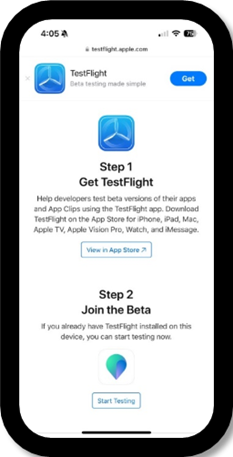
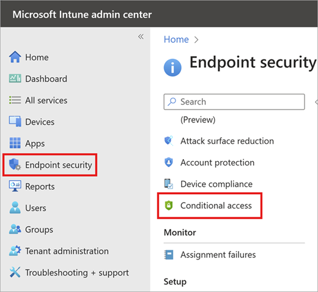
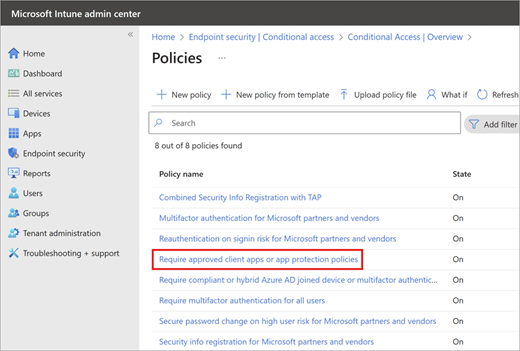
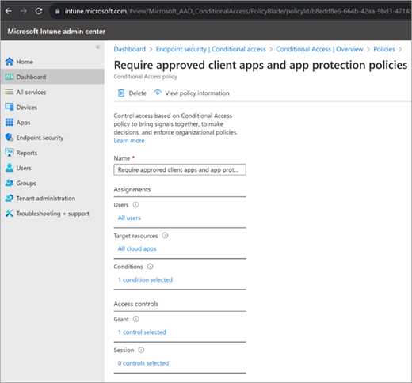
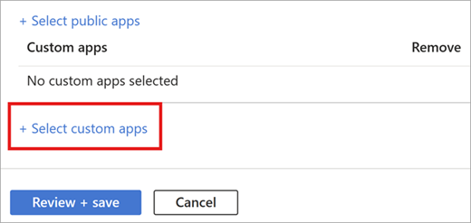

# Configure the iOS app for Microsoft Places

To enable the Microsoft Places mobile experience, an IT admin might need to configure the Mobile Application Management (MAM), and users must install Apple’s TestFlight app and the Places app on their mobile phones. This article explains how to install the Places app.

- These instructions are only in effect for the Private and Public Previews. Testing is managed through Apple’s TestFlight platform.

- TestFlight is an application and service owned by Apple. It's offered to app developers to make it easy to invite users to test apps and collect feedback before releasing their apps in the App Store.

- The Places mobile app can be made available to Private and Public Preview customers and their users who have iOS devices (version 16.4 or later).  

- Because the Places mobile app is still in its pilot phase and not yet available in the App Store, to allow Preview customers to install and test the application we've made the Places mobile iOS available (installed through Apple TestFlight).

## Prerequisites
> [!NOTE]
> The Microsoft Places iOS app is an opt-in feature. For more information, see [Opt in to the Microsoft Places Public Preview](opt-in-places-preview.md).

- Places is Deployed. For more information, see the [Deployment guide for Microsoft Places (preview)](deployment-guide-for-places.md).

- If applicable, your organization’s MAM policy should allow your users to download and install the Apple TestFlight app so they can install, run, and experience the Places iOS.

- If applicable, your organization’s MAM policy needs to be updated to allow employees to install the Places Mobile App (see guidance below).

## Enable Places mobile for your users

Run the following PowerShell cmdlet to enable the opt-in features for your tenant.

```powershell
Set-PlacesSettings -Collection Places -EnablePlacesMobileApp ‘Default:true' 
```

## The Places mobile app installation

To install the Places mobile experience (iOS only), an IT admin must update their Intune MAM policy (if applicable). Pilot users need to install the Places app on their mobile devices.

The mobile access installation process is made up of these four steps.

|Step  |Action     |Owner     |
|---------|---------|---------|
|**1**|Review and update mobile policies, if applicable (**see the appendix for further information**) |Customer IT admin or mobile-security admin  |
|**2**|URL is generated by the Places mobile team, which is shared with the customer using an email notification |Microsoft Places mobile team |
|**3**|Customer distributes the URL to their pilot users |Customer IT admin |
|**4**|The customer's pilot users click on the URL to download and install the Places iOS app |Pilot users |

> [!NOTE]
> It's a one-time process to install the Places app on your iOS device. Once the Places app is installed, users can open it from their mobile home screens.

### Steps for iOS Places app enablement and installation

#### Step 1: Review and update your mobile policies (IT admin)

- **See the appendix** for details and confirmation if your organization requires additional Unified Endpoint Management configuration.

#### Step: 2 The URL is generated and shared with the customer in an email notification (Places mobile team)

- [CHANGE COMING] The Places mobile team responds in e-mail to the customer within 24 to 48 hours and provides your organization’s URL for mobile installation (using Apple's TestFlight platform).

#### Step 3: The customer distributes the URL to their users (IT admin)

- The customer IT admin shares the URL with the iOS pilot users in their tenant.

   The following is a sample URL:

   

> [!NOTE]
> Users must be part of the Opt-in features and the EnablePlaceMobileApp should be set to **default:true** or be set to an SG for the desired users.

#### Step 4: The customer's users click on the URL to download and install the Places iOS app (pilot users)

1. Users navigate to the URL provided by their tenant admin in the browser of the user’s mobile device. Note, it's a one-time step to install the Places app.
2. The Apple TestFlight app installation directs users to a two-step process to install the Places app. First, install the TestFlight app. Second, return to the URL and tap on **Start Testing.** This launches the TestFlight app on the device and makes the user eligible to install the Places app.

   

3. In the TestFlight app, find the listing for **Microsoft Places** and tap **Install**.

   

4. Turn on the auto-updates feature to get access to new versions of the app on your mobile device (this is an optional step).

   

5. Open and sign in to the Places mobile app.

   Once the Places app is installed, it will show up in the user's dashboard like any other app installed from the App Store.

   You can tap to open the app and sign in using your corporate credentials (the same email that was granted access through PlacesEnabled and EnablePlacesMobileApp in the Places tenant settings.)

   

> [!NOTE]
> If you no longer want to test the app, you can also delete it yourself as a tester by visiting the app’s **Information** page in TestFlight and tapping **Stop Testing**.”

## MAM Intune configurations

### Mobile policy scenarios

The mobile access installation process is made up of these four steps.

|Scenario  |Action     |
|---------|---------|
|**1**|No Intune Policy.<br>If no Intune policy is applied at your organization, no additional steps are needed to install and run Places through TestFlight. You can skip the rest of the Intune setup instructions.|
|**2**|Mobile Device Management (MDM) as the only Intune Policy (no MAM policy applied).<br>In case of MDM only Intune Policy applied for all employees in your organization, there are no additional steps needed to install and run MS Places through test flight. You can skip the rest of the Intune setup instructions.  |
|**3**|MDM policy applicable for few employees while MAM policy for others.<br>For employees who are on an MDM only policy, there are no additional steps. For employees on MAM policy, see scenario 4. |
|**4**|MAM only or MAM with MDM Policy.<br>Follow the Intune setup instructions to perform similar actions in your organization’s Unified Endpoint Management system.  |

> [!NOTE]
> To learn more about creating Intune policies for custom apps, see "Create an iOS/iPadOS or Android app protection policy" in [How to create and assign app protection policies](/mem/intune/apps/app-protection-policies).

## Add a custom app in your organization’s Intune MAM

The following procedure adds the bundleID as a custom app in an organization’s InTune **com.microsoft.msplaces** MAM policy.

1. Click on **Endpoint Security** from left menu and navigate to **Endpoint Security Overview**. Then click **Conditional access**.

   

2. In **Conditional access**, click on **View all policies** to see all of the deployed conditional-access policies.

   

3. The following summary shows all of the **Policies** for the tenant.

   

4. Click on **Require approved client apps and app protection policies**, which opens the policy details.

   

5. Under **Access Control**, then **Grant,** enable the **Require app protection policy** option along with the existing policy **Required approved client app**. Then below that section, under **For multiple control**, choose **Require one of the selected apps**.

   

6. To enable MAM CA protection for the Places app, from the **Intune Admin Center** home page, navigate to **Apps**, then to **App Protection Policies**.

   
   
   Select your existing app protection policy, then under **Propertie**, select **Edit** for the **Apps** section.

   

   Add the bundle id **com.microsoft.msplaces** in the text box, and click **Add**.


