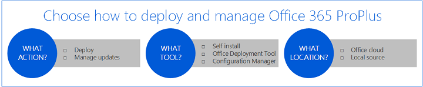
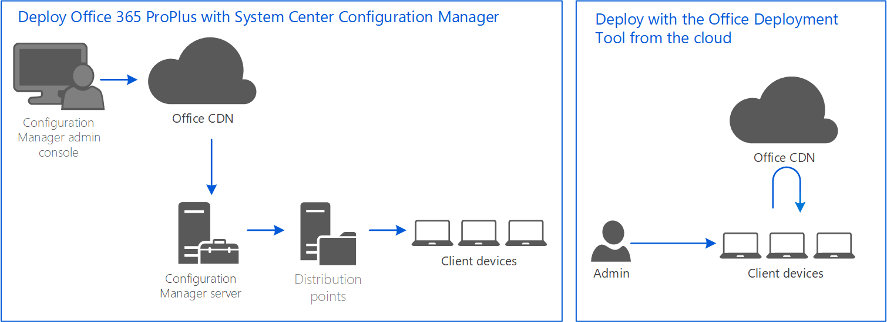

# Plan your enterprise deployment of Office 365 ProPlus

Follow the steps in this article to choose how to deploy Office, how to manage updates to Office, and whether to deploy the Office files from a local source on your network or from the cloud. 

## Before you begin 

If you haven't already, complete the [assessment of your environment and infrastructure](assess-office-365-proplus.md). This assessment will help you make key decisions as part of planning your deployment.

## Step 1 - Choose how to deploy

> [!NOTE]
> **Best practice:** If you use Configuration Manager already, make sure you are on the Current Branch and use it to deploy Office from distributions points on your network. If you don't have Configuration Manager, use the Office Deployment Tool and deploy Office from the cloud. If your network capacity doesn't allow for that, deploy Office with the ODT from a local source. We recommend self-install for situations in which you require less administrative control and you have the network capacity to have your users install directly from the Office portal.  

To deploy Office, you first choose what deployment tool to use and whether to install  the Office files directly from the cloud or from a local source on your network.

We recommend the Current Branch of Configuration Manager for organizations that already use it to distribute and manage software. Configuration Manager scales for large environments; enables extensive control over installation, updates, and settings; and has built-in features for deploying and managing Office. 

If you do deploy with Configuration Manager, we recommend deploying from a local source, using your Configuration Manager distribution points. If you use a previous version of Configuration Manager, we recommend upgrading to the Current Branch before using it to deploy Office. 

For organizations that don't have Configuration Manager but still want to manage their deployment, we recommend using the Office Deployment Tool (ODT). You can use the ODT as a standalone tool or you can use it to download installation files that can be deployed using third-party software deployment tools. In either case, the ODT provides control over installation, updates, and settings. For more details, see [Overview of the Office Deployment Tool](overview-of-the-office-2016-deployment-tool.md).

If you use the ODT and have the network capacity, we recommend deploying Office from the cloud. Doing so will minimize your administrative overhead. If you don't have the network capacity to install Office on client devices from the cloud, you can use the ODT to download the Office files to a local source on your network and install from there.

You can also manage your deployment from the Office portal and have your users install Office on their client devices directly from the portal. This method requires the least amount of administrative setup, but gives you less control over the deployment. You can, however, still define how frequently your users receive feature updates. For more details, see [Manage user software in Office 365](https://support.office.com/article/manage-user-software-in-office-365-c13051e6-f75c-4737-bc0d-7685dcedf360). This option requires that your users have local administrative rights on their client devices.

Choose how you want to deploy:

- **Deploy from a local source with Configuration Manager:** Manage your deployment with Configuration Manager, and download and deploy Office from distribution points on your network.

- **Deploy from the cloud with the Office Deployment Tool:** Manage your deployment with the ODT, and install Office on client devices directly from the Office CDN.
 
- **Deploy from a local source with the Office Deployment Tool:** Manage your deployment with the ODT, and download and deploy Office from a local source on your network. 

- **Self-install from the cloud:** Manage your deployment from the Office portal and have your users install Office on their client devices directly from the portal.

Many organizations will use a combination of these options for different users. For example, an organization might use Configuration Manager to deploy Office to most of their users, but enable self-install for a small group of workers who are not frequently connected to the internal network.
 
## Step 2 - Choose how to manage updates

> [!NOTE]
> **Best practice:** We recommend updating your client devices automatically.  You can define the frequency of the feature updates, but the updates occur without any administrative overhead. 

To manage updates to Office, you choose whether to have your client devices automatically updated, what tool to use, and whether to install the updates to Office directly from the cloud or from a local source on your network.

We recommend updating your client devices automatically from the Office CDN. You can still control the frequency of the feature updates, as those settings are defined as part of the initial deployment, but the updates themselves occur without any additional tools or administrative overhead. In addition, the updates are automatically deployed over a number of days to conserve your network bandwidth.

If you choose to manage the updates directly, you can do so with Configuration Manager by downloading the updates and deploying them from distribution points. If you use a previous version of Configuration Manager, we recommend you upgrade to the Current Branch. 

If you don't have Configuration Manager, you can use the ODT to download updates to a local source on your network and deploy them from there. This option requires the most administrative overhead, as you will need to manage update packages for different channels, architectures, and platforms. We suggest this option only when your network capacity is too limited to update from the cloud.

Choose how to manage updates:

- **Update automatically:** Client devices are automatically updated directly from the Office CDN based on the update channel you define as part of the initial deployment.  

- **Manage updates with Configuration Manager:**  Office updates are downloaded and deployed to client devices by Configuration Manager. 

- **Manage updates with the Office Deployment Tool:** Office updates are downloaded to a local source by the ODT and then installed on client devices. 
    
As with the initial deployment, organizations can use a combination of these options for different users. 

## Step 3 - Choose your update channels 

> [!NOTE]
> **Best practice:** Deploy the Semi-Annual Channel (Targeted) to a representative group of users and client devices. Deploy the Semi-Annual Channel to the rest of your users. This process ensures a four-month lead time for testing new Office feature updates before they're deployed to your entire organization. 

With Office 365 ProPlus, you can control how frequently your users receive feature updates to their Office applications. To do so, you choose an update channel for your users:

- Semi-Annual Channel: Provides users with new features of Office every six months, in January and July.

- Semi-Annual Channel (Targeted): Provides users the opportunity to test the next Semi-Annual Channel. Releases every six months in March and September, four months ahead of the Semi-Annual Channel.

- Monthly Channel: Provides users with the newest features of Office as soon as they're available. 

All the channels will receive updates for security and critical non-security issues when needed. These updates usually occur on the second Tuesday of the month.

Which users should get which update channel depends on several factors, including how many line-of-business applications, add-ins, or macros that you need to test. To ensure you can test new updates to Office before deploying them to your entire organization, we recommend deploying two update channels:

- Deploy the Semi-Annual Channel (Targeted) to a targeted group of representative users who can pilot new features of Office.  The users should include people from business groups across the organization and their client devices should include the architectures in your organization (32-bit and 64-bit), as well as any critical line-of-business applications, add-ins, and macros. This group receives feature updates four months ahead of the rest of your organization. We recommend using the same group of users you defined in the [assessment phase](assess-office-365-proplus.md). 

- Deploy the Semi-Annual Channel to the remaining users in your organization. They receive feature updates every six months, four months after the users with the Semi-Annual Channel (Targeted).

With this approach, you can test new Office features in your environment, particularly with your hardware and device drivers. 
 
## Step 4 - Define your source files

> [!NOTE]
> **Best practice:** Build separate Office installation packages for the different architectures and update channels you require. In each installation package, include all the required languages and applications, including the core Office applications and, if needed, Visio and Project. For additional languages, you can make them available for user installation or deploy them separately after the initial deployment.

When deploying Office, you create an installation package of the source files used to install Office. The source files are different for 32-bit and 64-bit versions of Office and are different for each of the update channels. Because of this, you will likely need to create multiple installation packages to support the different architectures and update requirements in your organization. For example, to deploy to two channels and both architectures, you create four packages: 

- Semi-Annual Channel for 32-bit 
- Semi-Annual Channel for 64-bit
- Semi-Annual Channel (Targeted) for 32-bit
- Semi-Annual Channel (Targeted) for 64-bit

You can also create separate packages based on different languages, Office applications, or installation settings, but we don't recommend it. Instead, we recommend including all the Office applications and all the languages your organization requires in each of your installation packages. Later, when you deploy the packages to different groups of client devices, you can specify which language and Office applications are actually installed.   

To package the languages, we recommend identifying required languages in each region. You can deploy these languages directly as part of the first installation of Office. You can also install the language that matches the operating system of the client device. For more details, see [Install the same languages as the operating system](overview-of-deploying-languages-in-office-365-proplus.md#install-the-same-languages-as-the-operating-system).  

After you've deployed Office with the required languages, you can install additional language accessory packs at any time by choosing one of the following:

- Have your users download and install the language accessory packs that they need from the Office 365 portal (requires local administrator permissions).
- Use Configuration Manager or the Office Deployment Tool to deploy the appropriate language accessory packs to your users.

For more details, see [Overview of deploying languages in Office 365 ProPlus](overview-of-deploying-languages-in-office-365-proplus.md).

For details on which architecture to choose, see [Choose the 32-bit or 64-bit version of Office](https://support.office.com/article/Choose-between-the-64-bit-or-32-bit-version-of-Office-2dee7807-8f95-4d0c-b5fe-6c6f49b8d261).

If you have subscription versions of Visio or Project (Visio Online Plan 2 or Project Online Desktop Client), continue to use those. If you have the 2013 versions of Project and Visio, you can either upgrade to the subscription versions or keep using the 2013 versions side-by-side with Office 365 ProPlus. If you have the 2016 MSI version of Project or Visio, you should [use the Office Deployment Tool to install volume licensed editions of Visio 2016 and Project 2016](use-the-office-deployment-tool-to-install-volume-licensed-editions-of-visio-2016.md).

## Step 5 - Define your deployment groups

> [!NOTE]
> **Best practice:** Define deployment groups to deploy the appropriate architectures, update channels, languages, and applications to your client devices. If multiple deployment groups share the same architecture and update channel, use the same installation package to install Office.

When deploying Office, you can install different versions of Office for different groups of users. In addition to the architecture and update channel, you can include or exclude specific applications, choose languages, and define the installation experience. Each group of users is a separate deployment group. If you use Configuration Manager, you define the settings for these deployment groups as part of the deployment wizard. If you use the ODT, you define the settings in a configuration file. 

Note that you can use the same installation package to deploy different configurations of Office to different groups. For example, you can create an installation package that includes the following:

- 32-bit version of Office 365 ProPlus
- English, Japanese, and German
- Semi-Annual Channel

This single installation package can then be used to deploy to multiple deployment groups:

- Group 1 receives the Office apps in English
- Group 2 receives the Office apps in all three languages
- Group 3 receives the Office apps in English, but without Publisher

By re-using installation packages for different deployment groups, you can save administrative costs and conserve network bandwidth.

## Step 6 - Plan your upgrade from existing versions of Office 

> [!NOTE]
> **Best practice:** Before installing Office 365 ProPlus, remove any existing versions of Office. 

Before installing Office 365 ProPlus, we recommend removing any existing versions of Office. Microsoft supports installing Office 365 ProPlus alongside the most recent previous version of the Office suite, but we don't recommend it. If you need to have two versions of Office on the same computer, we recommend that you keep only the necessary earlier applications and that you plan to transition to using only Office 365 ProPlus when possible. To verify the supported versions to be installed alongside Office 365 ProPlus, refer to [Supported scenarios for installing different versions of Office, Project, and Visio on the same computer](https://docs.microsoft.com/DeployOffice/install-different-office-visio-and-project-versions-on-the-same-computer).

To help you remove prior versions of Office that use Windows Installer (MSI) as the installation technology, you can use the Office Deployment Tool and specify the RemoveMSI element to automate the removal with your Office 365 ProPlus deployment package. For details see [Remove existing MSI versions of Office when upgrading to Office 365 ProPlus](https://docs.microsoft.com/DeployOffice/upgrade-from-msi-version).

## Step 7 - Plan for shared computers (optional)

> [!NOTE]
> **Best practice:** For shared computer scenarios, such as VDI, enable shared computer activation when deploying Office 365 ProPlus.

If your organization has a virtual desktop infrastructure (VDI) implementation, or you have users that share workstations (for example, shift workers), you need to enable shared computer activation for those devices when you deploy Office 365 ProPlus. 

With shared computer activation enabled, any user that has been assigned an Office 365 ProPlus license can log on to the computer and use the Office 365 ProPlus apps, such as Word or Excel. For more details, see [Overview of shared computer activation for Office 365 ProPlus](overview-of-shared-computer-activation-for-office-365-proplus.md).   

## Review exit criteria

Before beginning your deployment, make sure you've completed the planning exit criteria:

|Plan               |Completed?        |
|-------------------|------------------|
|Choose how to deploy                             |**Y/N**|
|Choose how to manage updates                     |**Y/N**|
|Choose your update channels                      |**Y/N**|
|Define your source files                         |**Y/N**|
|Define your deployment groups                    |**Y/N**|
|Plan your upgrade                                |**Y/N**|
|Plan for shared computers                        |**Y/N**|

## Next step

Depending on your deployment  plan, go to one of the following articles:

- [Deploy Office 365 ProPlus with Microsoft Endpoint Configuration Manager (Current Branch)](deploy-office-365-proplus-with-system-center-configuration-manager.md)
- [Deploy Office 365 ProPlus with the ODT from the cloud](deploy-office-365-proplus-from-the-cloud.md)
- [Deploy Office 365 ProPlus with the ODT from a local source](deploy-office-365-proplus-from-a-local-source.md)
- [Self-install Office from the cloud](https://support.office.com/article/download-and-install-or-reinstall-office-365-or-office-2016-on-a-pc-or-mac-4414eaaf-0478-48be-9c42-23adc4716658)

