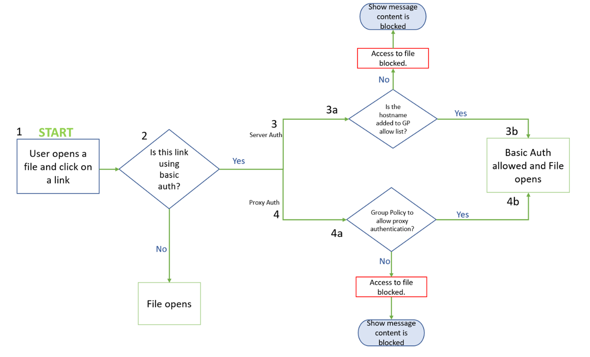

# Basic authentication sign-in prompts are blocked by default in Microsoft 365 Apps

> [!IMPORTANT]
> This is pre-release documentation and is subject to change. The information only applies to customers that are in a private preview program.

The Office apps included with Microsoft 365 Apps allow users to use Basic authentication to connect to resources on remote servers by sending usernames and passwords with each request. These credentials are often stored on the servers, making it easier for attackers to capture them and reuse them against other endpoints or services.

Basic authentication is an outdated industry standard and doesn't support more robust security features, such as multifactor authentication. The threats posed by it have only increased and there are better and more effective user authentication alternatives. For example, modern authentication, which supports multifactor authentication, smart cards, and certificate-based authentication.

Therefore, to help improve security in Microsoft 365 Apps, we’re changing the default behavior of Office applications to block sign-in prompts from Basic authentication.

With this change, if users try to open Office files on servers that only use Basic authentication, they won't see any Basic authentication sign-in prompts. Instead, they'll see a message that the file has been blocked because it uses a sign-in method that may be unsecure. The message will include a link that takes users to an article that contains information about the security risks of Basic authentication.

> [!NOTE]
> SharePoint Online, OneDrive, and on-premises SharePoint Server aren't affected by this change.

## Versions of Office affected by this change

This change affects Office apps only on devices running Windows and affects the following applications:

- Access
- Excel
- OneNote
- Outlook
- PowerPoint
- Project
- Publisher
- Visio
- Word

> [!NOTE]
> Basic authentication will continue to work partially on Outlook, as deprecation of Basic authentication in Exchange Online is a separate effort. For more information, see [Basic Authentication Deprecation in Exchange Online – May 2022 Update](https://techcommunity.microsoft.com/t5/exchange-team-blog/basic-authentication-deprecation-in-exchange-online-may-2022/ba-p/3301866).

The plan is to begin rolling out this change in Version 2208, starting with Current Channel (Preview) in August 2022. Later, the change will be available in the other update channels, such as Current Channel and Monthly Enterprise Channel.

The following table shows the projected schedule of when this change will be available in each update channel. Information in italics is subject to change.

|Update channel  |Version  |Date  |
|---------|---------|---------|
|Current Channel (Preview)|Version 2208|August 2022|
|Current Channel|*Version 2208*|*To be determined*|
|Monthly Enterprise Channel|*To be determined*|*To be determined*|
|Semi-Annual Enterprise Channel (Preview)|*To be determined*|*To be determined*|
|Semi-Annual Enterprise Channel |*To be determined*|*To be determined*|

> [!NOTE]
> - This change will also affect retail versions of Office 2021, Office 2019, and Office 2016. 
> - This change won't affect volume licensed versions of Office, such as Office LTSC Professional Plus 2021 or Office Standard 2019.

## How Office determines whether to show Basic authentication prompts

The following flowchart graphic shows how Office determines whether to open a file if the server uses Basic authentication.

The following steps explain the information in the flowchart graphic.

1. A user tries to open an Office file that is stored on a remote server.
2. If the server isn't using Basic authentication, the file opens. If the server uses Basic authentication, Office will check if a policy exists to allow Basic authentication prompts.
3. If the server is authenticating directly with Basic authentication, Office evaluates the state of the [Allow specified hosts to show Basic Authentication prompts to Office](#allow-specified-hosts-to-show-basic-authentication-prompts-to-office) policy.
   - If the policy is set to Enabled and the server is specified, the user is prompted to provide a username and password to open the file.
   - Otherwise, the user doesn't see a sign-in prompt and the file is blocked from opening. Instead, the user will see a message that the file has been blocked because it uses a sign-in method that may be unsecure.
4. If the server is using proxy authentication, Office evaluates the state of the [Allow Basic Authentication prompts from network proxies](#allow-basic-authentication-prompts-from-network-proxies) policy.
   - If the policy is set to Enabled, the user is prompted to provide a username and password to open the file.
   - Otherwise, the user doesn't see a sign-in prompt and the file is blocked from opening. Instead, the user will see a message that the file has been blocked because it uses a sign-in method that may be unsecure.

## Use policies to manage Basic authentication prompts

> [!IMPORTANT]
> The following policies only work for customers that are in a private preview program.

If you need to provide Basic authentication prompts for certain hosts or from network proxies, you can configure the following policies:

- [Allow specified hosts to show Basic Authentication prompts to Office](#allow-specified-hosts-to-show-basic-authentication-prompts-to-office)
- [Allow Basic Authentication prompts from network proxies](#allow-basic-authentication-prompts-from-network-proxies)

> [!IMPORTANT]
> - We don't recommend allowing Basic authentication prompts for certain hosts or from network proxies, because using Basic authentication isn't secure.
> - But you can use these policies if you need to provide these prompts temporarily while you move those servers to more secure authentication methods.

These policies can be found in the Group Policy Management Console under User Configuration\Policies\Administrative Templates\Microsoft Office 2016\Security Settings.

> [!NOTE]
> To use these policies, download at least version 5359.1000 of the [Group Policy Administrative Template files (ADMX/ADML) for Office](https://www.microsoft.com/download/details.aspx?id=49030) from the Microsoft Download Center. That version was released on August 11, 2022.

### Allow specified hosts to show Basic Authentication prompts to Office

This policy allows you to specify which hosts can show Basic authentication sign-in prompts to Office apps.

The following table shows the level of protection you get with each state of the policy.

|Icon|Protection level|Policy state|Description|
|-----|---------|---------|---------|
|| Protected |Enabled  (no hosts specified) |Users will be blocked from opening files located on remote servers that use Basic authentication. |
||Partially protected|Enabled  (hosts specified)| Basic authentication prompts will be allowed only from the hosts specified.    If you specify multiple hosts, separate them by a semi-colon.|
|| Protected |Disabled |Users will be blocked from opening files located on remote servers that use Basic authentication. |
|| Protected  **[recommended]**|Not Configured |Users will be blocked from opening files located on remote servers that use Basic authentication. |

### Allow Basic Authentication prompts from network proxies

This policy controls whether network proxies are allowed to show Basic authentication prompts.

The following table shows the level of protection you get with each state of the policy.

|Icon|Protection level|Policy state|Description|
|-----|---------|---------|---------|
|| Protected |Disabled | Network proxies won't show Basic authentication prompts.|
|| Not protected|Enabled|Network proxies will show Basic authentication prompts. |
|| Protected  **[recommended]**|Not Configured |Network proxies won't show Basic authentication prompts. |