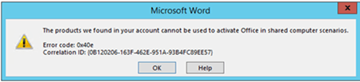

# Troubleshoot issues with shared computer activation for Office 365 ProPlus

 **Summary:** Explains how to troubleshoot issues with deployments of Office 365 ProPlus that are configured to use shared configured activation.
  
    
    

If you're having problems getting shared computer activation to work when you deploy Office 365 ProPlus to shared computers in your organization, try the following to fix the problem.
## Check that your Office 365 plan supports shared computer activation

To use shared computer activation, you must have an  [Office 365 plan](https://go.microsoft.com/fwlink/p/?LinkId=510587) that includes Office 365 ProPlus.
  
    
    

> [!NOTE]
> You also can use shared computer activation with Visio Pro for Office 365 or Project Online Desktop Client. You just need a subscription plan that includes those products. 
  
    
    

## Verify that shared computer activation is enabled for Office 365 ProPlus

Here are two ways that you can check whether shared computer activation is enabled on the computer that has Office 365 ProPlus installed.
  
    
    

- Open any Office 365 ProPlus program, such as Word. Go to **File** > **Account** > **About Word** (or whatever the name of the app is). On the second line from the top, underneath the MSO version number, you should see **Shared Computer Activation**, instead of a Product ID.
    
  
- Use Registry Editor, and go to **HKEY_LOCAL_MACHINE\\SOFTWARE\\Microsoft\\Office\\ClickToRun\\Configuration**. There should be a value for SharedComputerLicensing with a setting of 1.
    
  

## Verify that activation for Office 365 ProPlus succeeded

On the shared computer, after you open any Office 365 ProPlus program, go to the following folder:
  
    
    
 %localappdata%\\Microsoft\\Office\\16.0\\Licensing
  
    
    
If activation succeeded, there are some text files in the folder. Don't make any changes to these files.
  
    
    

## Review error messages for shared computer activation

If you're having problems using shared computer activation, you might get one of the following error messages.
  
    
    

### The products we found in your account cannot be used to activate Office in shared computer scenarios.

This error means that you don't have an  [Office 365 plan](https://go.microsoft.com/fwlink/p/?LinkId=510587) that includes Office 365 ProPlus. Therefore, you can't use shared computer activation.
  
    
    

  
    
    

  
    
    

  
    
    

  
    
    

### UNLICENSED PRODUCT Most features are turned off because a shared computer license isn't available.

This error means that a licensing token wasn't obtained from the Office Licensing Service on the Internet. Office 365 ProPlus is now in reduced functionality mode. The user can view and print Office 365 ProPlus documents, but can't create or edit documents.
  
    
    
You can try these steps to fix this problem:
  
    
    

-  [Assign or remove licenses for Office 365 for business](http://technet.microsoft.com/library/997596b5-4173-4627-b915-36abac6786dc%28Office.14%29.aspx) for Office 365 ProPlus.
    
  
- Check that the user signs in with her user account for Office 365 if the **Activate Office** dialog box appears when the user opens an Office 365 ProPlus program.
    
  
- Check that there is connectivity between the shared computer and the Internet.
    
  

  
    
    

  
    
    

  
    
    

  
    
    

### Sorry, we cannot verify the license currently installed for this product.

This error means that Office 365 ProPlus has a problem with the user's licensing token on the shared computer. The user should make sure to sign in to Office 365 ProPlus with his user account for Office 365 so that Office 365 ProPlus can obtain a new licensing token from the Office Licensing Service on the Internet.
  
    
    

  
    
    

  
    
    

  
    
    

  
    
    

### PRODUCT NOTICE Your shared computer license expires on <date> and we're having trouble renewing it.

This error means that Office 365 ProPlus tried to renew the licensing token automatically, but there was a problem. One possible cause for this is that the shared computer wasn't connected to the Internet when Office 365 ProPlus tried to renew the licensing token with the Office Licensing Service.
  
    
    
The licensing token is valid until the date listed in the error message. The user can continue to use Office 365 ProPlus to create, edit, and print documents. The user can choose **Renew** to try to renew the license before the license token expires.
  
    
    

  
    
    

  
    
    

  
    
    

  
    
    

### Sorry, this Office 365 account has recently been used to activate too many computers.

Microsoft places a limit on the number of shared computers that a user can activate Office 365 ProPlus on in a given time period. This error means that the user exceeded that limit.
  
    
    

  
    
    

  
    
    

  
    
    

  
    
    

## See also

#### Other Resources

  
    
    
 [Overview of shared computer activation for Office 365 ProPlus](overview-of-shared-computer-activation-for-office-365-proplus.md)
  
    
    
 [Deploy Office 365 ProPlus by using Remote Desktop Services](deploy-office-365-proplus-by-using-remote-desktop-services.md)
