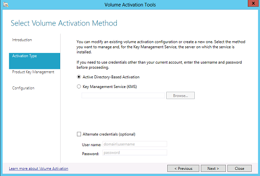

# Activate volume licensed versions of Office by using Active Directory

***Applies to:*** *Volume licensed versions of Office 2019 and Office 2016, including Project and Visio*
  
Active Directory-based activation enables an organization to activate volume licensed versions of Office, including Project and Visio, on computers that are joined to an Active Directory domain. Active Directory-based activation is implemented as a role service on Windows Server and relies on Active Directory Domain Services to store an activation object. For more information, see [Activate using Active Directory-based activation](https://docs.microsoft.com/windows/deployment/volume-activation/activate-using-active-directory-based-activation-client).

## Requirements for using Active Directory-based activation

To use Active Directory-based activation, the volume licensed version of Office, Project, or Visio must have a Generic Volume License Key (GVLK) and must be installed on one of the following operating systems:

- Windows 10
- Windows 8.1
- Windows Server 2016
- Windows Server 2012 R2
- Windows Server 2012  
    
Review the [System requirements for Office](https://products.office.com/office-system-requirements) to determine which operating systems are supported by the volume licensed version of Office, Project, or Visio that you're deploying the users in your organization. For example, Office Professional Plus 2019 is supported on Windows 10 but isn't supported on Windows 8.1.

## Configure Active Directory-based activation

To configure Active Directory-based activation, you must have Domain Administrator and Enterprise Administrator credentials.

1. Sign in to a domain controller in Active Directory and use Server Manager to install the Volume Activation Services role.
2. Sign in to the [Volume Licensing Service Center](https://www.microsoft.com/licensing/servicecenter/default.aspx) and get your KMS key for your version of Office.
3. Download the appropriate Office Volume License Pack from the Microsoft Download Center: [Office 2019](https://www.microsoft.com/downloads/details.aspx?FamilyID=878fef7e-3f4d-4d22-a423-f447c0f5bfdd), [Office 2016](https://www.microsoft.com/download/details.aspx?id=49164).
4. Run the Office Volume License Pack executable file. This will install the Office Volume License Pack and opens the **Volume Activation Tools** wizard.
5. Choose **Next**, and then on the **Select Volume Activation Method** page, choose **Active Directory-Based Activation**.
    
     
  
6. On the **Manage Activation Objects** page, enter the KMS host key, which you got from the VLSC, and, optionally, give it a name. Then choose **Next**.
7. On the **Activate Product** page, either activate the KMS host key online or by phone, and then follow the rest of the wizard instructions.
8. When you're done, an **Activation Succeeded** page displays. 

## Additional information about Active-Directory based activation

- Active-Directory based activation uses the same keys that are used by Key Management Service (KMS). But Active Directory-based activation doesn't require a dedicated host computer, because the activation object is replicated across all the domain controllers in the Active Directory forest.
- A successful Active Directory-based activation of Office lasts for up to 180 days. The Software Protection service running on the computer periodically attempts to re-activate Office by querying Active Directory for the activation object. If Active Directory can't be contacted, Office will try to activate by using a discoverable KMS host computer. 

    
## Related topics

- [Overview of volume activation of Office](plan-volume-activation-of-office.md)
- [GVLKs for KMS and Active Directory-based activation of Office 2019 and Office 2016](gvlks.md)
 
