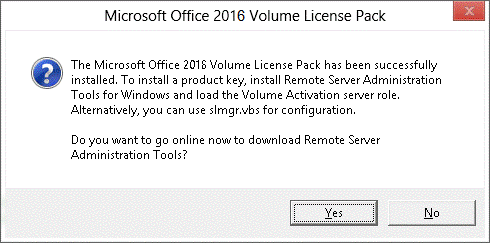

# Prepare and set up the Office 2016 KMS host computer

 ***Applies to:*** *Volume licensed versions of Office 2019 and Office 2016, including Project and Visio*

  
To enable Key Management Service (KMS) functionality for Office 2016, you install KMS host license files and a KMS activation key on the KMS host computer. Then, you activate the key over the Internet or by telephone using Microsoft hosted activation services.
  
To find out more about how to buy volume license editions of Office 2016, see [Microsoft Office Volume Licensing Buyer's Guide](https://www.microsoft.com/en-us/licensing/product-licensing/office.aspx).
  
|||
|:-----|:-----|
|           <br/> |If you are a user activating a personal copy of Office 2016, follow the [Activate Office 365, Office 2016, or Office 2013](https://support.office.com/article/5bd38f38-db92-448b-a982-ad170b1e187e) directions instead.  <br/> |
|           <br/> |If you are an admin and you want to activate Office 365 ProPlus for your company, review the [Overview of licensing and activation in Office 365 ProPlus](../overview-of-licensing-and-activation-in-office-365-proplus.md) instead.  <br/> <br/>Not sure if you need to use KMS, MAK, or AD DS-based activation? Review [Plan volume activation of Office 2016](plan-volume-activation-of-office.md) before continuing.  <br/> <br/>If you are an admin setting up a KMS host computer in order to activate Office 2016 for your company, you're at the right place, keep reading.  <br/> |
   

    
<a name="SupportedOSKMS"> </a>

## Supported operating systems for the KMS host computer and client computers

You can use the KMS activation method with the 32-bit and 64-bit editions of these operating systems.
  
For KMS client computers:
  
- Windows 10
    
- Windows 8 or Windows 8.1
    
- Windows 7
    
- Windows Server 2012 or Windows Server 2012 R2 
    
- Windows Server 2008 R2
    
For the KMS host computer:
  
- Windows 8
    
- Volume license editions of Windows 7
    
- Windows Server 2012
    
- Windows Server 2008 R2
    
<a name="coHostwithWindows"> </a>

## Co-hosting Office 2016 with Windows on the same KMS host computer

If you currently have a Windows KMS host computer on an operating system that supports Office KMS, we recommend that you use the same computer as your Office KMS host computer as well. To use the same computer for volume license editions of Office, you must still install the licensing files, and activate an Office 2016 KMS host key on the computer.

<a name="BMK_PreparetheKMSHost"> </a>
 
## Prepare the Office KMS host computer


You can set up Office 2016 KMS host on the same computer that is serving as KMS host for Office 2013.
  
If you are setting up KMS on Windows 7 volume license edition or Windows Server 2008 R2, you must first install a patch as described in Microsoft Knowledge Base article [2757817](https://go.microsoft.com/fwlink/p/?LinkId=254800). This patch allows the KMS host computer to activate Office 2016 clients that run on Windows 8.
  
<a name="BMK_SetupAndActivateOfficeKMShost"> </a>

## Set up and activate Office KMS

Once you have prepared your KMS host computer, you need to install the Volume License Pack and then activate the KMS host key as described in this article.
  
### To set up Office KMS

1. Verify that the user account that is performing this procedure is a member of the Administrators group on the KMS host computer.
    
2. Download the [Microsoft Office 2016 Volume License Pack](https://www.microsoft.com/download/details.aspx?id=49164) and run **office2016volumelicensepack_4285-1000_en-us_x86.exe**. This launches the **Volume Activation Tools** wizard. 
    
    Then, follow the steps in the **Install Instructions** section on the download page. 
    
    To get the key for the Microsoft Office 2016 KMS, sign in to the [Microsoft Volume Licensing Service Center](https://go.microsoft.com/fwlink/p/?LinkId=184280). Choose the Office version for which you are licensed. Then, look for the KMS key for that version. Don't choose the Key Management Service Host Key. 
    
3. If the KMS host computer does not have an Internet connection, see [To activate an Office KMS host by telephone](configure-a-kms-host-computer-for-office.md#BMK_ToactivateanOfficeKMSbytelephone) later in this article. 
    
4. If you have a firewall enabled, follow these steps to activate the KMS host computer through the firewall:
    
5. In Control Panel, select **System and Security**, and then select **Windows Firewall**.
    
6. Select the **Allow a program or feature through Windows Firewall** link. 
    
7. Select **Change Settings**.
    
8. Select the **Key Management Service** check box, and then click **OK**.
    
9. If you installed the Microsoft Office 2016 Volume License Pack on Windows 8, when the application opens, the dialog box in the following figure appears. Choose **Yes** to install the Remote Server Administration Tools (RSAT) for Windows 8 from the [RSAT download page](https://go.microsoft.com/fwlink/p/?LinkId=254802), or click **No** to use **slmgr.vbs** to set up KMS host computer activation. We recommend that you install RSAT. 
    
   **Figure: Office 2016 Volume License Pack dialog box**

     
  
    For more information about **slmgr.vbs** (Software License Manager script), see [The slmgr.vbs script](tools-to-manage-volume-activation-of-office.md#BK_Theslmgrscript).
    
   **Activating an Office KMS host computer by telephone**
  
If your KMS host does not have an Internet connection, you can activate it by telephone.

<a name="BMK_ToactivateanOfficeKMSbytelephone"> </a>

### To activate an Office KMS host computer by telephone

1. Verify that the user account that is performing this procedure is a member of the Administrators group on the computer that is running KMS.
    
2. Start a Command Prompt with elevated privileges. For example:
    
   - For Windows Server 2008 R2, click **Start**, click **All Programs**, expand **Accessories**, right-click **Command Prompt**, and then click **Run as administrator**.
    
   - For Windows Server 2012, on the **Start** screen, right-click **Command Prompt**, and then click **Run as administrator**. If **Command Prompt** is not on the **Start** screen, right-click **Computer**, click **All apps**, right-click **Command Prompt**, and then click **Run as administrator**.
    
3. In the **User Account Control** dialog box, click **Yes**.
    
4. In the **Administrator: Command Prompt** window, change to the **C:\Windows\system32** directory and then run the following command: 
    
    cscript slmgr.vbs /dti 98EBFE73-2084-4C97-932C-C0CD1643BEA7
    
    > [!NOTE]
    > The 98EBFE73-2084-4C97-932C-C0CD1643BEA7 value is the Office 2016 activation ID. 
  
    The result of this command is a 36-digit installation ID. To prepare for step 6, paste the installation ID number into Notepad, and then break it up into six groups of six numbers.
    
5. At the command line, run **slui.exe 4**. This launches the Windows phone activation wizard. Call the telephone number that is displayed. 
    
    After you have obtained the telephone number, cancel the wizard.
    
    > [!CAUTION]
    > Ignore the activation ID displayed by the wizard. It is for Windows. 
  
6. Call the telephone number. At each prompt, enter a group of six numbers. This is the installation ID for Office 2016 that you obtained in step 4.
    
7. When you hear the response, write down the numbers. This is your confirmation ID.
    
8. At the command line, run **cscript slmgr.vbs /atp xxxxxxxxxxxx 98EBFE73-2084-4C97-932C-C0CD1643BEA7**, where  _xxxxxxxxxxxx_ is the confirmation ID that you receive by telephone (there should be 48 numbers). 
    
    > [!IMPORTANT]
    > The 98EBFE73-2084-4C97-932C-C0CD1643BEA7 value is the Office 2016 activation ID. Therefore, paste this value exactly as shown. 
  
9. You should see a message that the confirmation ID was successfully deposited.
    
<a name="BKM_VerifysuccesfulactivationofhteOfficeKMSHost"> </a>

## Verify successful activation of the Office KMS host computer

After you set up the host computer, the KMS clients send requests for activation and increment the current count of activations. The current count must be 5 or larger before KMS clients are activated. The maximum current count is double the activation threshold, or 10. You can also check the KMS log in the Applications and Services Logs folder for event ID 12290, the ID for KMS-related activity. The KMS log records activation requests from KMS clients. Each event displays the name of the computer and the time stamp of each activation request.
  
### To verify that the Office 2016 KMS host key is successfully installed and activated

1. Verify that the user account that is performing this procedure is a member of the Administrators group on the computer that is running KMS.
    
2. Start a Command Prompt with elevated privileges. For example:
    
   - For Windows Server 2008 R2, click **Start**, click **All Programs**, expand **Accessories**, right-click **Command Prompt**, and then click **Run as administrator**.
    
   - For Windows Server 2012, on the **Start** screen, right-click **Command Prompt**, and then click **Run as administrator**. If **Command Prompt** is not on the **Start** screen, right-click **Computer**, click **All apps**, right-click **Command Prompt**, and then click **Run as administrator**.
    
3. In the **User Account Control** dialog box, click **Yes**.
    
4. In the **Administrator: Command Prompt** window, type the following command, and then press ENTER: 
    
    cscript slmgr.vbs /dlv all
    
    To view information only for Office 2016, specify the Activation ID after the **/dlv** parameter. For example: 
    
    cscript slmgr.vbs /dlv 98EBFE73-2084-4C97-932C-C0CD1643BEA7
    
    The following is an example of the output. The line that says: "License Status: Licensed" indicates that your KMS host computer is successfully activated.
    
   ```
   Name: Office 16, OfficeKMSHostVL_KMS_Host edition
   Description: Office 16, VOLUME_KMS channel
   Activation ID: 98EBFE73-2084-4C97-932C-C0CD1643BEA7
   Application ID: 0ff1ce16-a989-479d-af46-f275c6370663
   Extended PID: 05426-00206-234-001162-03-1033-9200.0000-0992013
   Installation ID: 020650770493837252929082195773527024195725809211989214
   Use License URL: https://activation.sls.microsoft.com/SLActivateProduct/SLActiva
   teProduct.asmx?configextension=o16
   Validation URL: https://go.microsoft.com/fwlink/?LinkID=187557
   Partial Product Key: KDQ2G
   License Status: Licensed
   Remaining Windows rearm count: 1000
   Trusted time: 10/26/2016 9:58:33 AM
   Key Management Service is enabled on this machine
      Current count: 0
      Listening on Port: 1688
      DNS publishing enabled
      KMS priority: Normal
   Key Management Service cumulative requests received from clients
      Total requests received: 0
      Failed requests received: 0
      Requests with License Status Unlicensed: 0
      Requests with License Status Licensed: 0
      Requests with License Status Initial grace period: 0
      Requests with License Status License expired or Hardware out of tolerance: 0
      Requests with License Status Non-genuine grace period: 0
      Requests with License Status Notification: 0
   ```

5. Close the **Administrator: Command Prompt** window. 
    
## Related topics
[Plan volume activation of Office 2016](plan-volume-activation-of-office.md)
  
[Active Directory Domain Services-based activation of Office 2016](activate-office-by-using-active-directory.md)

