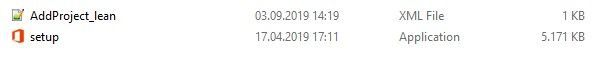

# Build dynamic, lean & universal packages for Office 365 ProPlus

As an admin, you might have been tasked with the deployment of Office 365 ProPlus to your organization. But such a deployment is more than just Office. After the initial migration to ProPlus, you might have to provide ways for your users to acquire automated installs of additional Language Packs, Proofing Tools, products like Visio and Project or other components.

This blog post will walk your through a concept of building dynamic, lean & universal packages for Office 365 ProPlus, greatly reducing long-term maintenance costs and effort needed in managed environments.

Grab a coffee, it’s a long post. Let’s roll.
 
## The challenge
When you plan your upgrade to Office 365 ProPlus, the actual upgrade from a legacy version to the always-current Office 365 ProPlus is front and center. But looking beyond the initial deployment, there are other scenarios you’ll need to cover as an admin. After you upgraded your users, they might need one of the following components going forward:
 
- Additional Language Packs
- Proofing Tools
- Visio
- Project

So in managed environments each of the above would require a dedicated installation package in order to allow an automated and controlled way to e.g. install additional languages for a user. Usually, for each of the above components, an admin would combine the necessary source files (~2.5 gigabyte), a copy of the Office Deployment Tool (ODT) together with a configuration file into a package.

But, especially in larger organizations, you often do not run a single installation of Office 365 ProPlus. You might have a mix of update channels (often SAC and SAC-T) and maybe you are currently transitioning from 32 bit to 64 bit, and for quite some time you will have to support both architectures.


So at the end, we would not have one package per component, but rather four, covering each possible permutation of SAC/SAC-T and x86/x64.
The end result would be:

- High number of packages, the four listed components would result in 16 or more packages.
- High bandwidth consumption, as a client might get the full 2.5 GB package pushed down before install
- High maintenance costs to keep embedded source files current.
- High user impact, if you haven’t kept the source files current and installing a component will perform a downgrade, just to perform an update to the current version soon after.
- Low user satisfaction when having to pick the matching package out of a bunch of options.
 
While the initial upgrade to Office 365 ProPlus is a one-time activity, the above scenarios will be applicable over a longer period as users might need additional components days, weeks or even years after the initial deployment.
So, how do we build packages which are less costly to maintain over a long time frame and avoid the above downsides?

## The solution: Dynamic, lean and universal packages
Good news: There is a way to resolve all of the above issues by implementing self-adjusting, small and universal package. I will give you the “meat and potatoes” of the concept before we dive into sample scenarios:

Build dynamic packages where you don’t hard-code anything. Leverage features of the [Office Deployment Tool (ODT)](https://go.microsoft.com/fwlink/p/?LinkID=626065) to allow the packages to self-adjust to the requirements:
- Use [Version=MatchInstalled](https://techcommunity.microsoft.com/t5/Office-365-Blog/New-feature-Make-changes-to-Office-deployments-without-changing/ba-p/816482) to prevent unexpected updates and stay in control of the version installed on a client. No hard-coding of a build number (which gets outdated quickly) required.
- Use [Language=MatchInstalled](https://techcommunity.microsoft.com/t5/Office-365-ProPlus/Dynamically-match-already-existing-languages-when-installing/m-p/716927) to instruct e.g. Visio or Project to install with the very same languages which are already installed for Office. No need to list them or build a script which injects the required languages.
 
Build lean packages by removing the source files from the packages. This has multiple benefits:

- Package size is much smaller, from 2.5 GB down to less than 10 megabytes for the ODT and its configuration file.
- Instead of pushing a 2.5 GB install package to clients, we allow clients to pull what it needs on demand from Office CDN which saves bandwidth:
   - When adding Project to an existing Office 365 ProPlus install, we need to download less than 50 megabytes as Office shared components are already installed.
   - Visio installs are typically between 100-200 megabytes, based and the number of languages as the templates/stencils are a substantial part of the download.
   - Installing Proofing Tools is typically between 30-50 megabytes versus a full Language Pack is somewhere between 200 to 300 megabyte.
- A 2nd install scenario is often less frequent, which lowers the burden on the internet traffic ultimately reducing the impact.
- You don’t have to update the source files every time when Microsoft releases new features, security and quality fixes.
 
Build universal packages by not hard-coding things like the architecture or update channel. ODT will dynamically match the existing install ; so your packages work across all update channels and architectures. Instead of having e.g. four packages to install Visio, you will have a single, universal package which will work across all permutations of update channels and architectures.
- Leaving out [OfficeClientEdition](https://techcommunity.microsoft.com/t5/Office-365-ProPlus/Insights-into-OfficeClientEdition-and-how-to-make-it-work-for/m-p/767577) makes your package universal for mixed x86/x64 environments.
- Leaving out [Channel](https://techcommunity.microsoft.com/t5/Office-365-ProPlus/Understanding-the-Channel-attribute-of-the-Office-Deployment/m-p/813604) makes your package universal across update channels, even ones you don’t support :smile:.
 
## How to and benefit of building dynamic, lean & universal packages

The idea behind this concept is to not hard-coding everything in the configuration file, but rather leverage the cleverness of the Office Deployment Tool (ODT) as much as possible. Let’s have a look at a “classic” package, built to add Project to an existing install of Office 365 ProPlus. We have the source files (~2.5 gigabyte in size) and a configuration file which explicitly states what we want to achieve:


```
<Configuration>
 <Add OfficeClientEdition="64" Channel="Broad">
  <Product ID="ProjectProRetail">
   <Language ID="en-us" />
  </Product>
 </Add>
 <Display Level="None" />
</Configuration>
```
 
When applying  the concepts of dynamic, lean, universal packages, the result would look like this:
 


```
<Configuration>
 <Add OfficeClientEdition="64" Channel="Broad">
  <Product ID="ProjectProRetail">
   <Language ID="en-us" />
  </Product>
 </Add>
 <Display Level="None" />
</Configuration>
```

So what have we changed and what are the benefits of doing so?

- Removed OfficeClientEdition-attribute, as the ODT will automatically match the installed version.
   - Benefit: Configuration file now work for both x86 and x64 scenarios.
- Remove Channel, same reason, ODT will automatically match the already assigned update channel.
   - Benefit I: Package works for all update channels (Monthly, Semi-Annual, SAC-T, you name it)
   - Benefit II: It will also work for update channels you don’t offer as central IT. Some users are running Monthly, some are on Insider builds? Don’t worry, it just works!
- Added Version=MatchInstalled which will ensure that ODT will install the exact same version which is already installed.
   - Benefit: You are in control of versions deployed, no unexpected updates.
- Added Language ID="MatchInstalled"  and TargetProduct  designed to match the currently installed language(s), replacing a hard-coded list of languages to install.
   - Benefit I: User will have the same languages in Project as already installed for Office.
   - Benefit II: No need to re-request Language Pack installs.
   - Benefit III: Will also work for rarely used languages which you as central IT admin don’t offer, leading to happier users.
- Removed the source files, the ODT will fetch the correct set of source files from the Office CDN just-in-time.
   - Benefit I: Package never gets old. No maintenance of source files needed.
   - Benefit II: Download is ~50 megabyte instead of pushing 2.5 GB around.
 
## Another example: Adding Language Packs and Proofing Tools the dynamic, lean & universal way

Let’s have a brief look at other scenarios as well, like adding Language Packs and Proofing Tools. The classic configuration file to install the German Language Pack might look like this:
 
```
<Configuration>
 <Add OfficeClientEdition="64" Channel="Broad">
  <Product ID="LanguagePack">
   <Language ID="de-de" />
  </Product>
 </Add>
 <Display Level="None" />
</Configuration>
```

If you’re running SAC as well as SAC-T and have a x86/x64 mixed environment, you would need three additional files to cover the remaining permutations of configurations. Or you just go the dynamic, lean and universal way:

```
<Configuration>
 <Add Version="MatchInstalled">
  <Product ID="LanguagePack">
   <Language ID="de-de" />
  </Product>
 </Add>
 <Display Level="None" />
</Configuration>
```
 
This single configuration file will work across x86/x64 and all update channels (Insider Fast, Monthly Targeted, Monthly, SAC-T, SAC, and so on). So if you want to offer 5 additional languages in your environment, just build 5 of these “config file + ODT” packages and you’re good to go. For Proofing Tools you just change the ProductID to "ProofingTools".
 
## Prerequisites

I hope this new concept helps you to build dynamic, lean and universal packages and reduce the overall effort of managing Office 365 client Apps.
There are some prerequisites you must meet to make this concept work in your environment:
- Use [Office Deployment Tool](https://go.microsoft.com/fwlink/p/?LinkID=626065) 16.0.11615.33602 or newer to enable Version=MatchInstalled to work.
- The ODT must be able to locate the matching source files on the Office CDN.
- Ensure that the context your using for running the install can traverse the proxy. Check out our [Office 365 ProPlus Deployment and Proxy Server Guidance](https://techcommunity.microsoft.com/t5/Office-365-Blog/Office-365-ProPlus-Deployment-and-Proxy-Server-Guidance/ba-p/849164)  for a deep-dive on this.
- Make sure, that the account (user or SYSTEM) used to install the apps is able to connect to the internet.
