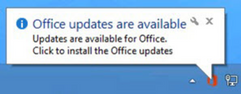
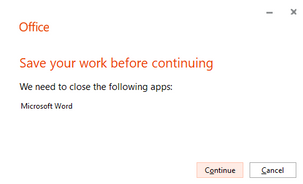
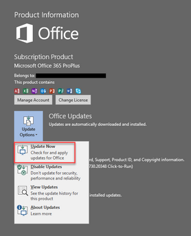
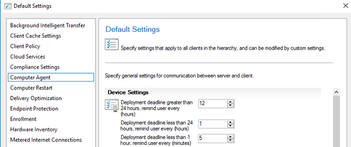

# Understand Office 365 ProPlus Updates for IT Pros (CDN vs SCCM)

In supporting customers in the field, we receive many questions about Office 365 ProPlus update process. The objective of this blog is to provide context around end user behavior during update scenario and clarify when and how Office updates are applied. 

Office ProPlus was designed to be a cloud first product…. What does that mean?  It means that by default, Microsoft recommends you update Office 365 ProPlus directly from Microsoft Content Delivery Network (CDN).  While IT Pros are always in control,  Office 365 ProPlus is automatically kept up-to-date via evergreen model.  IT Pros can offload servicing aspect of Office 365 ProPlus to Microsoft so they can focus on other duties removing repetitive tasks.  At present, while we lead with CDN as our recommendation, the vast majority of Enterprise customers I work with prefer to manage updates from System Center Configuration Manager (SCCM) for a variety of reasons. (too many to list here such as network, governing process or political etc.)

Let’s compare and contrast both scenarios below to see which approach is best to address your business requirements.  Regardless, the goal is to ensure Office 365 ProPlus is serviced *every month* to address security and deliver features based on cadence suitable for our customers.

 
## Quick refresher of Office ProPlus channel cadence -Simplified 

**Monthly:** Provide users with the newest features of Office as soon as they're available.  This could be three or four builds per Month. (Updates should be delivered by CDN)

**Semi-Annual Channel (Targeted):** Provide pilot users and application compatibility testers the opportunity to test the next Semi-Annual Channel.  Features\fixes delivered every six months, in March and September (Updates can use CDN or SCCM)
**Semi-Annual Channel:** Provide users with new features of Office only a few times a year. Features\fixes delivered every six months, in January and July (Updates can use CDN or SCCM)

**(Official Link is here: [Overview of update channels](https://docs.microsoft.com/en-us/deployoffice/overview-of-update-channels-for-office-365-proplus))**

 Note about PREVIEW feature using Delivery Optimization for Office 365 ProPlus install\updates
 
The point of the channels is to define the timing when those cumulative builds include features and fixes in addition to security. If you would like more information about channel management please see my other posting for more information called [How to manage Office 365 ProPlus Channels for IT Pros](https://techcommunity.microsoft.com/t5/Office-365-ProPlus/How-to-manage-Office-365-ProPlus-Channels-for-IT-Pros/m-p/775602#M716)

*This blog will focus primarily on update process.  Deployment of Office 365 ProPlus is out of scope and will assume Office 365 ProPlus is already installed on the machine.

## Update from CDN

Prerequisites

Automatic Updates is by default Enabled (equivalent GPO is “Enabled Automatic Updates”). If disabled, Office 365 ProPlus will *never update*.

## Benefits

- Admins don’t have to spend time developing processes to duplicate CDN content on-premises.
- Admins don’t have to build processes to target software updates to collections. Each machine will pull updates on it’s own.
- Aligns with “Modern Desktop” motion where machines are increasingly managed by Mobile device management (MDM) rather than on-premises solutions without requirement for any infrastructure.
- CDN supports a variety of advanced policies to control updates at granular level such as “delay downloading and installing updates for Office”, “prioritize BITS”, “Target Version”, “Update Channel”, “Update Deadline”. IT Pros can control updates effectively without the need for on-premises software.
- Leverages inbox task scheduler \Microsoft\Office\Office Automatic Updates 2.0 to perform updates based on trigger mechanism (Weekly, At log on, On idle)

Note: [On idle](https://docs.microsoft.com/en-us/windows/win32/taskschd/task-idle-conditions) is very interesting trigger condition in that it can check for criteria such as user absence and lack of resource consumption to determine opportunistic time to retry updates (no reboots required when Office applications are closed).

Reference Links for next section: [Update history for Office 365 ProPlus (listed by date)](https://docs.microsoft.com/en-us/officeupdates/update-history-office365-proplus-by-date) and [Download sizes for updates to Office 365 ProPlus](https://docs.microsoft.com/en-us/officeupdates/download-sizes-office365-proplus-updates)

## User Experience when updating from CDN

Let’s imagine Office 365 ProPlus has June 2019 build installed which is Version 1808 (Build 10730.20348).  “Patch Tuesday” rolls around and on July 9th 2019 July build is released which is Version 1902 (Build 11328.20368).  Based on the trigger assigned the scheduled task “Office Automatic Updates 2.0” will detect a newer build applicable.  Upon initial release to CDN, a new build is temporary throttled until signals are received ensuring highest quality release have been verified.  As a result, IT Pros may observe updates may not occur on Day 0 to all machines but rather over a period of days.  Alternatively, IT Pros can intervene and enable policy “delay downloading and installing updates for Office” and simply define installing update based on number of days.   This mirrors servicing plans feature in SCCM for delivering Windows Feature Updates and makes it easy to build rings.

Since the build installed is most recent version we can leverage a feature called binary delta compression to help reduce the size of the files further.  Therefore, keeping Office ProPlus up-to-date is friendlier on network.  Office will download deltas and will stage in C:\Program Files\Microsoft Office\Updates\Download.  After download Office Automatic Updates 2.0 will attempt to update Office 365 ProPlus.  If no Office applications are open, it will update.  If Office applications were open at the time of update request a series of notifications will occur of period of days. ([Officially documented here](https://docs.microsoft.com/en-us/deployoffice/end-user-update-notifications-for-office-365-proplus))

Specifically, If, after four days, the updates still aren't applied, a message appears in the notification area in Windows, telling the user that updates are available.



If, after six days, the updates still aren't applied, a message appears in any newly opened Office document, reminding the user that updates are available.  We refer to this as the “BusBar” which allows user to drive change when convenient. 


Clicking “Update now” when Office applications are open will result in sample dialogue below.  Clicking continue will save work, update and reopen applications.

<GRAPHICS>
saveyourwork.png

The Office backstage also offers a “Update now” selection driven by the user which will check for updates and download build resulting in same prompt above.




IT Pros can also configure policy “Update Deadline” to set a deadline by when updates for Office must be applied.  Users are given notifications leading up to the deadline. For example, within seventy-two hours of the deadline, users see a message, in any newly opened Office document, that updates are blocked.


Additional reminders will appear leading up to deadline notifying user update is mandatory.  This message appears every two hours. It'll also be shown 60 minutes, 30 minutes, 15 minutes, and 5 minutes before the deadline.


If the deadline arrives and the updates still aren't applied, users see a dialog box that warns them that they have 15 minutes before the updates are applied.


## User Experience when updating from SCCM
 
Prerequisites

- SCCM Current Branch with Windows Server Update Services (WSUS) 4.0, you can't use WSUS by itself to deploy these updates. You need to use WSUS in conjunction with Configuration Manager
- The hierarchy's top level WSUS server and the top level Configuration Manager site server must have access to the following URLs: *.microsoft.com, *.msocdn.com, *.office.com, *.office.net, *.onmicrosoft.com, officecdn.microsoft.com, officecdn.microsoft.com.edgesuite.net.
- Office 365 Client product must be selected from products tab under Software Update Point Component Properties and synchronize software updates after change. Once complete, you should see Office 365 Client Updates populate the Office 365 Updates node under Office 365 Client Management within Software Library tab in SCCM Console.
- Office 365 Client Management must be enabled on the client. This can be configured in multiple ways such as adding OfficeMgmtCOM="TRUE" in configuration.xml during installation, enable domain policy “Office 365 Client Management” and finally by toggling “Enable management of the Office 365 Client Agent” to Yes from within SCCM Client settings under Software Updates.  You can verify by launching dcomcnfg.exe on the client computer and confirming OfficeC2RCom application is registered.  **Only one is required**, where policy overrides and take priority over all other methods.  The purpose of the COM application is to allow Office 365 ProPlus to interop with SCCM to pull updates from distribution points rather than CDN


*Example of running dcomcnfg.exe*


Note about PREVIEW feature using Delivery Optimization for Office 365 ProPlus install\updates

Overwhelming majority of enterprise customers use SCCM to deliver Office 365 Client updates for compliance and distribute content from Distribution Points.  Microsoft is always working hard to provide customers additional options including the new feature [Delivery Optimization and Office 365 ProPlus which is now in (Preview)](https://docs.microsoft.com/en-us/deployoffice/delivery-optimization).  Please read article for full details but one-liner is customers will be able to install AND update Office 365 ProPlus sourcing content from peers without infrastructure requirements which we're super excited about. (no more "thick packages" or distributing loads of content to support a simple language pack).  If you enabled OfficeMgmtCom for SCCM integration, this action must be reversed in order to use Delivery Optimization (DO). The Microsoft Office Click-to-Run Service is responsible for registering and unregistering OfficeC2RCom (OfficeMgmtCOM) application during service startup.  Changing domain policy or SCCM client settings for Office 365 Client Management from ‘Enabled’ to ‘Not configured’ *is not enough*.  Domain Policy or SCCM Client settings require explicit ‘Disable’ selection for OfficeC2RCom to be successfully deregistered and restore default configuration. Further, any custom update path configuration must also be removed.

Benefits
- Office 365 ProPlus updates can easily be included in the same software deployment as monthly Windows patch process. As a result, all existing business processes and change control can be aligned in the same manner as legacy MSI Office products.
- Clients will only pull down what's needed to update themselves from Distribution Point.
- SCCM Administrators can download cumulative build one time from the internet and than deploy to all distribution points so clients pull updates from intranet sources.
- Administrators can make deployment Available (optional where user is notified update)
- Administrators can make deployment Available for a period of time prior to Installation Deadline. In this scenario, Office 365 Client using OfficeMgmtCOM will pull deltas from distribution point prior to Installation Deadline and give user a chance to “Update now” via BizBar discussed above at a time which is convenient for them.  This is especially important in a ever mobile world where machines are mobile and not powered on all the time.  Further, IT Pros can get some early production validation as some subset of their population will update prior to Installation Deadline giving them advanced notification of any problems prior to broad deployment.
- Administrators can make deployment Available time and Installation Deadline the same time. SCCM will ensure update is downloaded and installed at Deadline. (additional details on user experience below)
- Administrators can enable SCCM features such as Peer Cache so clients can share content among themselves further reducing network WAN traffic. ([Peer cache for Configuration Manager clients](https://docs.microsoft.com/en-us/sccm/core/plan-design/hierarchy/client-peer-cache))
 

## User Experience when updating from SCCM

 *Frequency of toast notifications from SCCM are configurable within "Client Settings" under "Computer Agent". This configuration is applicable to all software deployments not just Office 365 Client.*


*Can be found within SCCM console under client settings.*


## SCCM Deployment Scenarios
 
### Scenario 1 - Available only
If the deployment is Available only, the user will only see a toast notification in the system tray for a few seconds, Office update will never be deployed automatically.  The problem is this notification isn’t context sensitive so it simply takes end user to Software Center and it also doesn’t ensure security compliance.  Therefore, approach isn’t used often in my experience.
 
## Scenario 2 - Available with future Installation Deadline
This scenario is a good fit for customers who desire faster compliance, no reboots for Office 365 ProPlus updates and are comfortable with additional Office 365 ProPlus end user toast notifications, also in app notifications as well as Office 365 ProPlus countdown dialog leading up to deadline.  If the SCCM deployment is Available with future Installation Deadline, Office 365 ProPlus working with OfficeC2RCom application will download the necessary Office build pieces (not the entire build) and stage for installation pulling content from Distribution Point.  When COM is enabled and new build is staged, restart of Windows will not result in installation of update.  Immediately after the newer build is staged, any Office 365 ProPlus application which is reopened will immediately see the “BusBar” with end user option to drive change through “Update now” button.  This is a subtle difference compared to CDN scenario where banner shows only after a number of days.  Clicking the button results in same workflow as defined in CDN section.  When content is prestaged, there are a number of potential notifications, please review bullet items in blue from page [Manage Office 365 ProPlus with Configuration Manager](https://docs.microsoft.com/en-us/sccm/sum/deploy-use/manage-office-365-proplus-updates#restart-behavior-and-client-notifications-for-office-365-updates) to review all details as there are many.

For example:

"BusBar"


Once build is staged, a toast notification might not display until the user clicks the icon in the notification area which is easy to miss.


*"Basic notification" which sometimes be hidden under task bar chevron*


7.5 hours prior to deadline, Office will show 'Enforced Toast' which will present above "Office Updates Available" toast to foreground.  If user doesn't click "Update now", end user will potentially receive three additional notifications with countdown.  If no decision is made to postpone, Office applications will be forced closed and updates prior to deadline defined in SCCM.

![Office will update in *XX* minutes warning]<br/>
(images/minu.png)

*Minute countdown*<br/>*Second countdown*
<br/>*Updates installed*

If user postponed update by clicking 'Postpone' and deadline is eventually reached, standard SCCM restart window will be displayed with countdown.  Additionally, Office may also raise additional notification with 30 minute countdown.  Important to note, countdown from SCCM and Office countdown are not synchronized in any way, they work on separate timers.


### Scenario 3 - Available and Required Installation Deadline have same date

This scenario is best for IT Pros who want to minimize notifications to end user unless deadline has been reached.(Office content is not prestaged)  If the software deployment Available time and Installation Deadline have the same date, SCCM Client will determine that deadline has been missed and therefore make the deployment immediate.  Typical notification workflow will be presented to user.  


In this case since deadline has passed, download will begin automatically.


Once content has been downloaded, SCCM will immediately initiate Office update with following logic:  
- If all Office applications are closed, update will occur with no reboot. 
- If any Office application are open standard SCCM reboot workflow occurs.


The end user will begin to see SCCM “Restart Window” below which shows countdown until restart is forced.  The countdown frequency of notification are controlled solely by SCCM Client and can be configured within Client Settings node within SCCM Console.


**FAQ:**

**Is there a simple way to hide all notifications in Office such as the “Biz Bar” with button “Update Now?”**

Yes. Use “Hide Update Notifications” GPO or registry

```
HKLM\SOFTWARE\Policies\Microsoft\office\16.0\common\officeupdate
"hideupdatenotifications"=dword:00000001
```
 
W*This registry setting doesn't apply to deadline notifications such as the large white splash screen with countdown.*
 
**Is there an Microsoft official page which talks about this topic?**

Yes. [Manage Office 365 ProPlus with Configuration Manager](https://docs.microsoft.com/en-us/sccm/sum/deploy-use/manage-office-365-proplus-updates)

**If the download is supposed to only contain deltas and stage to C:\Program Files\Microsoft Office\Updates\Download, why in my environment is it staged in C:\Windows\ccmcache and full build? (~2GB)**

This means SCCM “Peer Cache” feature is enabled and content is available to be shared with other peers.  Windows is leveraging a NTFS feature called [“Sparse Files”](https://docs.microsoft.com/en-us/windows/win32/fileio/sparse-files).  Looking closely at size on disk details, you can compare the differences between the full data and the one on the right using peer cache. (Peer cache really only downloaded 80 MB.)

<GRAPHIC> 

**I’ve done everything I can think of and OfficeC2RCom application never shows within MMC console.  In fact, when I browse COM applications from within dcomconfg.exe, My Computer has a red down arrow?**

This means COM, part of .NET may be corrupted on machine.  Office cannot register application as COM itself is broken.  Typically this is edge case and requires rebuild of Windows :(

**You mentioned [On idle](https://docs.microsoft.com/en-us/windows/win32/taskschd/task-idle-conditions) update feature in CDN section but was omitted for SCCM, why?**

"By design", feature is enabled only for CDN scenario.

**Users who launch Office immediately after logon receive message "Updating Office, please wait a moment". Why?**


This means Office update was attempted while applications were open which cannot succeed.  Therefore, build was staged to retry update by Microsoft Office Click-to-Run Service on Windows startup.  In this edge case, the user was able to access desktop and launch a Office application while Office update process is in progress.  If easily reproducible, this is often a reflection of slow boot process and Windows startup performance.  Best to troubleshoot by removing 3rd party filter drivers and or startup items.

**I've tried everything and Software Center never shows Office 365 Client build applicable to my machine?**

Review how Office 365 ProPlus determines priority:

```
1st Priority : GPO "UpdatePath" - HKLM\software\policies\microsoft\office\16.0\common\officeupdate!updatepath
2nd Priority : GPO "UpdateChannel" - HKLM\software\policies\microsoft\office\16.0\common\officeupdate!updatebranch
3rd Priority : "UpdateURL" or UpdatePath="\\Server\Share" under HKLM\SOFTWARE\Microsoft\Office\ClickToRun\Configuration
4th Priority : "CDNBaseURL" - HKLM\SOFTWARE\Microsoft\Office\ClickToRun\Configuration\CDNBaseUrl
```
Reflecting on priority list above, have you intentionally or unintentionally set a GPO "UpdatePath" - HKLM\software\policies\microsoft\office\16.0\common\officeupdate!updatepath or included an element inside configuration.xml during initial installation for UpdatePath HKLM\SOFTWARE\Microsoft\Office\ClickToRun\Configuration\UpdatePath="\\Server\Share"? This in effect breaks native updates via SCCM as they take precedence.  To resolve, remove these values and reset HKLM\SOFTWARE\Microsoft\Office\ClickToRun\Configuration UpdateChannelChanged to False, run Automatic Updates 2.0 scheduled task manually (or be patient and allow it to run) and then perform Software Updates Deployment Evaluation Cycle from SCCM Control Panel Applet.

 
**You didn't mention updating from on-premises file share, why?**

Updating Office 365 ProPlus from File Shares has been deemphasized as a strategy.  Initially Office 365 ProPlus didn't support update workflows such as SCCM or Delivery Optimization and therefore customers used this approach.  However, this is resolved with SCCM Current Branch and modern versions of Windows 10 this is no longer necessary. (still supported just less adopted)
